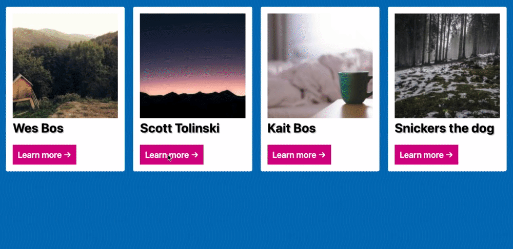

# Wes Bos Beginner JavaScript course

### What is this repository about?

- it's my codealong to [Wes Bos Beginner JavaScript](https://beginnerjavascript.com/) course
- videos are grouped into module sections, see **Course Content**
- the course is 85 videos long, so it's quite time intense
- [Wes Bos Beginner JavaScript on GitHub](https://github.com/wesbos/beginner-javascript)
- [Wes Bos JavaScript Notes & Reference](https://wesbos.com/javascript)
- [Wes Bos courses on wesbos.com](https://wesbos.com/courses)

My codealong is
- simple HTML5, CSS and JavaScript files - no build processes
- no fancy extra CSS (my focus is on learning JavaScript), most of the CSS has been provided by Wes Bos out of the box

### How to run this?

Mind you, there's no build process in here.
So there's two ways: clone the whole repo or copy and paste code of a single module
- navigate to module you want to look into
- to throw it on localhost, open respective `.html` file in your browser of choice (in my case, built in/for Chrome)
- tip: if you work with Visual Studio Code consider installing the Live Server extension

### Course Content

[Module 1 - Basics](./module-01-basics)

[Module 2 - Functions](./module-02-functions)

[Module 3 - The Tricky Bits](./module-03-tricky-bits)

[Module 4 - The DOM - Working with HTML and CSS](./module-04-the-dom)

[Module 5 - Events](./module-05-events)

[Module 6 - Serious Practice Exercises - Etch-a-Sketch](./module-06-01-etch-a-sketch)

[Module 6 - Serious Practice Exercises - Click Outside Modal](./module-06-02-click-outside-modal)

[Module 6 - Serious Practice Exercises - Scroll Intersection Observer](./module-06-03-scoll-intersection-observer)

[Module 6 - Serious Practice Exercises - Tabs](./module-06-04-tabs)

[Module 7 - Logic and Flow Control](./module-07-logic-and-flow-control)

[Module 8 - Data Types](./module-08-data-types)

[Module 9 - Looping and Iterating](./module-09-loops)

[Module 10 - Harder Practice Exercises - Face Detection](./module-10-01-face-detection)

ToDo:
- Module 10 - Harder Practice Exercises - Rest
- Module 11 - Prototypes, `this`, `new` and Inheritance
- Module 12 - Advanced Flow Control
- Module 13 - Ajax and Fetching Data
- Module 14 - ES Modules and Structuring Larger Apps
- Module 15 - Final Round of Exercises