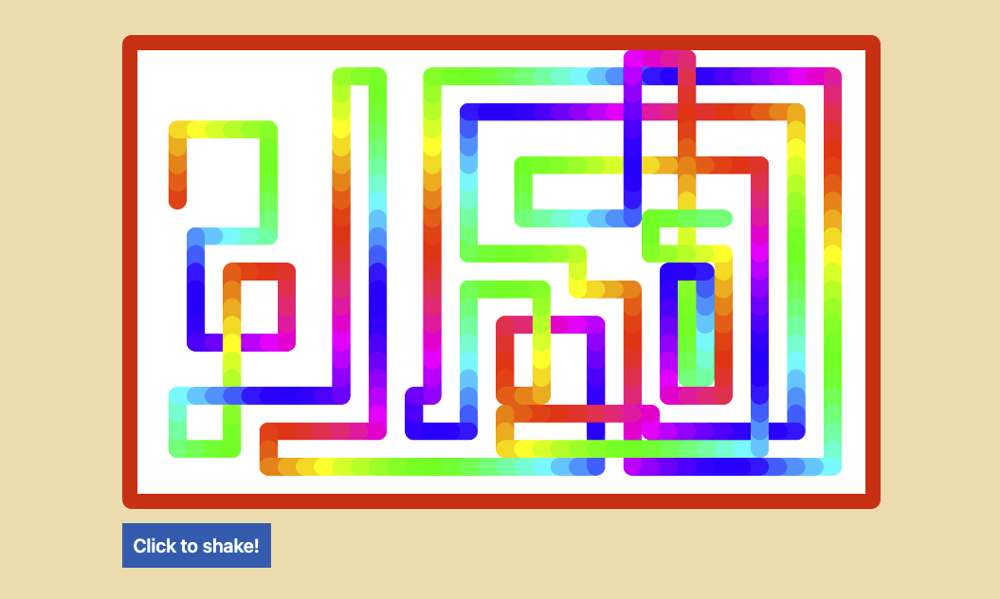

# Based on Wes Bos Beginner JavaScript course

### What is this about?

- codealong to [Wes Bos Beginner JavaScript](https://beginnerjavascript.com/) course
- you can buy this as a starter course or as a master package, my codealong is based on the master package
- see more of [his courses on wesbos.com](https://wesbos.com/courses)
- see [Wes Bos Beginner JavaScript on GitHub](https://github.com/wesbos/beginner-javascript) here

### How to run this?

- clone this whole repo or copy and paste code of a single project
- navigate to folder you want to throw on localhost
- open `index.html` (or other html files present) in your browser of choice (in my case, built in/for Chrome)

### Course Content

[Module 1 - Basics](#module-1-basics)

[Module 2 - Functions](#module-2-functions)

[Module 3 - The Tricky Bits](#module-3-the-tricky-bits)

[Module 4 - The DOM](#module-4-the-dom)

[Module 5 - Events](#module-5-events)

[Module 6 - Etch-a-Sketch](#module-6-etch-a-sketch)

[Module 6 - Click Outside Modal](#module-6-click-outside-modal)

### Module 1 Basics

Please see folder `module-01-basics` [with extra README here](./module-01-basics/README.md). 
Content of this module is information and small coding bits, no project.

- Welcome and Course Methodologies
- Browser, Editor and Terminal Setup
- Running and Loading JS
- Variables and Statements
- Code Quality Tooling with Prettier and ESLint
- Types - Introduction
- Type - String
- Type - Number
- Type - Object
- (Type - Symbol)
- Type - Null and Undefined
- Type - Boolean and equality

### Module 2 Functions

Please see folder `module-02-functions` [with extra README here](./module-02-functions/README.md) 
Content of this module is information and small coding bits, no project.

- Functions - Custom
- Functions - Parameters and Arguments
- Different ways to declare Functions
- Debugging Tools

### Module 3 The Tricky Bits

Please see folder `module-03-tricky-bits` [with extra README here](./module-03-tricky-bits/README.md) 
Content of this module is information and small coding bits, no project.

- Scope
- Hoisting
- Closure

### Module 4 The DOM

Please see folder `module-04-the-dom` [with extra README here](./module-04-the-dom/README.md) 
Content of this module is information and small coding bits, no project.

- Introduction to the document
- Selecting Elements
- Element Properties and Methods
- Working with Classes
- Build in and Custom Data Attributes
- Creating HTML
- HTML from Strings and XSS
- Traversing and Removing Nodes
- CARDIO

### Module 5 Events

Please see folder `module-05-events` [with extra README here](./module-05-events/README.md) 

Content of this module is information and small coding bits, no project.

- Event Listener
- Targets, Bubbling, Propagation and Capture
- Prevent Default and Form Events
- Accessibility Gotchas and Keyboard Codes

### Module 6 Etch-a-Sketch

Please see folder `module-06-01-etch-a-sketch` [with extra README here](./module-06-01-etch-a-sketch/README.md) 

### Module 6 Click Outside Modal

Please see folder `module-06-02-click-outside-modal` [with extra README here](./module-06-02-click-outside-modal/README.md) 

