# Module 2 - Functions

As most of the content is information and small coding bits, this README here is used as a notepad. <br>
This module contains no project. <br>

[Functions - Built in](#Functions-built-in)

[Functions - Custom](#Functions-custom)

[Functions - Parameters and Arguments](#Functions-Parameters-and-Arguments)

[Different ways to declare Functions](#Different-ways-to-declare-Functions)

[Debugging Tools](#Debugging-Tools)

## Function Definition

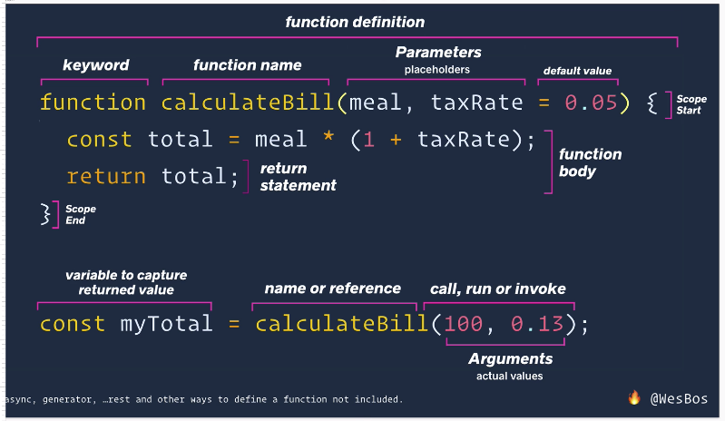

## Functions Built In

- functions are like types: a fundamental building block of JavaScript
- functions allow to group a set of statements together
- they take in values / arguments / parameters / data and return a new value or set of values
  - pass it in directly
  - as a variable that holds a value
  - as expressions

```
const mathMax = Math.max(10, 12);
console.log(mathMax); // 12

const mathFloor = Math.floor(2.4444);
console.log(mathFloor); // 2
```
- there's a whole lot of built-in functions in JavaScript
- for example `.log()`

```
console.log('hey'); // hey // undefined
```
- why undefined?
- that's ok, because functions can be used to do some operations without returning a value

```
// pass a string
// returns a floating point NUMBER

const parseFl = parseFloat('20.343434');
console.log(parseFloat('20.343434')); // 20.343434

// pass a string
// returns a WHOLE NUMBER

const parseI = parseInt('20.343434');
console.log(parseInt('20.343434')); // 20
```
```
// pass no argument
// returns the number of milliseconds passed since 01.01.1970, 00:00:00 UTC Universal Time
// also known as International Standard Time

const dateN = Date.now();
console.log(dateN); // 1618297431375
```
- [Timebie Universal Time (UTC)](http://www.timebie.com/timelocal/universal.php)
- [Timebie Berlin UTC](http://www.timebie.com/timezone/universalberlin.php)
- [Epoch Converter](https://epoch.now.sh/)
- [MDN web docs page - API Navigator](https://developer.mozilla.org/en-US/docs/Web/API/Navigator)

**Functions that work with the DOM**

```
// .querySelector
const div = document.querySelector('div');

// type this directly into the JavaScript console
// to see what happens when you have a bunch of text on a page:
scrollTo(0, 200);

// or try this with an object being passed
/* scrollTo({
  top: 500,
  left: 0,
  behavior: 'smooth'
}); */
```

## Custom Functions

- first: define / declare a function
- second: call / invoke that function
- everything after a `return` will be ignored

```
function calculateBillReturn() {
  const total = 100 * 1.13;
  return total;
}
const myTotal = calculateBillReturn();
console.log(myTotal); // 112.99999999999999

// or this
console.log(`Your total is $${myTotal}, tax included.`); // Your total is $112.99999999999999, tax included.

// or this
// calling a function within `${}` will execute immediately
console.log(`Your total is $${calculateBillReturn()}, inclucing tax.`); // Your total is $112.99999999999999, inclucing tax.
```

- `total` here is a temporary variable, created inside a function's body
- when the function is done running, `total` gets cleaned up ("garbage collected")
- if you have to capture a value, you need to stick it into a new variable

## Functions Parameters and Arguments

**Variables defined in global/outer scope**

- sub-optimal to calculate, reaches outside into a higher / global scope
- further down below in your code you might accidentally re-assign a previously set variable

```
let bill = 100;
let taxRate = 0.13;
function calculateBillNew() {
  const total = bill * 1 + taxRate;
  return total;
}
const myTotal2 = calculateBillNew();
console.log(myTotal2); // 100.13
bill = 200;
const myTotal3 = calculateBillNew();
console.log('myTotal3); // 200.13
```

**Make variable values to parameters for the function**

```
function calculateBillParam(billAmount, canadianTax) {
  const total = billAmount * (1 + canadianTax);
  return total;
}
const myTotalParam1 = calculateBillParam(100, 0.13);
console.log(myTotalParam1); //  112.99999999999999
```
- values available to the function are scoped to that function!
- parameters can be seen as placeholders
- arguments can be seen as actual values
- values/arguments passed into a function can be variables aswell

```
function calculateBillParams2(billAmount2, canadianTax2) {
  const total = billAmount2 * (1 + canadianTax2);
  return total;
}
const wesTotal = 500;
const wesTaxRate = 0.3;
const myTotalParam2 = calculateBillParams2(wesTotal, wesTaxRate);
console.log('WES tax thingy here: ', myTotalParam2); // WES tax thingy here:  650
```

- confusion here is what's being worked with? `billAmount2`? `canadianTax2`? `wesTotal`? `wesTaxRate`?
- functions are like factories
  - when you run a function, it takes in whatever you pass it
  - weather you pass it a number/string or weather you pass it a reference to a variable
  - at the end of the day, VALUES are being passed - either "directly" as strings/numbers/etc. or referenced to a variable that HOLDS the value

**This function returns undefined**

```
function sayHiTo() {
  return `Hello ${firstName}`;
}
const greeting = sayHiTo();
console.log(greeting); // firstName is not defined
```

**Passing a parameter with an undefined value**
```
function sayHiTo(firstName) {
  return `Hello ${firstName}`;
}
const greeting1 = sayHiTo();
console.log(greeting1); // Hello undefined
```

- first this will look inside the function body to see if `firstName` is defined - it's not it's only declared
- then, it looks outside of the function body and does not find a definition for `firstName`, so it's `undefined`

**This function will work, as long as a value is passed**
```
function sayHiTo(firstName) {
  return `Hello ${firstName}`;
}
const greeting1 = sayHiTo('wes');
console.log(greeting1); // Hello wes
```

**Passing expressions**

```
function calculateNewBill(billAmount2, canadianTax2) {
  const total = billAmount2 * (1 + canadianTax2);
  return total;
}

let myTotalNewBill = calculateNewBill(100, 0.15);
console.log(myTotalNewBill); // 114.99999999999999 -> canadian tax

let myTotalNewBill2 = calculateNewBill(20 + 20 + 30 + 20, 0.15);
console.log(myTotalNewBill2); // 103.49999999999999 -> made up
```

**Pass functions as arguments**

- it is ok to reuse parameters as they are passed in and are only available to inside of the function

```
function doctorize(name) {
  return `Dr. ${name}`;
}
function yell(name) {
  return `HEY ${name.toUpperCase()} !`;
}
doctorize('umpa'); // "Dr. umpa"
yell('lumpa'); // "HEY LUMPA !"

// pass the output of doctorize() into yell()
yell(doctorize('Lumpa')); // "HEY DR. LUMPA !"
```

- the usage of `name` passed in as arguemnt will never collide or overwrite because they are scoped to the function
- at the end of the day, the output of another function is the value passed in

**Set a default to avoid breaking a function in case of missing to pass a value**

```
function yello(namoh = 'Silly Goose') {
  return `Hey ${namoh.toUpperCase()}`;
}
yello(); // "Hey SILLY GOOSE"
```

- there's also the possibility to pass in an empty string to not have an error thrown

**Overwrite default of 3 set values, and here, not passing in all 3 values**

```
function calculateBill(billAmount = 120, taxRate = 0.2, tipRate = 0.2) {
	console.log('Running Calculate Bill');
	const total = billAmount + billAmount * taxRate + billAmount * tipRate;
	return total;
}

const testBill = calculateBill(100, ,0.5); // Unexpected token
```

- won't work, arguments need to be `100, undefined, 0.5`
- you have to set the one that should be passed as a _default_ to `undefined`

## Different ways to declare Functions

#### JavaScript functions are first class citizens
- JavaScript functions are values in themselves
- they can be stored in variables
- they can be passed in to other functions
- they can be moved around just like any other data within JavaScript

### Anonymous Function

- function without a name
- defining them on their own like here as a pure statement is not valid JavaScript, will throw an error (but are used for example in callbacks or IIFEs)

```
function (firstName) {
  return `Dr. ${firstName}`;
}
```

### Function Expression

- store a function as a value in a variable

```
const doctorize = function (firstName) {
  return `Dr. ${firstName}`;
}
doctorize('dude'); // "Dr. dude"
```

**What's the difference between using a regular function and a function expression?**
- the difference is how they operate in hoisting

### Hoisting

- regular functions that are declared with a function keyword are hoisted
- JavaScript takes all of those functions and hoist them up
- those functions are put at the top of the file, before they are called/initialized
- JavaScript does not hoist functions assigned to variables / function expressions

```
// console.log(doctorize('wes')); // Cannot access 'doctorize' before initialization
// console.log(doctorize2('woah')); // Dr. woah

// Function Expression
const doctorize = function (firstName) {
  return `Dr. ${firstName}`;
}

// Regular Function - hoisted
function doctorize2(firstName) {
  return `Dr. ${firstName}`;
}
```

### Arrow Function

- concise syntax
- have their own scope with the `this` keyword
- are anonymous functions, you always have to stick them into a declared variable

**How to construct an Arrow Function?**

- start with a regular function
```
function inchToCM(inches) {
  const cm = inches * 2.54;
  return cm;
}
console.log(inchToCM(3)); // 7.62
```

- shrink it down
```
function inchToCM(inches) {
  return inches * 2.54;
}
console.log(inchToCM(3)); // 7.62
```

- assign to a variable, function is now anonymous
```
const inchToCM1 = function(inches) {
  return inches * 2.54;
}
console.log(inchToCM1(3)); // 7.62
```

- arrow function (explicit return)
  - delete `function` keyword
  - add fat arrow
```
const inchToCM2 = (inches) => {
    return inches * 2.54;
}
console.log(inchToCM2(3)); // 7.62
```

- arrow function (implicit return)
  - delete `return` and `{}`
```
const inchToCM3 = (inches) => inches * 2.54;
```

- as there's only one argument passed, `()` can also be deleted
```
const inchToCM3 = inches => inches * 2.54;
console.log(inchToCM3(3)); // 7.62
```

### Returning an Object

- start with a regular function
```
function makeADonut(first, last) {
	const donut = {
		name: `${first} ${last}`,
		age: 0
	}
	return donut;
}
console.log(makeADonut('chocolate', 'vanilla')); // {name: "chocolate vanilla", age: 0}
```

- anonymous arrow function
```
const makeADonut = (first, last) => {
  const donut = {
    name: `${first} ${last}`,
	  age: 0
	}
	return donut;
}
console.log(makeADonut('chocolate', 'vanilla')); // {name: "chocolate vanilla", age: 0}
```

- even less
```
const makeADonut = (first, last) => {
  return {
    name: `${first} ${last}`,
		age: 0
	}
}
console.log(makeADonut('chocolate', 'vanilla')); // {name: "chocolate vanilla", age: 0}
```

- implicit return - won't work
```
const makeADonut = (first, last) => { name: `${first} ${last}`, age: 0 };
console.log(makeADonut('chocolate', 'vanilla')); // Unexpected token
```
- `{}` will be taken as the `{}` of the _function body_ not the `{}` of the donut object

- implicit return - works
```
const makeADonut = (first, last) => ({ name: `${first} ${last}`, age: 0 });
console.log(makeADonut('chocolate', 'vanilla')); // {name: "chocolate vanilla", age: 0}
```
- if you want to implicitly return an object, just have a set of `()` around it

### IIFE

- Immediately Invoked Function Expression

```
(function() {
  console.log('run the IIFE'); // run the IIFE
  return 'Something witty here'; // "Something witty here"
})();
```

- parenthesis `()` always run first in JavaScript
- this will return a function value
- putting the other pair of `()` at the end will immediately run the function expression
- this was really popular before Modules and Block Scope
- IIFE is declared in it’s own scope
- functions inside of it run in the overarching, contained scope
- variables cannot leak

**Within an IIFE, passing a parameter**

```
(function(age) {
  console.log('run the IIFE'); // run the IIFE
  return `Something witty here and age ${age}`; // "Something witty here and age 5"
})(5);
```

### Methods

- a method is a function that lives inside of an object
- `console.log();`
  - `.log()` is the function that lives inside of `console`
  - `console` is actually an object
- create a property on your object and assign a function to it
- these functions can also have names, it's technically allowed
- you don't have to set a name, when a function name is missing, the browser will derive the name from the property name

```
const wes = {
  name: 'Wes Bos',
  sayHi: function() {
    console.log('Hey Wes');
    return 'Hey Wesser';
  }
}
console.log(wes); // Hey Wes
console.log(wes.sayHi()); // Hey Wesser
```

- another example

```
const functionmethod = {
  name: 'Whatever Ever',

  // METHOD
  // create a property on your object and assign it a function
  sayHi: function() {
    console.log("Hey there");
    return "Hey there";
  },

  // SHORTHAND METHOD
  yellHi() {
    console.log("YELLLL without function keyword");
  },
  // same as above but with function keyword
  /* yellHi: function() {
    console.log("YELLLL with function keyword");
  }, */

  // ARROW FUNCTION
  wisperHi: () => {
    console.log('hii');
  }
}
```

### Callback Functions

- regular function
- something that will happen when something is done
- a function that gets passed into another function and is called by the browser at a later point in time
- "when somebody clicks something, run this"
- "when this amount of time has passed, run this"

```
const button = document.querySelector('.click-me');
button.addEventListener('click', functionmethod.yellHi);
```
- when the `click` happens, pass it a reference to any function that should run (in this case `functionmethod()`)
- the callback is sort of a function to which the event listener is given access to
- we're not running it here, we're just saying "here's the function, browser, please call that function, when somebody clicks the button"

**Callback Functions can be declared outside of handlers**

```
const button = document.querySelector('.click-me');
function handleClick() {
  console.log('you clicked!');
}
button.addEventListener('click', handleClick);
```

**Pass an Anonymous Function**

```
const button = document.querySelector('.click-me');
button.addEventListener('click', function() {
  console.log('inside anonymous');
});
```
- anonymous function directly being passed
- the browser would know to call the function itself
- is not a callback function right here

### Timer Callback
- probably the simplest one is `setTimeout()`
- first, it takes a function to call, that you want to run after a certain amount of time
- second, it asks for a duration in time (milliseconds), "after how long should I run this"

```
// timer callback
setTimeout(functionmethod.yellHi, 1000);

// anonymous function
setTimeout(function() {
  console.log('Done');
}, 1000);

// arrow function
setTimeout(() => {
  console.log('arrow done');
}, 1000);
```

## Debugging Tools
### Console

- `console.log()` - the most common log
- `console.error()` - only changes how the log looks like: error/warning
- `console.warn()` - only changes how the log looks like: error/warning
- `console.table()` - can be useful any time you have a list of objects which have the same property, will format into a more appealing table
- `console.count()` - counts how many times a function has been running
- `console.group()` - for grouping logging; when you have to log a lot of stuff, you need to start and end with the same string
- `console.groupCollapsed()` - will by default collapse the outprint

### Callstack, Stack Trace

- stack trace will tell you what function called what function called what function...
- you have to get good at reading call stacks to figure out where an error is coming from
- the JavaScript console will help guiding through errors
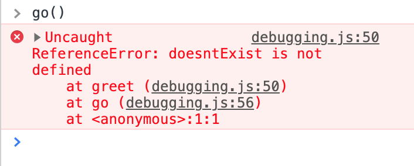

### Grabbing Elements

- go to any website, for example [MDN for example](https://developer.mozilla.org/en-US/)
- inspect the input field (so it turns "blue")
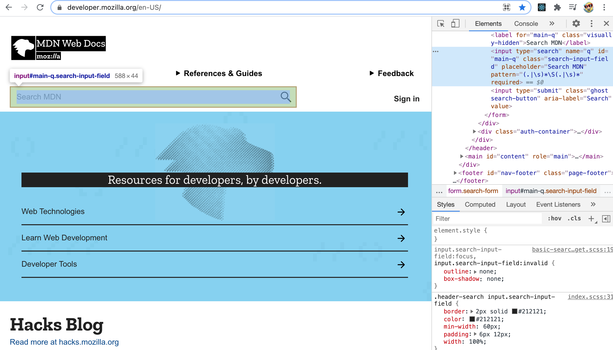
- flip over to the JavaScript console and type `$0`
- it will return to you whatever you've currently selected
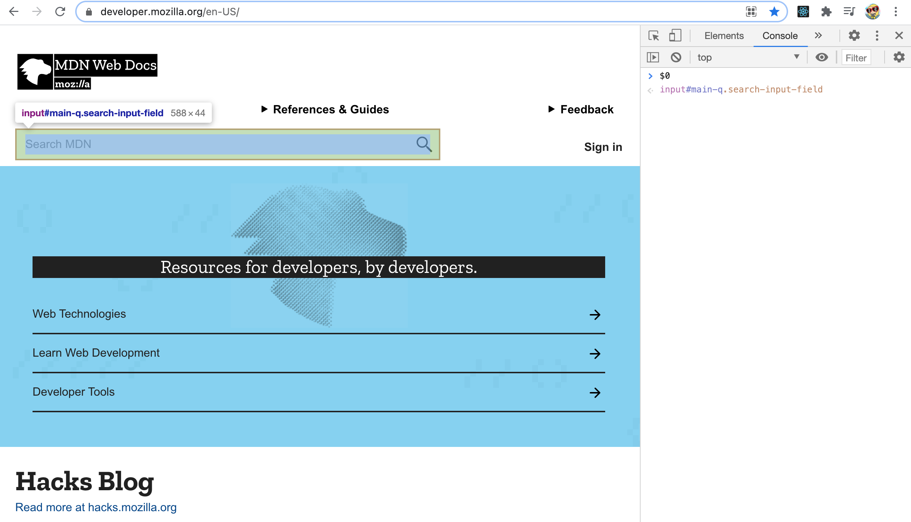
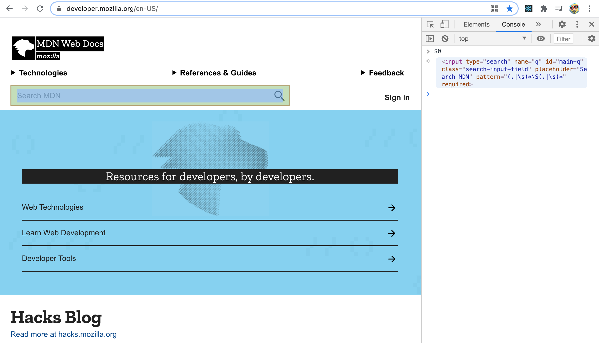
- helpful as you can call for example `.value` against it (type something into the input field)
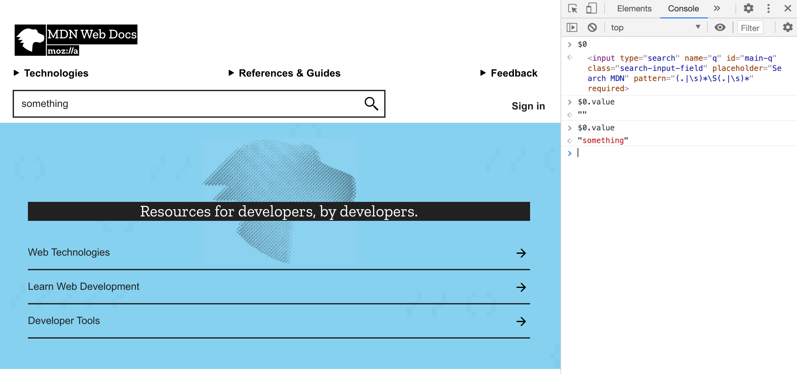
<br>
<br>
- `$0`
  - will return to you whatever element you've currently selected, the last one you've selected
  - gives you something like a shortcut access to the element
- `$1`
  - will return to you the second to last you've selected (and so on with `$2`, etc)
- `$('div')` - like querySelector, gives you the first `<div>` on a page (if present)
- `$$('div')` - like querySelectorAll, gives you all `<div>`s on a page (if present)

### Debugger - Setting Breakpoints

**Set `debugger;` in functions**
```
people.forEach((person, index) => {
  debugger;
  console.log(person.name);
});
```
- open JavaScript console
- the debugger will pause JavaScript from running but only when your Dev Tools are open
- when you now run it, JavaScript will run until the line you've set the `debugger` on and stop there - you've set a breakpoint
- you can gain a lot of info at this stopped point, in the Sources Tab
- `play` will keep on running JavaScript until the next debugger is hit
- `Setp over` will step into the next function call, will allow you to run the code line by line, again and again (in a loop)

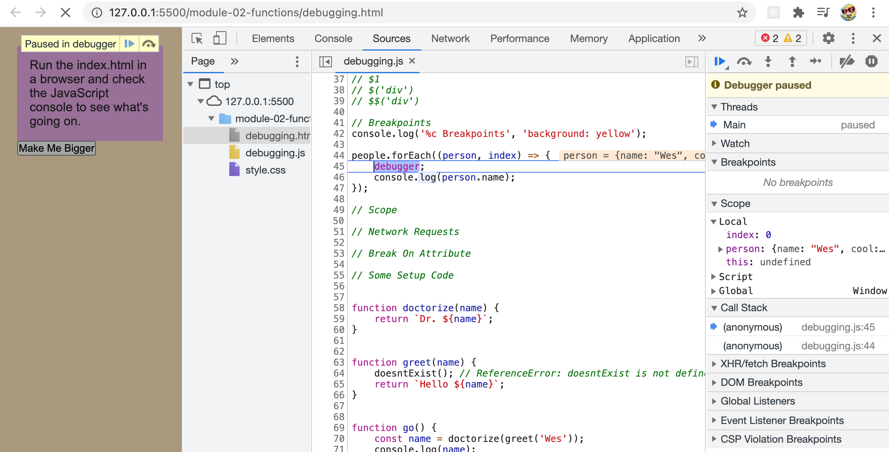

**Set `debugger;` within the Sources Tab**

- go to the sources tab and select the `.js` you want to set a debugger in
- now just pick the function/the line you want to debug and click on the number of that line
- refresh the page and you get that little debugger

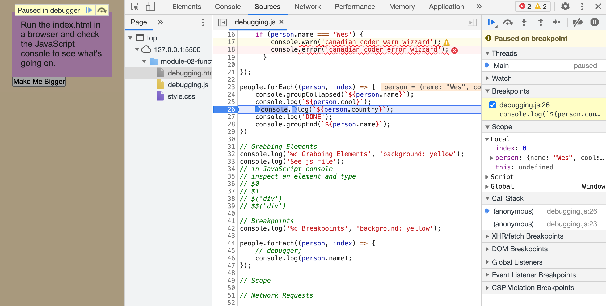

- if you put a debugger within the sources tag - **don’t forget to remove it once you’re done**

### Scope

- will be looked into more later in the course

### Network Requests

```
async function fetchDadJoke() {
  const res = await fetch('https://icanhazdadjoke.com/', {
    headers: {
      Accept: 'text/plain',
    },
  });
  const joke = await res.text();
  console.log(joke); // What did the late tomato say to the early tomato? I’ll ketch up
  return joke;
}

// in the JavaScript console, run fetchDadJoke()
```
- while doing so, open Network Tab in Dev Tools and refresh
- you now see all of the files that are needed in order for that website to work, that joke to work

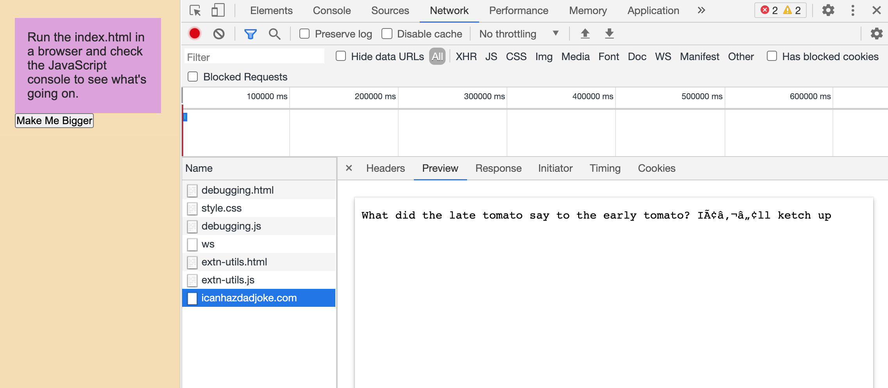

- if you have a request to an API, you can investigate for example why that request takes so long
- the XHR Tab for example is sending out data about YOU

### Break on attribute

**attribute modifications**
- example: "where is the JavaScript that is making a button bigger?"
- right click on Elements Tab, "Break on", "attribute modifications"
- when somebody changes one of the attributes in that button, break
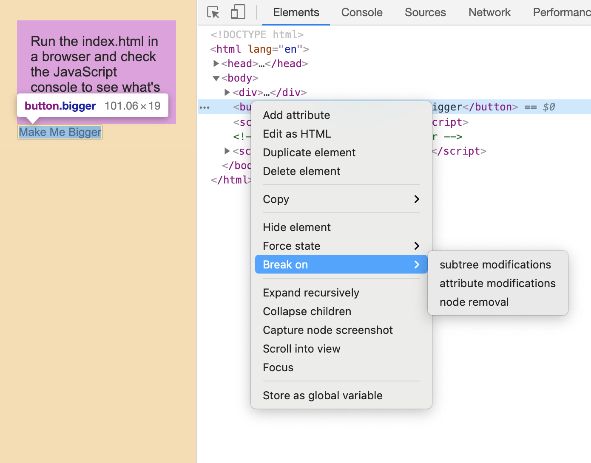
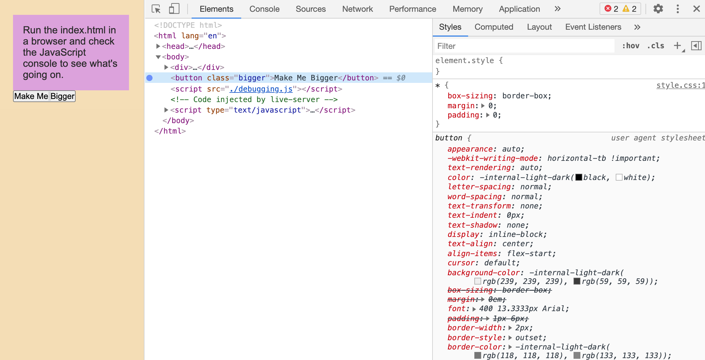
- click the button, will jump into debugging
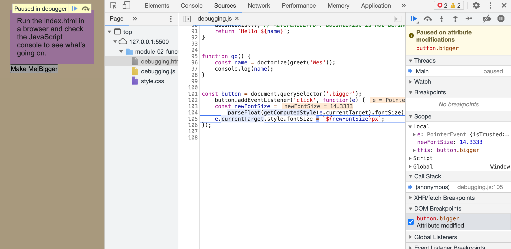

**subtree modifications**
- example: when somebody adds a `<div>`

**node removal**
- example: when somebody removes an element or some tags from the DOM
