# Module 4 - The DOM

As most of the content is information and small coding bits, this README here is used as a notepad. <br>
This module contains no project. <br>

[Introduction to the document](#introduction-to-the-document)

[Selecting Elements](#selecting-elements)

[Element Properties and Methods](#element-properties-and-methods)

[Working with Classes](#working-with-classes)

[Build in and Custom Data Attributes](#build-in-and-custom-data-attributes)

[Creating HTML](#creating-html)

[HTML from Strings and XSS](#html-from-strings-and-xss)

[Traversing and Removing Nodes](#traversing-and-removing-nodes)

[CARDIO](#cardio)

## Introduction to the document

- a big part of working with JavaScript in a web browser is interacting with elements on a page to, for example
  - add event listener ('click', 'scroll', etc)
  - add/remove and modify elements
  - add/remove classes
  - fetch new data
  - play music and videos, etc, etc
  - ... we need the **DOM**
<br>

**The browser grabs HTML and turns it into something that is called the "Document Object Model", the DOM**

- once all HTML elements have been grabbed and rendered into the DOM, this allows to interface with the DOM via JavaScript
- on any web page, in the browser, open up the JavaScript console and go to the Elements tab
- what you see in that Elements tab is NOT actual written HTML, but the HTML that JavaScript grabbed and rendered into the DOM
- the DOM is represented in a tree that pretty much looks like "regular" written HTML

### Window

**The global scope in the browser is called the `window`**

- the `window` is where all of the global variables are stored, aswell as helpful properties
- example `window.location`, will return an object full of information like current page you're on, host name, protocol, etc, etc
- example `window.innerWidth`, will return the inner width of the window
- think of the `window` as everything about the currently opened browser window, including the browser variables, the scroll bars, etc
- all of the stuff in your actual browser window generally is stored in the window object

### Document

**`document` is everything from the opening HTML tag `<!DOCTYPE html>` to the closing HTML tag `</!DOCTYPE>`**

- the `document` is only concerned about the DOM
- the entire Document Object Model is accessible via the `document` keyword

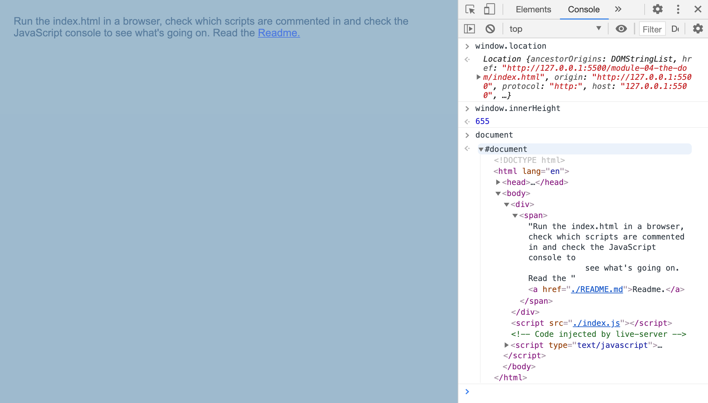

### Navigator

**`navigator` is higher level than the `window`, with information not just about the browser but the device itself**

- e.g. webcam, audio access, battery level, gps coordinates - things that are device specific

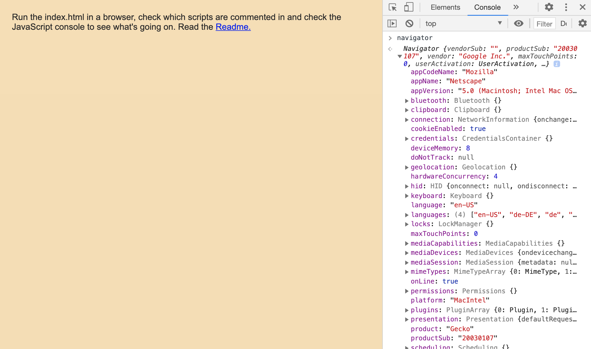

## Selecting Elements

**A word on loading JavaScript**

- do not have JavaScript loaded and running before elements are rendered (e.g. do not put a `<script>` tag in the `<head>` if possible)
- as mentioned before, put the `<script>` tag right before the closing `</body>` tag, this will ensure that your HTML is parsed/rendered on the page before the JavaScript is run
- if you have to have a `<script>` tag in the `<head>` tag, make sure that the DOM content is loaded (`DOMContentLoaded`) before running the JavaScript

**Following examples are referring to `index.html` and `the-dom.js`**

- before working with elements on a webbrowser page is possible, they need to be selected
- once elements are selected they can be manipulated
- there are two main ways to select elements, `querySelector` and `querySelectorAll`

**querySelector**

- returns only the first matching element
- will seach the entire webpage / the entire document
- as a method of a selected element, will only search inside of that selected element

**querySelectorAll**

- returns a NodeList
- a NodeList is NOT an array!
- it's a "list of things" (more explanation later in the courses)
- it does not have all the methods you'd have for an array (e.g. `map()`, `filter()`, `reduce()` and so on)

```
// grab the first matching p element
const p = document.querySelector('p');
console.log(p); // <p>Hi I'm the first ever item p</p>
```

```
// grab all div elements (node list)
const divs = document.querySelectorAll('div');
console.log(divs); // NodeList(4) [div.items, div.item, div.item.item2, div]
```

```
// grab all div elements with a class of item (node list)
const specificdivs = document.querySelectorAll('div.item');
console.log(specificdivs); // NodeList(2) [div.item, div.item.item2]
```

```
// grab all img elements inside elements with a class of item (node list)
const imgInItem = document.querySelectorAll('.item img');
console.log(imgInItem); // NodeList(2) [img, img]
```

```
// grab the first matching img element inside element with a class of item
const imgInFirstItem = document.querySelector('.item img');
console.log(imgInFirstItem); // 
```

```
// grab the first matching element with a class of item2
const imgInItemWithClass = document.querySelector('.item2');
console.log(imgInItemWithClass); // <div class="item item2">...</div>
```

```
// grab the first matching img element inside element with a class of item2
const item2 = document.querySelector('.item2');
// you can specifically address an element via class
const item2Image = item2.querySelector('img');
console.log(item2); // <div class="item item2">...</div>
```

```
// other ways of grabbing elements
const idElement = document.getElementById('wes');
console.log(idElement); // <h2 id="wes">Sub Div headline</h2>
```

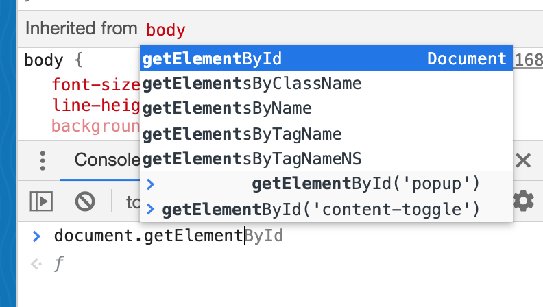

## Element Properties and Methods

**Following examples are referring to `index.html` and `the-dom.js`**

```
const heading = document.querySelector('h2');
console.log(heading); // <h2>Badly styled heading...</h2>
console.dir(heading); // h2
```
- this looks like it returns an actual _element_ but in reality it's an **object** that has a lot of properties and methods on it
- `.dir` will show the object properties, instead of the element itself
- if you open it up:

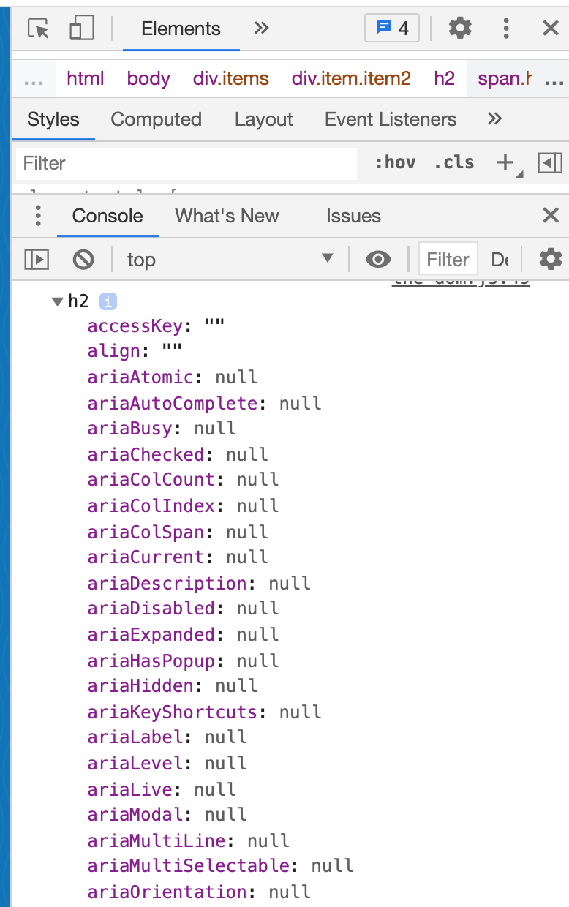

- there are properties in this long list that are helpful when working with elements
  - `outerHTML: "<h2 id="wes">Sub Div headline</h2>"`
  - `outerText: "Sub Div headline"`
  - `parentElement: div.item.item2`
  - `parentNode: div.item.item2`
  - ... etc, etc
- these are just properties, meaning they can be used as "getters" (pull the data out) or as "setters" (set new data)

- `textContent`
  - gets ALL of the elements, including `<script>` and `<style>` elements
  - returns EVERY element of the node<br>

- `innerText`
  - gets only human-readable elements
  - won't address text of hidden elements<br>

- to play it safe, use `textContent` to not for example miss a badly coded `<style>` element (see index.html, the first `<h2>` tag within that html)
- again, be aware of HOW / WHEN you address this hidden element!

```
// grabs inner text of addressed element
console.log(heading.innerHTML); // Set new headline with textContent

// grabs the outer HTML plus inner text of addressed element
console.log(heading.outerHTML); // <h2>Set new headline with textContent</h2>
```

### Upate content

```
const pizzaList = document.querySelector('.pizza');
console.log(pizzaList.textContent); // This is what I ate 🧇
```

#### One possibility to update
- can be slow in applications, will cause the browser to rerender the entire list
```
pizzaList.textContent = `${pizzaList.textContent} plus pizza 🍕`;
console.log(pizzaList.textContent); // This is what I ate 🧇 plus pizza 🍕
```

#### Better method to update is `insertAdjacentText`
- this is not a property on an object, it's a method
- when trying out various combinations of `.insertAdjacentText('option', element)`, have a close look in the Dev Tools Elements Tab _where_ an element is added

```
pizzaList.insertAdjacentText('afterbegin', '🍿');
console.log(pizzaList.textContent); // 🍿This is what I ate 🧇
```
- adds to the front, on an extra line, but prints no space

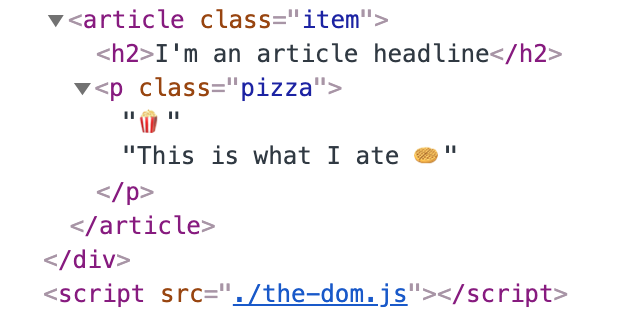

```
pizzaList.insertAdjacentText('beforeend', '🍕');
console.log(pizzaList.textContent); // 🍿This is what I ate 🧇🍕
```
- adds this to the end of the element `.insertAdjacentText('beforeend', element)`

```
pizzaList.insertAdjacentText('beforebegin', '🍔');
console.log(pizzaList.textContent); // 🍿This is what I ate 🧇🍕

const article = document.querySelector('article');
console.log(article.textContent); // I'm an article headline 🍔🍿This is what I ate 🧇🍕
```
- adds this as its OWN NODE on an extra line BEFORE the element `.insertAdjacentText('beforebegin', element)`

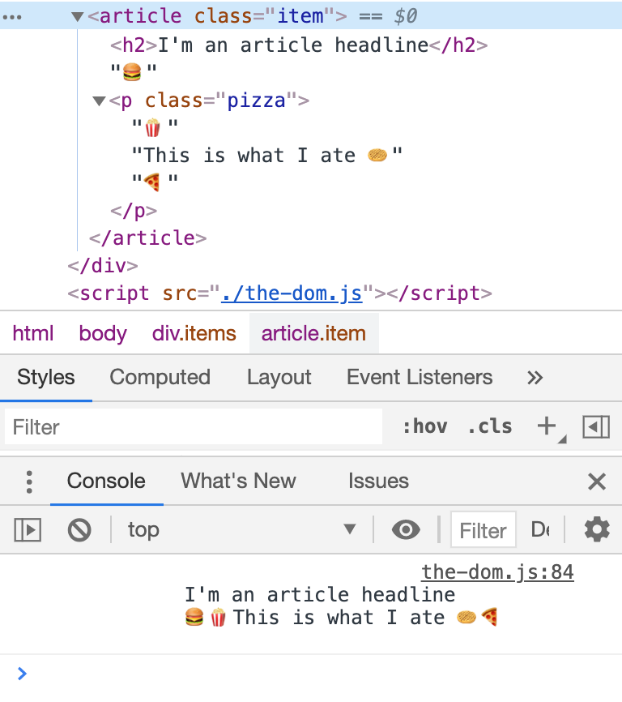

- methods
  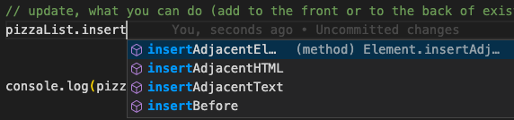

- check these pages to find properties and methods<br>
  [MDN Web Docs - Element](https://developer.mozilla.org/en-US/docs/Web/API/Element)<br>
  [MDN Web Docs - Node](https://developer.mozilla.org/en-US/docs/Web/API/Node)
- be aware that some properties doesn't only exist on elements but also on nodes - so if you don't find it in elements, check the nodes page


**That's the difference between elements and nodes - nodes can be anything, an element is something that's wrapped in a tag, so it's a specific kind of node**

## Working with Classes

**Following examples are referring to `classes.html` and `classes.js`**

- adding and removing classes is different from working with properties
- when you select an element there's a `classList` attribute on it and on that are methods

```
<body>
    
    ...
</body>
```

```
const pic = document.querySelector('.nice');
console.log(pic.classList); // DOMTokenList(2) ["nice", "cool", value: "nice cool"]

pic.classList.add('open');
console.log(pic.classList); // DOMTokenList(3) ["nice", "cool", "open", value: "nice cool open"]

pic.classList.remove('cool');
console.log(pic.classList); // DOMTokenList(2) ["nice", "open", value: "nice open"]
```

- `__proto__:` in JavaScript console will show the methods you are able to call against

**toggle**

- `toggle` will add the class if it's not there and remove it if it's there
- click the first image on the page to see toggle in action

```
img {
    transition: all 0.2s;
}
.round {
    border-radius: 50%;
    transform: rotate(1turn) scale(2);
    box-shadow: 0 0 10px #000;
}
```

```
pic.classList.toggle('round');

// try this out in repeatedly copy and pasting `pic.classList.toggle('round');` into the JavaScript console
pic.classList.toggle('round'); // true
// click
pic.classList.toggle('round'); // false
```

**add eventListener**

```
// add eventListener
function toggleRound() {
    pic.classList.toggle('round');
}

pic.addEventListener('click', toggleRound);
```

- a lot of JavaScript will be adding and removing classes at some point in time
- pretty common for modals or navs that need to open or close or slide in

```
// contains
// click
pic.classList.contains('round'); // true
// click
pic.classList.contains('round'); // false
```

## Build in and Custom Data Attributes

- all of the attributes you can think of on any type of element are all done via getters and setters
- use dot notation

```
// setter
pic.alt = 'random otherwise helpful alt text';
// getter
console.log(pic.alt); // random otherwise helpful alt text
console.log(pic.naturalWidth); // 0 - because the image isn't downloaded yet
```

**naturalWidth**

- `naturalWidth` is only a getter
- as the image HAS a width, how to solve the 0 pixel width above?
- addEventListener
- all the images, resources, css, JavaScript, etc have to be downloaded before this will fire:

```
window.addEventListener('load', function () {
    console.log(pic.naturalWidth); // 250
});
```

- listen to the specific image, which is the better use case

```
pic.addEventListener('load', function () {
    console.log(pic.naturalWidth); // 250
});
```

**getAttribute and setAttribute**

```
console.log(pic.getAttribute('alt')); // random otherwise helpful alt text
pic.setAttribute('alt', 'changed via set Attribute');
console.log(pic.getAttribute('alt')); // changed via set Attribute
```

- so where's the difference between using dot notation with a property on the picture object and those both methods?
- `setAttribute()` will also work for things that are non-standard

```
pic.setAttribute('newly-set-attr', 'new text too');
console.log(pic.getAttribute('newly-set-attr')); // new text too


```

- be careful to introduce weirdly named custom attributes - they might officially be introduced in the future, then there's legacy code that is clashing with the standard

- use data-attributes as custom attributes, use `data-`
- access them via `.dataset`
- dataset will give an object with all the properties that it has on it

## Creating HTML

**Following examples are referring to `creating.html` and `creating.js`**

- there's a few ways to create HTML with JavaScript

**createElement**

- the main way is with the `document.createElement`<br>
  [MDN Web Docs - createElement](https://developer.mozilla.org/en-US/docs/Web/API/Document/createElement)

```
const myParagraph = document.createElement('p');
```

- simply doing this won't have anything showing up on the page
- it's just been created in JavaScript memory
- how to add created elements to a page then?
- through the use of another API called `appendChild()`
- use an already existing element and call `appendChild()` against it
- `appendChild()` can be called against any node

```
document.body.appendChild(myDiv);
myDiv.appendChild(myParagraph);
myDiv.appendChild(myImage);
```

- every time `appendChild()` is used, the DOM is modified which causes a reflow in the browser, everything will be repainted
- to not have this happening, do the above calls in reverse order, to only have ONE touch of the DOM
- this will only cause one reflow/repaint:

```
myDiv.appendChild(myParagraph);
myDiv.appendChild(myImage);
document.body.appendChild(myDiv);
```

- below is valid JavaScript but it's not needed as `body` is directly available on `document`

```
const body = document.querySelector('body');
```

- the document gives reference to the body element quickly via a property
- not every element is accessible that way but the most popular ones

**Element.append()**

- currently not working with IE
- similar to `appendChild()`

**insertAdjacentElement()**

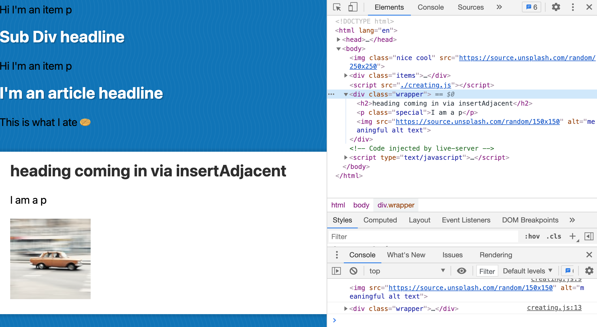

- worst way to create elements:

```
const myList = document.createElement('ul');
const li = document.createElement('li');
li.textContent = 'three';
myList.appendChild(li);

const li5 = document.createElement('li');
li5.textContent = 'five';
myList.append(li5);

const li1 = li5.cloneNode();
li1.textContent = 'one';
myList.insertAdjacentElement('afterbegin', li1);

const li4 = document.createElement('li');
li4.textContent = 'four';
li5.insertAdjacentElement('beforebegin', li4);

const li2 = document.createElement('li');
li2.textContent = 'two';
li.insertAdjacentElement('beforebegin', li2);

document.body.insertAdjacentElement('afterbegin', myList);
```

- only to show that there's a couple of ways to create elements

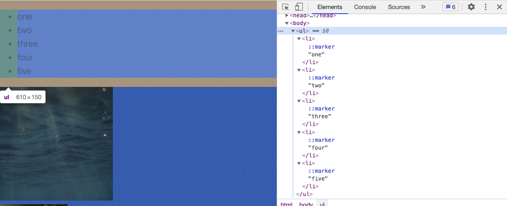

## HTML from Strings and XSS

**Following examples are referring to `creating.html` and `creating.js`**

- creating HTML with back tick strings
- there's a potential security hole - there's some things to know about XSS - Cross-Site Scripting

```
const item = document.querySelector('.item');
// getter, showing everything as a string
console.log(item.innerHTML); //   <p>Hi I'm the first ever item p</p>

// setter
item.innerHTML = `
    <div>
        <h1>Hey how are you</h1>
    </div>
`;
console.log(item.innerHTML);
```

- way better, than example in Creating HTML chapter
- `innerHTML` = great way to dump the string in and have the browser create all of the elements for you
- with back ticks you can interpolate values easier

```
const width = 300;
const src = `https://source.unsplash.com/random/${width}x${width}`;
const desc = `meaningful desc text`;
const myHTML = `
    <div className="wrapper">
        <h2>Random ${desc}</h2>
        
    </div>
`;
item.innerHTML = myHTML;

console.log(typeof myHTML); // string

const itemImage = document.querySelector('.wrapper img');
console.log(itemImage);
itemImage.classList.add('round');
```

- one downside: those are not elements, meaning that those are just strings
- `myHTML` is NOT an element, it's only a string

**createRange() and createContextualFragment()**

```
const item = document.querySelector('.item');

const width = 75;
const src = `https://source.unsplash.com/random/${width}x${width}`;
const desc = `meaningful desc text`;
const myHTML = `
    <div class="wrapper">
        <h2>Random ${desc}</h2>
        
    </div>
`;

const myFragment = document.createRange().createContextualFragment(myHTML);
console.log(myFragment.querySelector('img'));
console.log(myFragment);

document.body.appendChild(myFragment);
```

- `createRange()` - a collection of elements, parts of HTML, that can be worked with
- `createContextualFragment()` can immediately be called against it, taking in a string
- that gives a document fragment, a fancy way of saying "some HTML"
  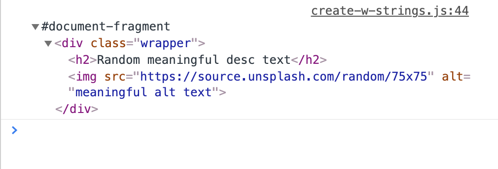
- from this fragment every element that's inside of it can be selected
- these now ARE elements to work with, not just strings like in the example before
- methods like `appendChild()` work now

**If you want to create HTML from a string**

- you can either dump it straight into an element with `.innerHTML`<br>OR
- if you do need to do things like addEventListeners, change classes, change attributes, with `createRange()` and `createContextualFragment()` you can turn it into DOM nodes before it's dumped in

**Security and Sanitization**

- example: people can edit their profile, name, etc
- if somebody puts HTML into _your_ HTML you've created via back ticks, what can happen is that the _foreign_ HTML will then be rendered onto the page
- not per se bad, but with cross-site scripting it is
- when people take it further and introduce `<script>` tags into your HTML
- the browser will run that tag, `onload` will execute immediately
- any time you allow a third party to run a JavaScript on your page that is a potential security hole

```
const desc = `meaningful desc text `;
```

## Traversing and Removing Nodes

**Following examples are referring to `traversing.html` and `traversing.js`**

- traversing through DOM elements and removing elements
- traversing means going up, down, over

```
const wes = document.querySelector('.wes');
console.log(wes); // <p class="wes">I am Wes, I <em>love </em> to bbq.</p>
console.log(wes.children); // HTMLCollection [em]
console.log(wes.childNodes); // NodeList(3) [text, em, text]
```

- what's the actual difference between a node and an element?
  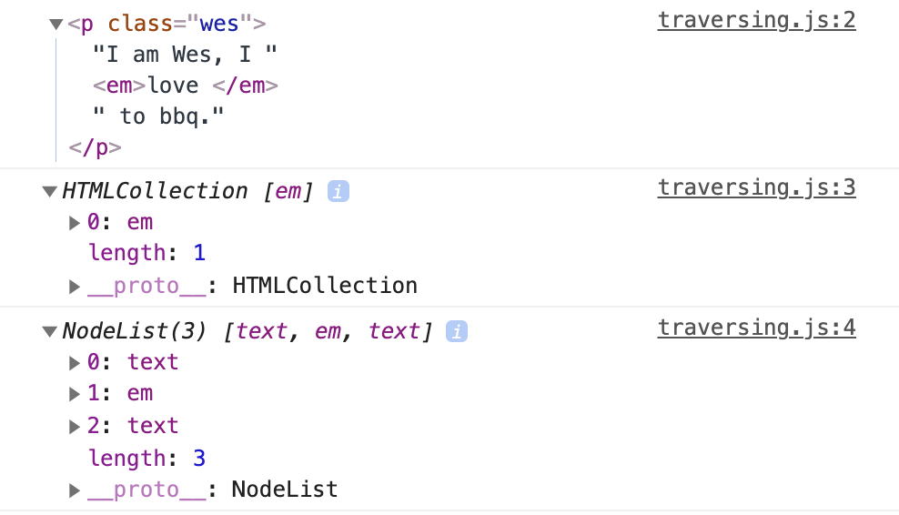
- everything here is actually a node
- if it is wrapped in a tag, it is also an element (but it doesn't work the other way around)
- there's a bunch of different properties for working with nodes and elements

**properties for elements**

```
console.log('first element', wes.firstElementChild); // <em>love </em>
console.log('last element', wes.lastElementChild); // <strong>make websites.</strong>
console.log('previous element sibling', wes.previousElementSibling); // null
console.log('next element sibling', wes.nextElementSibling); // 
console.log('parent element', wes.parentElement); // <body>...</body>
```

**properties for nodes**

```
el.childNodes
el.firstChild
el.lastChild
el.previousSibling
el.nextSibling
el.parentNode
```

- in most cases you probably want the element selectors

**removing elements**

- there's a method on every single element, in every single node `remove()`
- this will remove entirely from the DOM

```
const p = document.createElement('p');
p.textContent = 'I will be removed';
document.body.appendChild(p);
p.remove();
console.log(p); // <p>I will be removed</p>
```

- what about if you create an element and then remove it - does it still exist in the DOM?
- no, it's still there
- the fact that we've created that element so it exists in JavaScript memory means that we still have access to that paragraph element

## CARDIO

- this chapter is exercises, derived from previous lessons
- **check out `dom-cardio.html` and `dom-cardio.js`** to follow along
