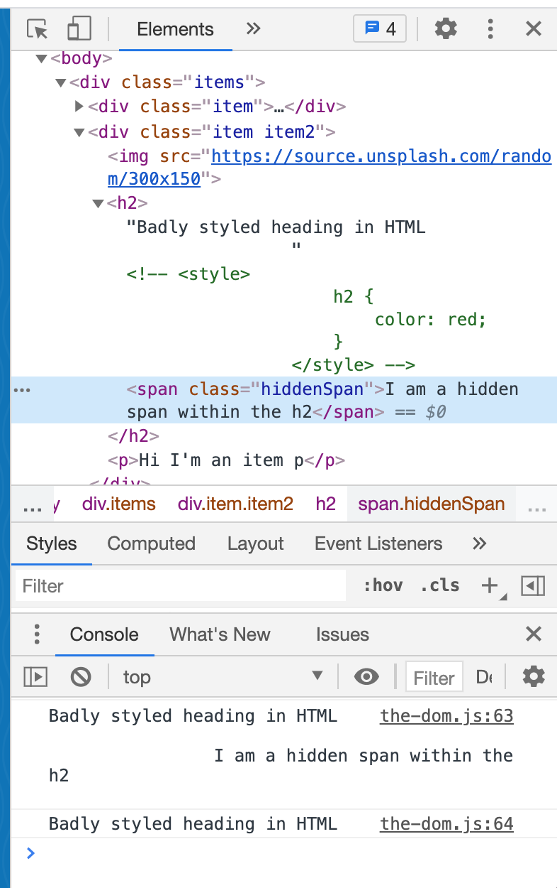

# Module 4 - The DOM

<!-- As most of the "Module 4 The DOM" content is information and small coding bits, this README here is used as a notepad. -->

Please check html file [index.html](./index.html) in this module's folder to check which js files are referenced to follow up with the coding bits.

[Introduction to the document](#introduction-to-the-document)

[Selecting Elements](#selecting-elements)

[Element Properties and Methods](#element-properties-and-methods)

[Working with Classes](#working-with-classes)

[Build in and Custom Data Attributes](#build-in-and-custom-data-attributes)

[Creating HTML](#creating-html)

[HTML from Strings and XSS](#html-from-strings-and-xss)

[Traversing and Removing Nodes](#traversing-and-removing-nodes)

[CARDIO](#cardio)

## Introduction to the document

- a big part of working with JavaScript in a web browser is interacting with elements on a page
- to, for example,
    - add event listener ('click', 'scroll', etc)
    - add/remove and modify elements
    - add/remove classes
    - fetch new data
    - play music and videos, etc, etc
    - ... we need the **DOM**<br>

**The browser grabs your written HTML and turns it into something that is called the "Document Object Model", the DOM**
- once we have all HTML elements grabbed and rendered into the DOM, this allows to interface with the DOM via JavaScript
- in the browser, open up the JavaScript console and go to the Elements tab
   - what you see in that Elements tab is NOT actual written HTML, but the HTML that JavaScript grabbed and rendered into the DOM
   - the DOM is represented in a tree that pretty much looks like "regular" written HTML

### Window

**The global scope in the browser is called the `window`**
- the `window` is where all of the global variables are stored, aswell as helpful properties
- example `window.location`, will return an object full of info (current page you're on,
host name, protocol, etc, etc, see screenshot below)
- example `window.innerWidth`, will return the inner width of the window, see screenshot below
- think of the `window` as everything about the currently opened browser window, including the browser variables, the scroll bars, etc
- all of the stuff in your actual browser window generally is stored in the window object

### Document

**`document` is everything from the opening HTML tag `<!DOCTYPE html>` to the closing HTML tag `</html>`**
- the `document` is only concerned about the DOM
- the entire Document **Object** Model is accessible via the `document.` keyword


### Navigator

**`navigator` is higher level than the `window` with info, not just about the browser but the device itself**
- e.g. webcam, audio access, battery level, gps coordinates - things that are device specific


## Selecting Elements

**A word on loading JS**
- do not have JavaScript loaded and running before elements are rendered (e.g. do not put a `<script>` tag in the `<head>` if possible)
- as mentioned before, put the `<script>` tag right before the closing `<body>` tag, this will ensure that your HTML is parsed/rendered on the page before the JavaScript is run
- if you have to have a `<script>` tag in the `<head>` tag, make sure that the DOM content is loaded (`DOMContentLoaded`) before running the function

**Following examples are of course dependent on the HTML, where and how to grab an element**

```
// returns the first matching <p>, making sure that DOM content is loaded

function init() {
    // grab the first matching p
    const p = document.querySelector('p');
    console.log(p);
}
document.addEventListener('DOMContentLoaded', init);
```

- before working with elements on a webbrowser page is possible, they need to be selected
- once elements are selected they can be manipulated
- there are two main ways to select elements, `querySelector` and `querySelectorAll`

**querySelector**

- returns the first matching element
- will seach the entire webpage / the entire document
- as a method of a selected element, will only search inside of that selected element

**querySelectorAll**

- returns a NodeList
- a NodeList is NOT an array!
    - it's a "list of things" (more explanation later in the courses)
    - it does not have all the methods you'd have for an array (e.g. `map()`, `filter()`, `reduce()` and so on)

```
// grab the first matching p element
const p = document.querySelector('p');
console.log(p); // <p>Hi I'm the first ever item p</p>
```
```
// grab all div elements (node list)
const divs = document.querySelectorAll('div');
console.log(divs); // NodeList(4) [div.items, div.item, div.item.item2, div]
```
```
// grab all div elements with a class of item (node list)
const specificdivs = document.querySelectorAll('div.item');
console.log(specificdivs); // NodeList(2) [div.item, div.item.item2]
```
```
// grab all img elements inside elements with a class of item (node list)
const imgInItem = document.querySelectorAll('.item img');
console.log(imgInItem); // NodeList(2) [img, img]
```
```
// grab the first matching img element inside element with a class of item
const imgInFirstItem = document.querySelector('.item img');
console.log(imgInFirstItem); // 
```
```
// grab the first matching element with a class of item2
const imgInItemWithClass = document.querySelector('.item2');
console.log(imgInItemWithClass); // <div class="item item2">...</div>
```
```
// grab the first matching img element inside element with a class of item2
const item2 = document.querySelector('.item2');
// you can specifically address an element via class
const item2Image = item2.querySelector('img');
console.log(item2); // <div class="item item2">...</div>
```
```
// other ways of grabbing elements
const idElement = document.getElementById('wes');
console.log(idElement); // <h2 id="wes">Sub Div headline</h2>
```


## Element Properties and Methods

```
const heading = document.querySelector('h2');
console.log(heading); // <h2>Badly styled heading...</h2>
console.dir(heading); // h2
```
- this looks like it returns an actual _element_ but in reality it's an **object** that has a lot of properties and methods on it
- `.dir` will show the object properties


- there are properties in this long list that are helpful when working with elements
    - `outerHTML: "<h2 id="wes">Sub Div headline</h2>"`
    - `outerText: "Sub Div headline"`
    - `parentElement: div.item.item2`
    - `parentNode: div.item.item2`
    - ... etc, etc
- they can be used as "getters" (pull the data out of them) or as "setters" (set new data)

```
console.log(heading.textContent); // Badly styled heading in HTML I am a hidden span within the h2
console.log(heading.innerText); // Badly styled heading in HTML

heading.textContent = 'Set new headline with textContent';

console.log(heading.textContent); // Set new headline with textContent
console.log(heading.innerText); // Set new headline with textContent

```
- `textContent`
    - gets ALL of the elements, including `<script>` and `<style>` elements
    - returns EVERY element of the node
    - in our example, `hidden span` will only properly be addressed with `.textContent`, (and text will be get) be aware of HOW / WHEN you address this element<br>

- `innerText`
    - gets only human-readable elements
    - won't address text of hidden elements<br>

- to play it safe, use `textContent` to not for example miss a badly coded `<style>` element (see index.html, the first `<h2>` tag within that html)
- again, be aware of HOW / WHEN you address this hidden element!



```
// grabs inner text of addressed element
console.log(heading.innerHTML); // Set new headline with textContent

// grabs the outer HTML plus inner text of addressed element
console.log(heading.outerHTML); // <h2>Set new headline with textContent</h2>
```

### Upate content

```
const pizzaList = document.querySelector('.pizza');
console.log(pizzaList.textContent); // This is what I ate 🧇
```
```
pizzaList.textContent = `${pizzaList.textContent} plus pizza 🍕`;
console.log(pizzaList.textContent); // This is what I ate 🧇 plus pizza 🍕
```
- one possibility to update
- can be slow in applications, will cause the browser to rerender the entire list

```
pizzaList.insertAdjacentText('afterbegin', '🍿');
console.log(pizzaList.textContent); // 🍿This is what I ate 🧇
```
- better method to update, `.insertAdjacentText('afterbegin', element)` adds to the front of the element
- this is not a property on an object, it's a method
- takes in two parameters, second parameter doesn't add an element but text
- the browser knows that you added it after first render, so it puts it on an extra line


**That's the difference between elements and nodes - nodes can be anything, an element is something that's wrapped in a tag, so it's a specific kind of node**

```
pizzaList.insertAdjacentText('beforeend', '🍕');
console.log(pizzaList.textContent); // 🍿This is what I ate 🧇🍕
```
- adds this to the end of the element `.insertAdjacentText('beforeend', element)`

- adds this as its OWN NODE on an extra line BEFORE the element `.insertAdjacentText('beforebegin', element)`
- it's if you will an extra element
```
pizzaList.insertAdjacentText('beforebegin', '🍔');
console.log(pizzaList.textContent); // 🍿This is what I ate 🧇🍕
const article = document.querySelector('article');
console.log(article.textContent); // I'm an article headline 🍔🍿This is what I ate 🧇🍕
```


- methods


- check these pages to find properties and methods
[MDN Web Docs - Element](https://developer.mozilla.org/en-US/docs/Web/API/Element)<br>
[MDN Web Docs - Node](https://developer.mozilla.org/en-US/docs/Web/API/Node)
- be aware that some properties doesn't only exist on elements but also on nodes - so if you don't find it in elements, check the nodes page

## Working with Classes

## Build in and Custom Data Attributes

## Creating HTML

## HTML from Strings and XSS

## Traversing and Removing Nodes

## CARDIO