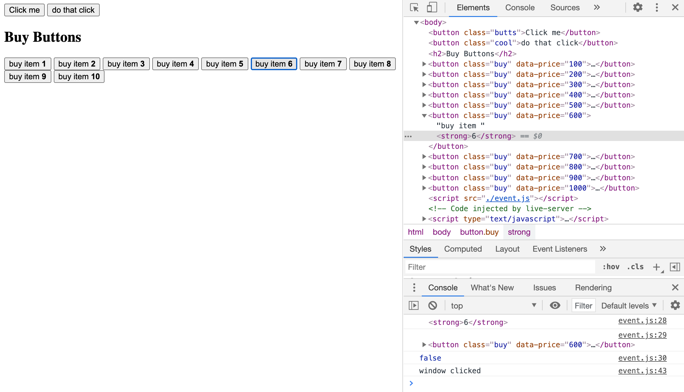

# Module 5 - Events - Event Listener

<!-- As most of the "Module 5 - Events - Event Listener" content is information and small coding bits, this README here is used as a notepad.

Please check html file [index.html](./index.html) in this module's folder to check which js files are referenced to follow up with the coding bits. -->

[Event Listener](#event-listener)

[Targets, bubbling, propagation and capture](#targets-bubbling-propagation-and-capture)

[Prevent default and form events](#prevent-default-and-form-events)

[Accessibility gotchas and keyboard codes](#accessibility-gotchas-and-keyboard-codes)

## Event Listener

- DOM elements emit events - when they are clicked, hovered, dragged, they will fire off
- **following examples are referring to `index.html` and `index.js`**

**event listener**

- "go, get something", "listen for something", "do something"
- event listeners are used to listen for when events happen and react to them
- event listeners can be attached to all elements, as well as to the `document` and the `window`
- `addEventListener()` will take two arguments, first the type of event, second an anonymous callback function

**callback function**

- is just a regular function that gets passed to a method that will then be called at a later point in time
- anonymous, as it's not named, there's no reference to it (!)
- with `addEventListener()` this function will be called/run by the browser when it needs to

```
const butts = document.querySelector('.butts');
const coolButton = document.querySelector('.cool');

// anonymous callback function
butts.addEventListener('click', function () {
    console.log('anon callback function');
});

// named function
function handleClick() {
    console.log('it got clicked');
}
butts.addEventListener('click', handleClick);
coolButton.addEventListener('click', handleClick);
butts.removeEventListener('click', handleClick);

// arrow function
const hooray = () => console.log('hooray');
coolButton.addEventListener('click', hooray);
```

**removeEventListener**

- `removeEventListener()` **needs reference to a function**
- `removeEventListener()` unbinds the function from the element
  - binding: taking a function, listening for a specific event against a specific element
- a named function or an arrow function that is stored in a variable, **must** be used to be able to reference and unbind
- the arrow function above technically is an anonymous function, as it's stored in a variable it is referencable

**listening for events on multiple items**

- example 10 `<button>`
  - selecting all of them gives a node list, not HTML elements
  - elements here don't have `addEventListener()` on them
  - you need to loop over the elements with `forEach()`
- for `removeEventListener()` it's the same, it needs to be looped over

```
const buyButton = document.querySelectorAll('button.buy');

// with anonymous function
function buyItem() {
    console.log('buying item');
}
buyButton.forEach(function (calledAnythingWeWant) {
    console.log(calledAnythingWeWant);
    calledAnythingWeWant.addEventListener('click', buyItem);
});

// with named function
function buyItem() {
    console.log('buying item');
}
function loopOverButton(calledAnythingWeWant) {
    console.log('looped over click');
    calledAnythingWeWant.addEventListener('click', buyItem);
}
buyButton.forEach(loopOverButton);

// with arrow function
buyButton.forEach((button) => {
    button.addEventListener('click', () => {
        console.log('arrow click');
    })
})
```

- arrow function downside: unbinding of event listeners doesn't work as it's an anonymous function

## Targets, Bubbling, Propagation and Capture

- **following examples are referring to `event.html` and `event.js`**
- how to get information about what has specifically been clicked?
  - that information is in the **event object**, with all kinds of useful information and methods for working with events
- to access the **event object**, the callback/handler function needs to have a parameter that is the event
- it doesn't matter what that event is called as long as it's the first argument of the callback, as the first argument IS the **event object**
- `event.target` once you have the target, you can access anything you want about it (and is accessible)
- what's the difference between `event.target` and `event.currentTarget`?
  - the difference comes in when there's elements that are nested **inside** of the element that's been listened to
  - `event.target` is the thing that got clicked
  - `event.currentTarget` is the the thing that fired the event listener
  - most cases most likely need `.currentTarget`

**Propagation and Bubbling**

- it is possible to click on multiple things at the same time = propagation
- example click on `<strong>` - also all other added events are fired



- what happens is that events bubble up
- click on `<strong>`, also click on `<button>`, also click on `<body>`, also click on `<html>`, also click on `window`, also click on (in my case) Google Chrome browser
- even though the tiny `<strong>` is clicked, both the browser and the operating system will register that click and it will keep bubbling up
- how to prevent that? with `stopPropagation()`

**Capture**

- is sort of the opposite
- a click on a deeper nested element will go through all of the "outer" elements, doesn't do anything
- after going through to the lowest DOM node, what happens is it starts to bubble up, will trigger the event
- example: listen to click on `window` first and stop it from going any further
- that happens via the third argument you can add to `addEventListner()`
- be careful to not unintentally stop events through `stopPropagation()`

**most common use case for event listener**

- listening for clicks on lower level element
- stopping the propagation when clicking on that element
- so that elements that are higher, that are also listening for clicks, do not also fire that specific element event listener

**this**

- reserved word
- in a callback function where you want to reference the actual element that the event was called against - the `this` keyword is going to surface that for you
- the `this` keyword is always going to be equal whatever is to the left of the dot
- the `this` keyword has a bit of a downside, when you change a function to an arrow function, then the `this` keyword is no longer scoped to that element
- recommendation to not use it in event listeners and callbacks, use `e.target` or `e.currentTarget`

## Prevent Default and Form Events

## Accessibility gotchas and keyboard codes
