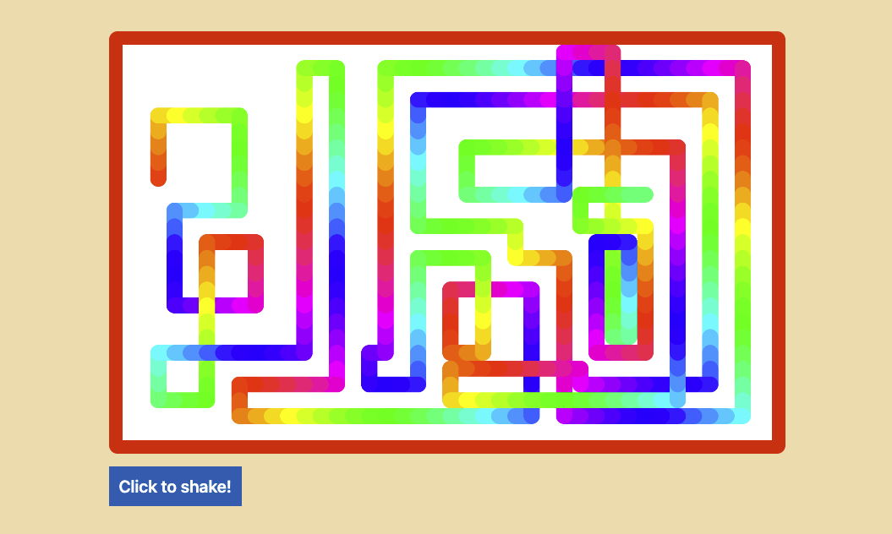

# Module 6 - Etch-a-Sketch

## What is this about?

- Etch-a-Sketch
  - JavaScript, HTML, CSS
  - use arrow keys up, right, down, left, to move around
  - draw a line in rainbow colors - everytime an arrow key moves the cursor, increment the hue value by 10
  - click "Click to clear" to start over (have a wobble effect applied to the canvas)
  - when reloading the page (`cmd + r`), starting spot is randomized
  - only desktop, not mobile
## Topics to cover

- DOM elements
- keyboard events
- `<canvas> ... </canvas>` (2d,  not 3d)
- switch statement
- hue colors
- randomisation of starting spot

**canvas**

- the exercise is build with 2d context, see examples with [3d context here: ](https://threejs.org/), [for example ](https://threejs.org/examples/#webgl_effects_parallaxbarrier)
- canvas is a set of APIs, set of methods, that are used for drawing
- rectangles, circles, drawing, lines, borders, different fill colors, you name it - all those are available in canvas
- programmatically draw something to the browser
- `canvas` is the element
- `context` is where the drawing happens

**keyboard events**

- don't forget to add a `preventDefault()` to the function that handles the arrow keys
- this will prevent the default scrolling of the page when hitting arrow keys

**switch statement**

- take in a variable, like the key, and depending on the four cases it might go up, go down, go left or go right
- a switch statement always needs a default case
- `break` will stop the switch from running and skip over the `false` statements

**colors**

- [Mother-effing hsl()](https://mothereffinghsl.com/)
