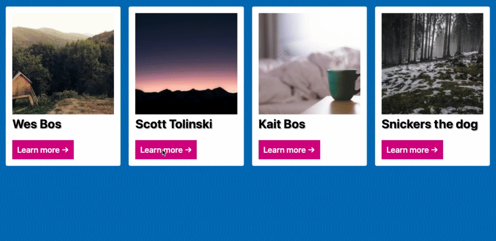

# Module 6 - Click Outside Modal

## What is this about?



- click outside of modal will close modal
  - JavaScript, HTML, CSS
  - a series of 4 cards "in the background" (responsive)
  - an outer modal to be place on top, centered, transparent background
  - an inner modal that takes in the to be displayed content (not 100% responsive, possible TODO)
    - grab and display the image
    - grab and display the descripton of the cards
  - no close button in this example
  - click outside the inner modal closes the whole modal

## hide modal by default

- `display: none;` or
- `visibility: hidden;` or
- `opacity: 0;` with `pointer-events: none;`
  - `opacity: 0;` won't cut it as the modal is still there, would listen to events
  - `pointer-events: none;` will tell the browser to ignore any events here, won't capture them
  - show modal again with `opacity: 1;` and `pointer-events: all;`

```
.modal-outer {
    display: grid;
    ...
    /* hide outer modal, capture no events */
    opacity: 0;
    pointer-events: none;
}

/* display outer modal, capture all events */
.modal-outer.open {
    opacity: 1;
    pointer-events: all;
}
```

- `closest()` is kinda like `querySelectorAll()` except it's the opposite - it will climb UP the nested tree of DOM elements

- in this example, the transitioning in of the modal-inner is a bit yanky
- not part of this course but a solution could be to solve this via `document.createElement`, create an image and wait for the image to load
