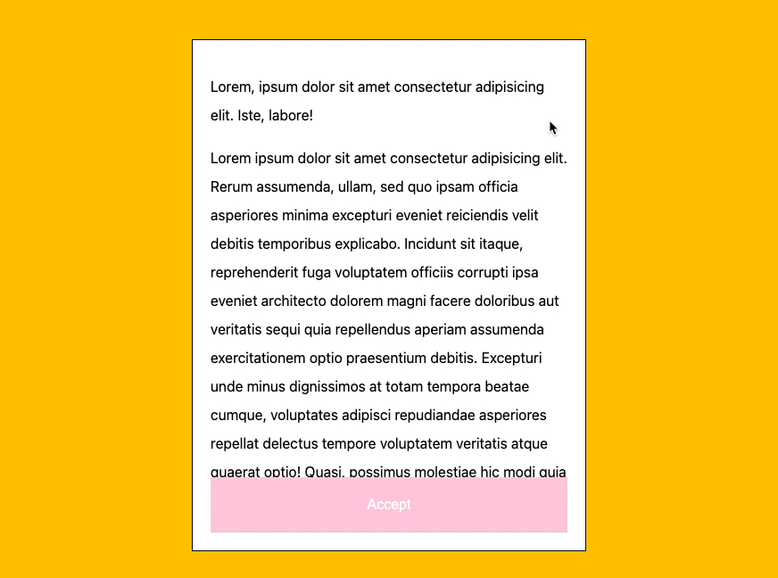
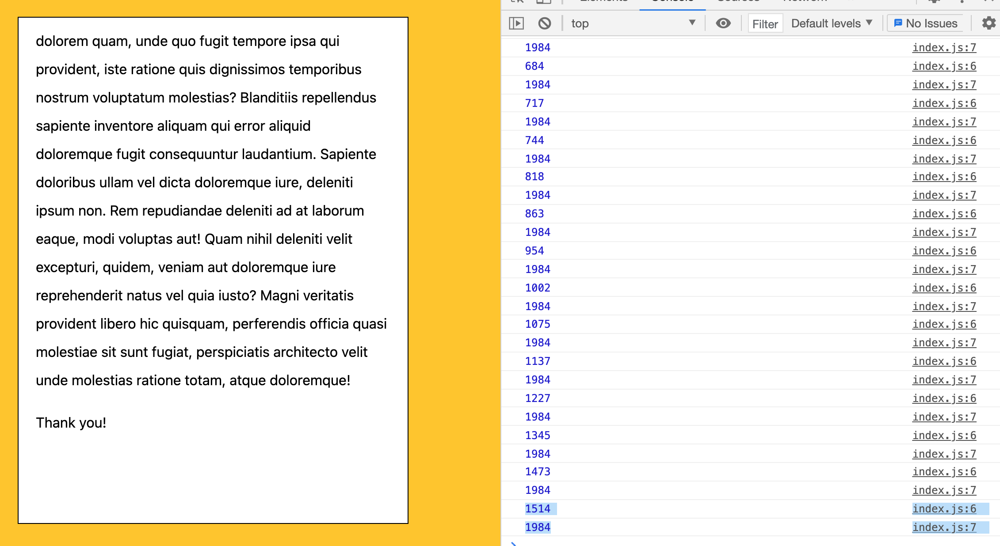
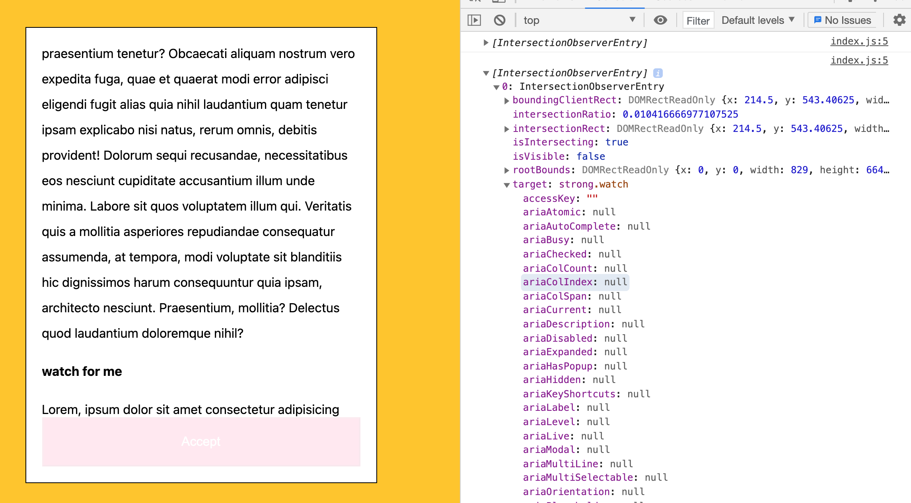
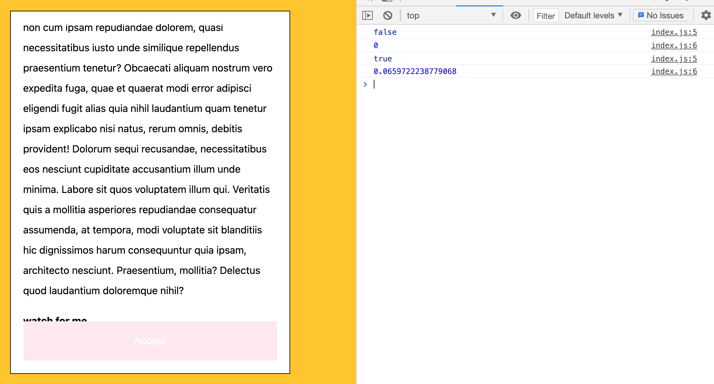

# Module 6 - Scoll To Accept - Intersection Observer

## What is this about?



- have terms and conditions `<div>` with `overflow: scroll` set on it
- the accept button at the bottom doesn't work until it's been scolled all the way down
- this is not window or document scoll, it's another element, that has `overflow: scroll;` set on it
- select that element and listen for scroll on it
- remark: there's additional styling in the css that lets the accept button slide in, I took that off

## scoll events and why this might not be what we want

**example for scroll**

```
terms.addEventListener('scroll', function (eve) {
    console.log(eve.currentTarget.scrollTop);
    console.log(eve.currentTarget.scrollHeight);
});
```

- `scrollTop` will give how far from top has been scrolled
- `scrollHeight` will give the height of the current (scrolled) target



- if scolled all to the bottom, it's still not the same number, as the accept button has some margin and some padding
- now, to get that straight, it would be needed to work with `offsetHeight`, which is a thing of the past
- the way that this is done now is called **IntersectionObserver()**

## IntersectionObserver()

- rather than figuring out how far along the page the user has scolled, `IntersectionObserver()` is used to figure out if something is currently viewable on the page
- `IntersectionObserver()` will observe if an element is on or off, or partway on or off of the page
- it's just a watcher
- `IntersectionObserver()` takes in a callback (a function that gets called at a certain point)
- this is a callback that needs to be fired every single time that it needs to check if something is currently on the page
- it's different than a click callback, or a scroll callback

#### Observe the element "watch for me":

```
const watch = document.querySelector('.watch');

function obCallback(payload) {
    console.log(payload);
}

const obs = new IntersectionObserver(obCallback);

obs.observe(watch);
```



#### Observe how far on the page it currently is:

```
const watch = document.querySelector('.watch');

function obCallback(payload) {
    console.log(payload[0].isIntersecting);
    console.log(payload[0].intersectionRatio);
}
const obs = new IntersectionObserver(obCallback);
obs.observe(watch);
```



#### Accept Button

- `intersectionRatio()` is used to determine if it's been scrolled all the way to the bottom
- how do you know that it's all the way to the bottom? check for the last element of terms and condition and that it's 100% displayed
- watch out if your element actually EVER will be visible within the window 100% - otherwise the event won't fire!
- this is the reason for the `<p>Thank you!</p>` at the end of terms and conditions

You don't see this observer pattern all that much, the only two ways currently in the browser are `IntersectionObserver` (when something is currently scrolled into view), `ResizeObserver` (when an element is resized)

## side note - how to check if terms and conditions are present on the page at all

```
function scrollToAccept() {
    const terms = document.querySelector('.terms-and-conditions');

    if (!terms) {
        return;
    }

    terms.addEventListener('scroll', function (eve) {
        console.log(eve);
    });
}

scrollToAccept();
```
