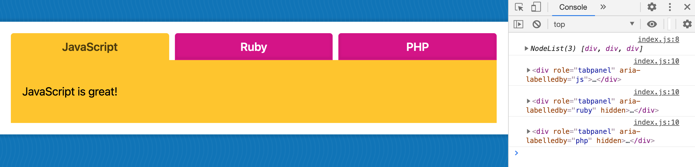

# Module 6 - Tabs

## What is this about?


- Tabs
  - JavaScript, HTML, CSS
  - click on `tab` shows current `tab` and `tabPanel` (content), hides other `tab`s and `tabPanel`s (content)
  - default state: show the first `tab` and `tabPanel` (content)

## Topics to cover

- "hiding and showing things"
- event listeners
- looping
- accessibility (use keyboard to tab over)
  - `<button>` already is accessible, no need to "fix" the click event to work without mouse
  - `role` and `aria-selected` make the `tab`s accessible (also to have your content easily read by search engines)
- `role="tablist" aria-label="Programming Languages"` for screen readers / what is this list about
- `aria-selected=" "` on `<button>`s will maintain whether that `tab` is currently active

## Exercise

#### Listen for click on `tabButtons`s, log `currentTarget`

```
const tabButtons = tabs.querySelectorAll('[role="tab"]');

function handleTabClick(eve) {
    console.log(eve.currentTarget);
}

tabButtons.forEach(button => button.addEventListener('click', handleTabClick));
```

- gives back each `<button>` HTML element


#### Log all `tabPanel`s

```
const tabButtons = tabs.querySelectorAll('[role="tab"]');
const tabPanels = Array.from(tabs.querySelectorAll('[role="tabpanel"]'));

function handleTabClick(eve) {
    console.log(tabPanels); // node list with 3 (dom) elements
    tabPanels.forEach(function (panel) {
        console.log(panel); // single html elements
    })
}

tabButtons.forEach(button => button.addEventListener('click', handleTabClick));
```

- `forEach()` takes the node list of 3 (DOM) elements (`tabPanels`), loops over every single one of them (`panel`)
- variable `panel` is the reference for each one of them
- `console.log()` gives back all three HTML elements (`tabPanels`)
- click on one `tab` gives back all three seperate HTML elements (`tabPanels`)



#### Now hide all `tabPanel`s

```
const tabButtons = tabs.querySelectorAll('[role="tab"]');
const tabPanels = Array.from(tabs.querySelectorAll('[role="tabpanel"]'));

function handleTabClick(eve) {
    tabPanels.forEach(function (panel) {
        panel.hidden = true;
    })
}

tabButtons.forEach(button => button.addEventListener('click', handleTabClick));
```

- it's easier to first hide them all (`panel.hidden = true;`) and then show the one that we want
- we _could_ filter for the ones that are not associated with the current one and only hide accordingly but it's not as easy as the other way
- as soon as _any_ `tab` is clicked, all `tabPanel`s will be closed


#### Mark all `tab`s as unselected

```
const tabButtons = tabs.querySelectorAll('[role="tab"]');
const tabPanels = Array.from(tabs.querySelectorAll('[role="tabpanel"]'));

function handleTabClick(eve) {

    tabPanels.forEach(panel => {
        panel.hidden = true;
    });

    tabButtons.forEach(tabButton => {
        // tabButton.ariaSelected = false; // won't work
        tabButton.setAttribute('aria-selected', false); // works
    });
}

tabButtons.forEach(button => button.addEventListener('click', handleTabClick));
```

`aria-selected` = how do you access a property when the property itself has a dash on it?
Any time you see an attribute with a dash on an HTML element, you can almost always access that with the camelcased version of it.

For most properties in JavaScript (for example `tabButton.alt` or `tabButton.src` or `tabButton.title`) you can access the property on the element directly BUT for some properties - including custom properties you made up as well as aria attributes - you can't access directly via `tabButton.ariaSelected = false;` and need `getAttribute()` and `setAttribute()` methods.


#### Mark the clicked `tab` as selected

```
eve.currentTarget.setAttribute('aria-selected', true);
```

- this is now easy
- click on `tab`s will now set and remove (toggle) the `aria-selected` attribute


- prefer accessing via accessibility attribute over a class, as you don't have to maintain classes on two places
- select and style your elements with `aria`

#### Find the associated `tabPanel` and show it

- if somebody clicks on a `<button>` with an `<id="js">` on it, we need to find the associated `tabPanel` that has the `aria-labelledby="js"`
- there's two ways

**With `querySelector`-ing, method 1**

```
...
// find the associated tabPanel and show it - method 1
const id = eve.currentTarget.id;
const tabPanel = tabs.querySelector(`[aria-labelledby="${id}"]`);
tabPanel.hidden = false;
...
```

**With `find()` in the array(!) of `tabPanel`'s, method 2**

- you need to have <br>
  `const tabPanels = Array.from(tabs.querySelectorAll('[role="tabpanel"]'));`<br>
  as an array with `Array.from()`
- find the `tabPanel` where the `tabPanel`'s `labelledby` is equal to the `id`
- store the result of that in a variable
- this method is to be preferred as we already have the `tabPanel`'s, no need to `querySelector` for them again, like in method 1

```
...
// find the associated tabPanel and show it - method 2
const id = eve.currentTarget.id;
const tabPanel = tabPanels.find(panel => panel.getAttribute('aria-labelledby') === id);
tabPanel.hidden = false;
...
```
