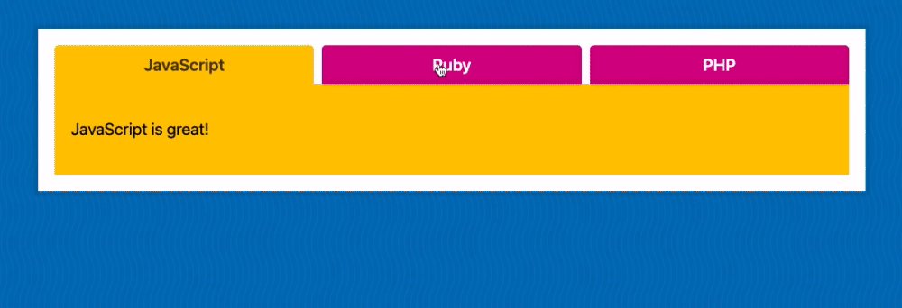
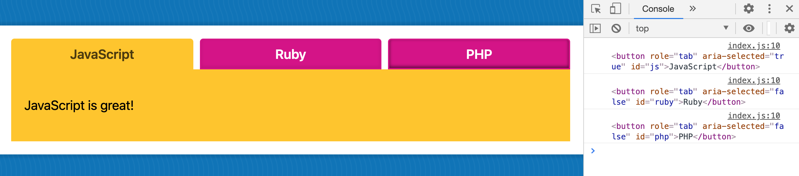
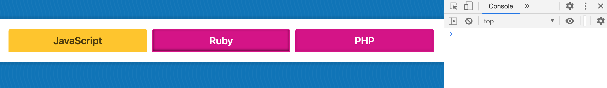
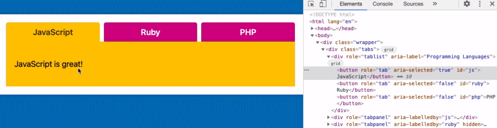
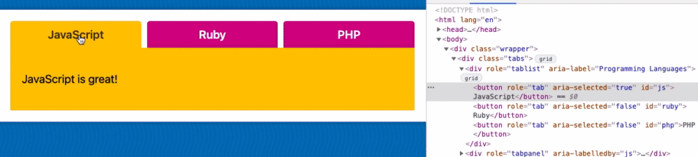

# Module 6 - Tabs

## What is this about?



- JavaScript, HTML, CSS
- click on one menu tab and show the current menu tab and the content that is associated with it
- hide other menu tabs and the content associated with them
- default state: show the first menu tab and the associated content

## Topics to cover

- "hiding and showing things"
- event listeners
- looping
- accessibility (use keyboard to tab over)
  - `<button>` is already accessible via keyboard, no need to "fix" the click event to work without mouse
  - `role` and `aria-selected` are used to make elements accessible and readable by search engines
  - `role="tablist" aria-label="Programming Languages"` for screen readers, "what is this list about"
- `aria-selected=" "` on `<button>` will maintain whether that element is currently active

## Exercise

#### How to log `currentTarget` in listening for a click on `tabButtons`

```
// select the outer div container
const tabs = document.querySelector('.tabs');

// select the tab buttons
const tabButtons = tabs.querySelectorAll('[role="tab"]');

function handleTabClick(eve) {
  console.log(eve.currentTarget);
}

tabButtons.forEach(button => button.addEventListener('click', handleTabClick));
```

- click on `tabButtons` returns `<button>` HTML element as `currentTarget`



#### Hide all `tabPanels` (the content)

```
// select the outer div container
const tabs = document.querySelector('.tabs');

// select the tab buttons
const tabButtons = tabs.querySelectorAll('[role="tab"]');

// select the tab panels divs
const tabPanels = tabs.querySelectorAll('[role="tabpanel"]');

function handleTabClick(eve) {
  // hide all tab panels
  // console.log(tabPanels); // NodeList with 3 DOM elements
  tabPanels.forEach(panel => {
    // console.log(panel); // single HTML element
    panel.hidden = true;
  });
}

tabButtons.forEach(button => button.addEventListener('click', handleTabClick));
```

- `function handeTabClick`
  - `forEach()` takes the NodeList of 3 DOM elements off of `tabPanels`, loops over every single one of them
  - for each one we get a variable of `panel` which is how we reference each of them
  - click on one `tabButtons` returns ALL three seperate HTML elements `tabPanels`!
  - using `panel.hidden = true` results in as soon as ANY `tabButtons` is clicked, ALL `tabPanels` are hidden



- it's easier to first hide them all (`panel.hidden = true;`) and then show the one that we want
- we _could_ filter for the ones that are not associated with the current one and only hide accordingly but it's not as easy as the other way

#### Mark all `tabButtons` as unselected

```
// select the outer div container
const tabs = document.querySelector('.tabs');

// select the tab buttons
const tabButtons = tabs.querySelectorAll('[role="tab"]');

// select the tab panels divs
const tabPanels = tabs.querySelectorAll('[role="tabpanel"]');

function handleTabClick(eve) {
  // hide all tab panels
  // console.log(tabPanels); // NodeList with 3 DOM elements
  tabPanels.forEach(panel => {
    // console.log(panel); // single HTML element
    panel.hidden = true;
  });

  // mark all tabs as unselected
  tabButtons.forEach(tabButton => {
    tabButton.setAttribute('aria-selected', false);
  })
}

tabButtons.forEach(button => button.addEventListener('click', handleTabClick));
```



`aria-selected` = how do you access a property when the property itself has a dash on it?<br>
**Any time you see an attribute with a dash on an HTML element, you can almost always access that with the camelcased version of it.**

For most properties in JavaScript (for example `tabButton.alt` or `tabButton.src` or `tabButton.title`) you can access the property on the element directly.<br>
For some properties though - including custom properties you made up as well as aria attributes - you CAN'T access directly via `tabButton.ariaSelected = false;`.<br>
You need `getAttribute()` and `setAttribute()` methods, like follows `tabButton.setAttribute('aria-selected', false);`

#### Mark the clicked `tabButtons` as selected

```
eve.currentTarget.setAttribute('aria-selected', true);
```



- a click on a `tabButtons` will toggle the `aria-selected` attribute
- prefer accessing via accessibility attribute over a class, as you don't have to maintain classes in two places
- styling comes in via css `button[aria-selected="true"] { ... }`

#### Find the associated `tabPanels` to `tabButtons` and show it

- example JavaScript menu tab: if somebody clicks on a `tabButtons` with an `<id="js">` on it, we need to find the associated `tabPanels` that has the `aria-labelledby="js"`

**With `querySelector`-ing, method 1**

```
// find the associated tabPanels to tabButtons and show it
// method 1
const id = eve.currentTarget.id;
const tabPanel = tabs.querySelector(`[aria-labelledby="${id}"]`);
tabPanel.hidden = false;
```

**With `find()` in the array() of `tabPanels`, method 2**

For this you need the original selection of `tabPanels` changed from<br>
`const tabPanels = tabs.querySelectorAll('[role="tabpanel"]');`<br>
to<br>
`const tabPanels = Array.from(tabs.querySelectorAll('[role="tabpanel"]'));`

```
// find the associated tabPanels (in the array of tabPanels) to tabButtons and show it
// method 2
const id = eve.currentTarget.id;
const tabPanel = tabPanels.find(panel => panel.getAttribute('aria-labelledby') === id);
tabPanel.hidden = false;
```

- we need to have `tabPanels` as an array, because before, it was a NodeList, we need it as an array to use `find()` on it
- within the `tabPanels` `<div>`s, find the `tabPanels` where the `labelledby` is equal to the `id`
- store the result of that in a variable `const tabPanel`
