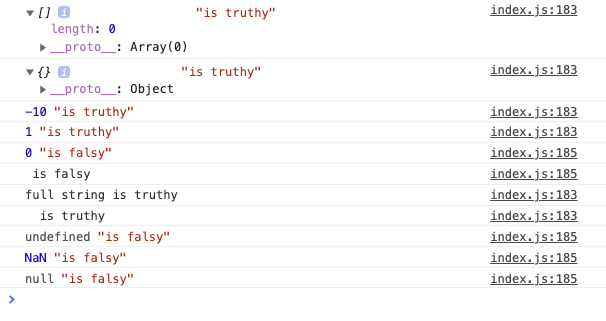

# Module 7 - Logic and Flow Control

As most of the "Module 7 - Logic and Flow Control" content (except for the animated turtle, see down below) is information and small coding bits, this README here is used as a notepad.

Please also [see index.html](./index.html) and [index.js](./index.js) in this module's folder to follow up with the coding bits.

[BEDMAS](#BEDMAS)

[Flow Control - If Statements, Function Returns, Truthy, Falsy](#Flow-Control)

[Coercion, Ternaries and Conditional Abuse](#Coercion-Ternaries-Conditional-Abuse)

[Case Switch and Animating a Turtle with CSS Variables](#Case-Switch)

[Intervals and Timers](#Intervals-and-Timers)

## BEDMAS

- **order of operations** in which JavaScript runs (exactly how math works)
  - Brackets (Parenthesis)
  - Exponents (to the power of)
  - Divisions
  - Multiplikation
  - Addition
  - Substraction

## Flow Control

### If Statements

- are the foundation of all logic in JavaScript
- expect Boolean (`true` or `false`) or some sort of condition that is evaluated to `true` or `false` (or `truthy` / `falsy`)

```
if (10 > 2) {
    console.log('Yo');
}
```

```
if (10 > 2) {
    console.log('Yo'); // Yo
} else if (11 > 10) {
    console.log('first else if yes'); // ignored
} else if (3 > 1) {
    console.log('second else if yes'); // ignored
}
```

- watch out: if the first statement returns `true`, the ones that follow will be ignored; as soon as an if statement finds itself to be `true`, it will skip the rest of the if statement
- check for multiple things to be `true` in using seperate statements

```
const alter = 50;

if (alter > 70) {
    console.log('In your seventies');
} else if (alter > 60) {
    console.log('In your sixties');
} else if (alter > 50) {
    console.log('In your fifties');
} else {
    console.log('Nothing was true');
}
```

- an `else` NEVER has a condition, it's just sort of a worst case scenario
- "if nothing is `true`, run me"

### If Statements inside of functions

- it's likely that to use an if statement inside of a function to return different values

```
function slugify(sentence, lowercase) {
    if (lowercase) {
        return sentence.replace(/\s/g, '-').toLowerCase();
    } else {
        return sentence.replace(/\s/g, '-');
    }
}
console.log(slugify('This, too, shall pass.')); // This,-too,-shall-pass.
console.log(slugify('This, too, shall pass.', true)); // this,-too,-shall-pass.
```

- regex
  - https://regex101.com/
  - `/\s/g, '-'`
  - always wrapped in an opening and closing `/`
  - inside, this `\s` means space
  - `g` means global
  - `'-'` means replace space with a dash

```
function slugify(sentence, lowercase) {
    if (lowercase) {
        return sentence.replace(/\s/g, '-').toLowerCase();
    }
    return sentence.replace(/\s/g, '-');
}
```

- it's the same as above
- `return` means return a value from a function and **stop that function from running**

```
function slugify3(sentence, lowercase) {

    let slug = sentence.replace(/\s/g, '-');

    if (lowercase) {
        return slug = slug.toLowerCase();
    } else {
        return slug;
    }
}
console.log(slugify3('Another One here')); // Another-One-here
console.log(slugify3('Another One here', true)); // another-one-here
```

### Operators

- equality: `=`, `==`, `===`

#### Almost always use `===`

- why are there `==` and `===` in the first place then? because of `null` and `undefined`

```
null === undefined // false
null == undefined // true
```

**Assignment to a `const` with `=`, won't work**

```
const age = 10 * 5 - 2; // 48
age = 48; // Uncaught TypeError: Assignment to constant variable. at <anonymous>:1:5
```

- the single `=` will set the value into a variable

**Checks for value with `==`**

```
const age = 10 * 5 - 2; // 48
age == 48; // true
age == '48'; // true
```

- returns `true`, as the value of age is 48
- `48` and `'48'` are technically the same thing, but they are not the same **type**

**Checks for type with `===`**

```
const age = 10 * 5 - 2; // 48
age === 48; // true
age === '48'; // false
console.log(typeof (48)); // number
console.log(typeof ('48')); // string
```

### other operators

```
10 > 10 // false
10 >= 10 // true
10 >==10 // Uncaught SyntaxError: Unexpected token '='
```

- why error with `10>==`? because `>=` or `<=` and `=` operators only ever deal with numbers
- if you use `'10' > 10`, `'10'` will be turned into a number

```
const naming = 'wes';
const lastNaming = 'bos';

if (naming === 'wes' || naming === 'scott') {
    console.log('cool name(s)'); // cool name(s)
    console.log(naming); // wes
}

if (naming === 'wes' && lastNaming === 'bos') {
    console.log(naming, lastNaming); // wes bos
}

if (naming === 'scott' || (naming === 'wes' && lastNaming === 'bos')) {
    console.log(naming, lastNaming); // wes bos
}
```

```
10 === 10 // true
10 === 10 && 5 === 5 // true
10 === 10 && 5 === 3 // false

true && true && true && true // true
true && true && false && true // false
true || true || false || true // true

```

- with `&&` if only one evaluates to `false`, everything is evaluated to `false`
- with `||` if one of them evaluates to `true`, everything is evaluated to `true`

### `true` and `false` with functions

```
const isAwesomeName = 'awesome'.includes(naming)
if (isAwesomeName) {
    console.log('super awesome'); // super awesome
}

// own function, that returns true or false
function nameIsAwesome(naming) {
    return 'awesome'.includes(naming);
}
if (nameIsAwesome('wes')) {
    console.log('own function wes'); // own function wes
}
```

### `truthy` and `falsy`

- an if statement does not only require `true` or `false`, but also takes in `truthy` or `falsy`

```
const dog = 'snickers';
if (dog) {
    console.log('you have a dog'); // you have a dog
} else {
    console.log('you don\'t have a dog'); //
}

const dog = '';
if (dog) {
    console.log('you have a dog'); // you have a dog
} else {
    console.log('you don\'t have a dog'); // you don't have a dog
}
```

- an empty string is not `true` and it's not `false`, it's a string
- so how come that this still works
- if statements take in a number of different values and will try to **coerce them** and will try to turn them into a Boolean of `true` or `false`

### check for `truthy` / `falsy` values

```
// GRAB ALL, LOOP OVER, TRUTHY OR FALSY
const values = [[], {}, -10, 1, 0, '', 'full string', ' ', undefined, NaN, null];

values.forEach(value => {
    if (value) {
        console.log(value, 'is truthy')
    } else {
        console.log(value, 'is falsy')
    }
});
```



### Truthy Values

**array**

- an array that has nothing in it is `truthy`
- if you have to check for anything IN an array, check for `.length()`
- `[1, 2, 3].length // 3` will be true
- `[].length // 0` will be false

**object**

- an object that has nothing in it is `truthy`
- if you have to check if anything is IN there, check `Object.keys({})`, will return to you an empty array where you then can use `.length` on: `Object.keys({}).length` and that's 0 (elements in it)

**-10**

- `truthy`

**1**

- `truthy`
- `1 == true // true`

**full string**

- `'some words'` a full string is `truthy`
- any string with content will be `truthy`
- so also `'0'` or `' '` will be `truthy`

### Falsy Values

**0**

- `0`, a zero will equate to `false`
- `0 == false // true`
- only `0` will be `falsy`, all other numbers will be `truthy`

**undefined**

- `falsy`

**NaN**

- `falsy`
- `score // NaN`

**`''`**

- `''` an empty string (without whitespace!) is `falsy`

## Coercion Ternaries Conditional Abuse

### Coercion

```
const isCool = true;

if (!isCool) {
    console.log('nope');
}
```

- `!` means "is not"
- `!` does coercion
- something of a different type (string, number...) will be taken and coerced into a real Boolean (`true` or `false`)

```
const holla = "ella";
!"ella" // false
!!"ella" // true
```

- `!` will coerce to `false`, `!!` will coerce to `true`

**`!` and `!!` take the fact that something has a `truthy` or `falsy` value and coerce that into a real Boolean.**

### Ternaries

- like a shorthand if statement
- helpful to quickly run functionality based on something being `true` or `false`
- it needs a condition, it needs what to do if `true`, it needs what to do if `false`

**If it's a simple if statement like below, that's too verbose and can be done better**

```
const count = 2;
let word;

if (count === 1) {
    word = 'item';
} else {
    word = 'items';
}
const sentence = `You have ${count} ${word} in your cart`;
console.log(sentence); // You have 2 items in your cart
```

**Ternary**

```
const count = 1;
const word = count === 1 ? 'item' : 'items';

const sentence = `You have ${count} ${word} in your cart`;
console.log(sentence); // You have 1 item in your cart
```

**Even shorter**

```
const count = 3;
const sentence = `You have ${count} items${count === 1 ? '' : 's'} in your cart`;
console.log(sentence); // You have 3 itemss in your cart
```

**Use with functions**

- how to do "nothing" in this statement? just type `null` (or an empty string `''`)
- using the `false` case is a must and cannot be left off

```
function showAdminBar() {
    console.log('Showing admin bar');
};
const isAdmin = true;
isAdmin ? showAdminBar() : null;
```

**`&&` trick**

- chaining: will check along the way if statements are true
- makes sure that all of these three are `true` before continuing

```
// && trick
function check1() {
    console.log('Running check1'); // Running check1
    return true;
}

function check2() {
    console.log('Running check2'); // Running check2
    return false;
}

function check3() {
    console.log('Running check3');
    return true;
}

if (check1() && check2() && check3()) {
    console.log('all checks passed');
} else {
    console.log('some checks failed'); // some checks failed
}
```

- the third check never runs
- if in a condition at any point of that condition one part is `false`, the condition is returned as `false`
- short circuiting, meaning that the whole condition knowingly was never finished

### Conditional Abuse

```
function showAdminBar() {
    console.log('Showing admin bar');
};
const isAdmin = true;
isAdmin && showAdminBar();
```

- previously `isAdmin ? showAdminBar() : null;` is changed to `isAdmin && showAdminBar();`
- if `isAdmin` is ever `false`, `showAdminBar()` will never run
- this a bit of abuse but totally works
- used in React a lot as if statements are hard to do there

**Statement block `{}`**

- if something is on the same line, the statement block is not needed and `{}` can be deleted

```
// this:
if (isAdmin) {
    showAdminBar();
}

// can be turned into this:
if (isAdmin) showAdminBar();
```

- question is if you _should_ do that

## Case Switch

### Switch

- pass it the thing that you are testing
- has cases, those cases HAVE to be clearly defined
- `break;` is needed after each single statement
- `default;` is needed at the end, (if something's going wrong in the other statements, there's at least `default;` to handle that)

```
switch (eve.key) {
    case 'ArrowUp':
        ...
        break;
    case 'ArrowDown':
        ...
        break;
    case 'ArrowLeft':
        ...
        break;
    case 'ArrowRight':
        ...
        break;
    default:
        console.log('that is not a valid move');
        break;
}
```

### Switch Turtle


See [html](./switch.html), [js](./switch.js) and [css](./styles.css) here.

- `turtle.png`
- make that turtle walk through pressing arrow keys 'up', 'down', 'left', 'right'
- add speed, flip over turtle (change direction), rotate
- update CSS variables with JavaScript

**How to add custom CSS properties to `style` in JavaScript**

```
turtle.style.background = 'red'; // works
turtle.style['background'] = 'yellow'; // works
turtle.style['border'] = `5px solid black`; // works
turtle.style['madeup'] = `5px solid green`; // does not work
```

- only CSS attributes that are "real" are going to be added to the turtle
- so how - when it's not a "real" CSS attribute - to apply custom CSS properties?
- this way:

```
.turt {
    --x: 0;
    --y: 0;
    transform: translate(var(--x)) translateY(var(--y));
}
```

- with `setAttribute();`

```
turtle.setAttribute('style', `
    --x: ${x}px;
    --y: ${y}px;
`);
```

## Intervals and Timers
