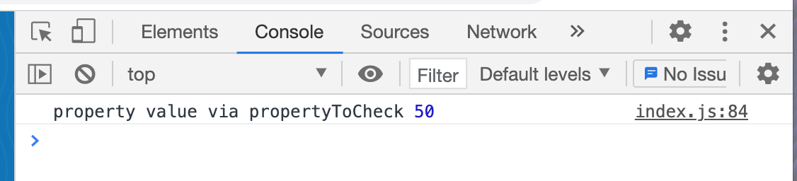
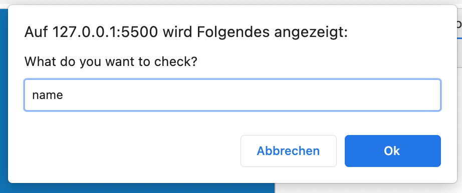
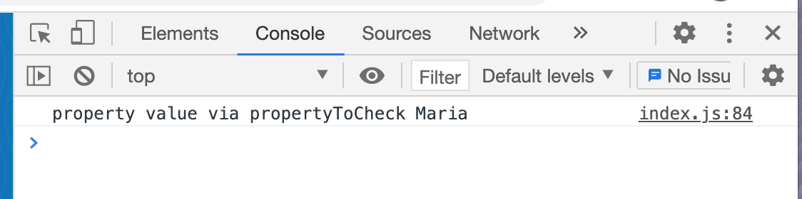
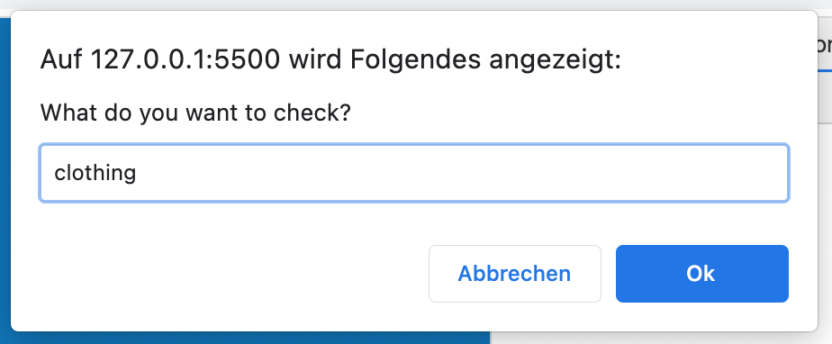
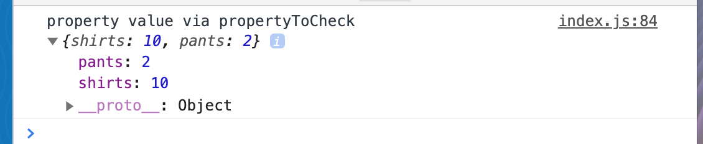

# Module 8 - Data Types

As most of the "Module 8 - Data Types" content is information and small coding bits, this README here is used as a notepad.

Please also [see index.html](./index.html) and [index.js](./index.js) in this module's folder to follow up with the coding bits.

[Objects](#Objects)

[Object Reference vs Values](#Object-Reference-vs-Values)

[Maps](#Maps)

[Arrays](#Arrays)

[Array Cardio Static Methods](#Array-Cardio-Static-Methods)

[Array Cardio Instance Methods](#Array-Cardio-Instance-Methods)

[Array Cardio Callback Methods and Function Generation](#Array-Cardio-Callback-Methods-and-Function-Generation)

## Objects

See [object.html](./object.html) and [object.js](./object.js) in this module's folder to follow up with the coding bits.

- Objects are fundamental building block of JavaScript, just like Strings, Numbers, Boolean
- actually everything in JavaScript is an object
- objects allow us to group together properties and values (keys and values)
- used for example for storing related data, storing functionality, all the way to creating custom types
- values of an object can be of any type

**Important: objects are used for where the order of the properties does not matter**

### Object Literal Syntax

```
const person = {
    name: 'Maria',
    age: 100,
}
```

```
// also possible but used rarely as the object literal syntax is much cleaner
const person = new Object({
    name: 'Maria',
    age: 100,
});
```

### Shorten

```
const age = 100;
const person = {
    name: 'Maria',
    age,
}
```

- if property and value are the same, it's possible to shorten to the property

### Create own properties

```
const age = 100;
const person = {
    name: 'Maria',
    age,
    'cool-dude': true,
    'really cool': true,
    '777': true,
}
```

- `'cool-dude'` will show up as a property with a dash in it
- `'really cool'` - spaces are possible in a property

**Reasoning to always put a comma at the end of the last property value pair**

- putting a new property value pair below the last one _way_ later in a coding process won't lead to a Syntax Error because of the missing comma
- when a Syntax Error is shown because of that missing comma, it will complain about the _newly_ added line - even though the comma is missing in the line _before_
- more important: Git
  - the person that has to add the next property value pair does not only have to add the new line but also needs to touch the line before to only add a comma
  - with Git Blame, that line will then fall on that person even though another person wrote the original code
- all modern browsers support putting a comma at the end of the last line

### Nested objects: access, adding and overwriting through dot notation

```
const age = 100;
const person = {
    name: 'Maria',
    age,
    clothing: {
        shirts: 10,
        pants: 2,
    }
};
console.log(person.age); // 100
person.job = 'Chef cook';
person.age = 50;
console.log(person.job); // Chef cook
console.log(person.age); // 50
```

**How is it possible to change a variable value that has been created with `const`?!**

- `const` does not mean that the VALUE of an object cannot be changed
- `const` means that the BINDING to `person` cannot be changed - properties CAN change but the actual object itself can never be overwritten entirely

### Immutable object

- freeze an entire object with `Object.freeze();`

```
const age = 100;
const maria = {
    name: 'Maria',
    age,
    clothing: {
        shirts: 10,
        pants: 2,
    }
};
console.log(maria.age); // age: 100

maria.job = 'Chef cook';
maria.age = 50;
console.log(maria.age); // age: 50

const mariaFroze = Object.freeze(maria);
maria.age = 75;
console.log(maria.age); // age: 50
```

- that's not going to freeze the original object though
- it will return a new object `mariaFroze`, and that object can never be changed

### Reason 1 for `[]`

```
const age = 100;
const person = {
    name: 'Maria',
    propertyToCheck: 'If I\'m logged - are you really looking for the property??',
    age,
    clothing: {
        shirts: 10,
        pants: 2,
    }
};
person.job = 'Chef cook';
person.age = 50;

console.log('regular log:', person.age); // regular log: 50
const propertyToCheck = prompt('What do you want to check?');

console.log('regular square brackets:', person['age']);
// regular square brackets: 50

console.log('propertyToCheck square brackets:', person[propertyToCheck]);
// whatever you type in the prompt (and is a value in the object) will be logged, e.g. propertyToCheck square brackets: 50

// will literally look for the property
console.log('propertyToCheck:', person.propertyToCheck);
// propertyToCheck: If I'm logged - are you really looking for the property??
```

**Why is there both - `.` and `[]`, as `[]` seem to be much uglier?**

- `person[propertyToCheck])` is not going to look for a property called `propertyToCheck`
- what `person[propertyToCheck])` will do is use the string in that variable as a property look-up








- `console.log(person.propertyToCheck);` will literally look for the property on that object
- that's the reason why `[]` are needed here `console.log('person[propertyToCheck]);` to reference the name of the property

### Reason 2 for `[]`

- if properties on an object are not referencable via JavaScript, you have to use a string

```
const age = 100;
const person = {
    name: 'Maria',
    age,
    'cool-dude': true,
    'really cool': true,
    '777': true,
    clothing: {
        shirts: 10,
        pants: 2,
    },
};

//console.log(person.cool - dude); // Uncaught ReferenceError: dude is not defined
//console.log(person.really cool); // Uncaught SyntaxError: missing ) after argument list
//console.log(person.777); // Uncaught SyntaxError: missing ) after argument list
```

- `person.cool-dude`, `person.really cool`, `person.777` are invalid property look-ups
- if that's the case, use square bracket notation, to access those

```
console.log(person['cool-dude']); // true
console.log(person['really cool']); // true
console.log(person[777]); // true
```

**Why is that necessary in the first place?**

Data from another language, or data from a server side, so you don't have a choice or a lot of options - then you need bracket notation in order to reference that data.

### Referencing multiple levels deep

```
const age = 100;
const person = {
    name: 'Maria',
    age,
    clothing: {
        shirts: 10,
        pants: 2,
    },
    'hey man': {
        shoes: 4,
    },
};

console.log('multiple level reference:', person.clothing.shirts);
// multiple level reference: 10

console.log('multiple level reference:', person['hey man'].shoes);
// multiple level reference: 4
```

### Check for existance

Exists in HTML:

```
<input type="text" name="first" value="valuehere">

const nameInput = document.querySelector('[name="first"]');
const naming = nameInput.value;
console.log(nameInput);
// <input type="text" name="first" value="valuehere">
console.log(naming); // valuehere
```

Does not exist in HTML:

```
const notPresentInput = document.querySelector('[name="not-present"]');
const nomen = notPresentInput.value;
// Uncaught TypeError: Cannot read property 'value' of null
console.log(notPresentInput); // null
```

Check for existance in HTML:

```
const noma = notPresentInput ? notPresentInput.value : '';
console.log(noma); // will return an empty string
```

- it's pretty common to check like this<br>
  `const noma = notPresentInput ? notPresentInput.value : '';`

### Move a property from an object

With `delete`, delete a property from an object

```
const age = 100;
const person = {
    name: 'Maria',
    age,
    clothing: {
        shirts: 10,
        pants: 2,
    },
    'hey man': {
        shoes: 4,
    },
};
const deleted = delete person['hey man'];
console.log(deleted); // true
console.log(delete person['hey man']); // true
console.log(person); // will log the object without deleted property
console.log(person['hey man']); // undefined
```

- `delete` will return `true` or `false`

With `null` and `undefined`? Nope, not really.

```
person.age = null;
person.age = undefined;
```

- won't delete, but will in some cases/in some frameworks just allow to be skipped over

### Methods

**What's the difference between a method and a function?**

A method is a function that lives inside of an object:

```
const age = 100;
const person = {
    name: 'Maria',
    age,
    sayHello: function (greeting = 'Hola') {
        return `${greeting} ${this.name}!`;
    },
};
console.log(person.sayHello()); // Hola Maria!
console.log(person.sayHello('HIIIIIII,')); // HIIIIIII, Maria!
```

- set `function (greeting = 'hola')` as the default value

**What is `this`?**

- look at a method and the left side of the dot: `this` will always be equal to the left of the dot
- for prototyping, to use a method on multiple instances, not only on `person`,
- when you have a function that lives on a property in an object (like here), that function is referred to as a method of that object
- more on that in future courses

### Method shorthand

```
sayHello(greeting = 'Hola') {
    return `${greeting} ${this.name}!`;
},
```

- this is not an arrow function!

### Method arrow function

```
const age = 100;
const person = {
    name: 'Maria',
    age,
    sneeze: () => {
        console.log('regular log:', 'ahhhchoooo');
        // regular log: ahhhchoooo

        console.log('with this:', 'ahhhchoooo', this);
        // with this: ahhhchoooo Window {window: Window, self: Window, document: document, name: "", location: Location, …}
    },
};
person.sneeze();
```

- `this` is equal to `window`
- because it is an arrow function as a property on an object, there is no access to the `this` keyword

### Method regular function

```
const age = 100;
const person = {
    name: 'Maria',
    age,
    sneeze1: function () {
        console.log('regular function:', 'brrrr', this);
        // regular function: brrrr {name: "Maria", age: 100, sneeze: ƒ, sneeze1: ƒ}
    }
};
person.sneeze1();
```

- `this` is equal to `person`

**Arrow functions do not scope `this` to the thing that they are called against.**

## Object Reference vs Values

### Strings

```
let name1 = 'betty';
let name2 = 'betty';
console.log(name1 === name2); // true

name1 = 'paul';
console.log(name1); // paul
console.log(name2); // betty
console.log(name1 === name2); // false

name1 = name2;
console.log(name1); // betty (!)
console.log(name1 === name2); // true

name2 = 'bettina';
console.log(name1 === name2); // false
console.log(name2); // bettina
```

- `===` checks the type: is string, the value: is exactly the same
- when taking `name1` and setting it to `name2` like this `name1 = name2;`, the value of `name2` is taken, copied and pasted into `name1`
- when one of the variables is updated, the other one that has been pointing to does not update itself

### Objects

**Why is that `false`?**

```
const person1 = {
    first: 'todd',
    last: 'smith',
};

const person2 = {
    first: 'todd',
    last: 'smith',
};

console.log(person1 === person2); // false
```

- when you are comparing objects, it is done by reference to the object itself, NOT the values inside of it. So even if the content is exactly the same, it is NOT the same object.

**What's going on here?**

```
const person1 = {
    first: 'todd',
    last: 'smith',
};

const person2 = {
    first: 'todd',
    last: 'smith',
};

console.log(person1 === person2); // false

const person3 = person1;
person1.first = 'teddy';
console.log(person3.first); // teddy
console.log(person1.first); // teddy (!)
```

- `person3` has been updated and `person1` was ALSO updated

**Why is `person1` being updated?**

```
const person1 = {
    first: 'todd',
    last: 'smith',
};

const person2 = {
    first: 'todd',
    last: 'smith',
};

console.log(person1 === person2); // false

const person3 = person1;
person1.first = 'teddy';

console.log(person3.first); // teddy
console.log(person1.first); // teddy (!)

console.log(person1); // {first: "teddy", last: "smith"}
console.log(person2); // {first: "todd", last: "smith"}
console.log(person3); // {first: "teddy", last: "smith"}

person3.last = 'cool';

console.log(person3); // {first: "teddy", last: "cool"}
console.log(person1); // {first: "teddy", last: "cool"}
```

- this is a fundamental concept of JavaScript that will come and bite you in the butt
- with this `const person3 = person1;`, we are not taking a copy, we are simply creating a variable `person3` that references/points to the original variable
- `person3` never was its own object, it was just pointing to the orginal object `person1`

### How to take a copy then?

- spread `...` operator or `Object.assign()` operator
- copying will only work one level deep
- "shallow copy"

**Copy via spread operator**

- takes in every single item in an object
- takes a copy of single item
- spreads them into a new object

```
const person1 = {
    first: 'todd',
    last: 'smith',
};

const person2 = {
    first: 'todd',
    last: 'smith',
};

const person3 = { ...person1 };
console.log(person3); // {first: "todd", last: "smith"}

person3.first = 'Larry';
console.log(person3.first); // Larry
console.log(person1.first); // todd
console.log(person3); // {first: "Larry", last: "smith"}
```

**Copy via Oject.assign()**

- not that popular anymore since spread has been introduced
- first argument is an empty object, second argument is the object that is supposed to be fold into the first argument empty object

```
const person4 = Object.assign({}, person1);
console.log(person3); // {first: "Larry", last: "smith"}
```

**Copying this way only goes one level deep**

```
const person1 = {
    first: 'todd',
    last: 'smith',
    clothing: {
        shirts: 2,
        shoes: 4,
    },
};

const person2 = {
    first: 'todd',
    last: 'smith',
};

const person3 = { ...person1 };
console.log(person3);
// {first: "todd", last: "smith", clothing: {{shirts: 2, shoes: 4}}}

person3.clothing.shirts = 100;
console.log(person3);
// {first: "todd", last: "smith", clothing: {{shirts: 100, shoes: 4}}}

console.log(person1);
// {first: "todd", last: "smith", clothing: {{shirts: 100, shoes: 4}}}
```

- changes you do on the newly created `person3` object will also be done on the spreaded object `person1`

### Deep Copy / Deep Clone

- via utility library, for example lodash https://lodash.com/
- lots of methods to work with objects and arrays
- can be included in your script
- all of lodash method live in the `_`
- `_.cloneDeep(value)` https://lodash.com/docs/4.17.15#cloneDeep

**How to work with lodash?**

- use https://unpkg.com/#/
- change URL to https://unpkg.com/lodash@4.17.21/lodash.js will return the most recent lodash version
- then take that URL and have it as a script tag right before your own scripts start

```
<body>
    ...
    <script src="https://unpkg.com/lodash@4.17.21/lodash.js"></script>
    <script src="./ref-vs-value.js"></script>
</body>
```

```
const person1 = {
    first: 'todd',
    last: 'smith',
    clothing: {
        shirts: 2,
        shoes: 4,
    },
};

const person2 = {
    first: 'todd',
    last: 'smith',
};

const person3 = _.cloneDeep(person1);
person3.clothing.shirts = 100;

console.log(person1);
// {first: "todd", last: "smith", clothing: {{shirts: 2, shoes: 4}}}

console.log(person3);
// {first: "todd", last: "smith", clothing: {{shirts: 100, shoes: 4}}}
```

### Merging objects with spread

```
const meatInventory = {
    bacon: 2,
    sausage: 3,
    oyster: 2,
};

const veggieInventory = {
    lettuce: 5,
    tomatoes: 3,
    oyster: 10,
};

const inventory = {
    ...meatInventory,
    ...veggieInventory,
    lobsters: 5
};
console.log(inventory);
// bacon: 2 lettuce: 5 lobsters: 5 oyster: 10 sausage: 3 tomatoes: 3
```

- you can spead in as many objects as you want
- you can add your own property value pair
- **in case of duplicates the last one in the code wins and overwrites the one before**

### Reference vs copy in functions

```
let name1 = 'betty';

function doStuff(data) {
    data = 'something else';
    console.log(data); // something else
}

doStuff(name1);
console.log(name1); // betty
```

- when we pass in `name1` to `doStuff()`, it only passes in the value
- it does NOT reference to the external variable

### Reference vs copy with objects in functions

```
const meatInventory = {
    bacon: 2,
    sausage: 3,
};

const veggieInventory = {
    lettuce: 5,
    tomatoes: 3,
};

const inventory = {
    ...meatInventory,
    ...veggieInventory,
};

function doStuff2(data) {
    data.tomatoes = 5000;
    console.log(data);
    // bacon: 2 lettuce: 5 sausage: 3 tomatoes: 5000
}

doStuff2(inventory);
console.log(inventory);
// bacon: 2 lettuce: 5 sausage: 3 tomatoes: 5000
```

- when you pass in an object into a function, and you modify that object, the external object will also be updated

## Maps

## Arrays

## Array Cardio Static Methods

## Array Cardio Instance Methods

## Array Cardio Callback Methods and Function Generation
