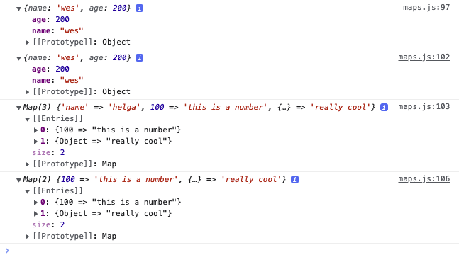
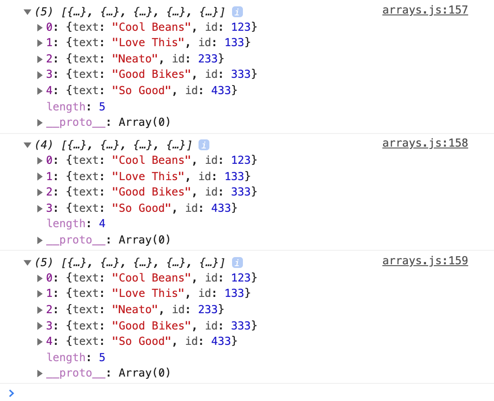
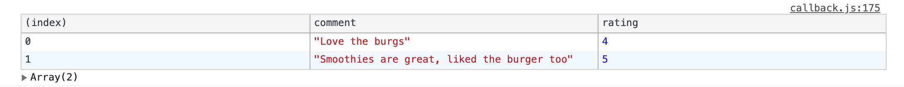
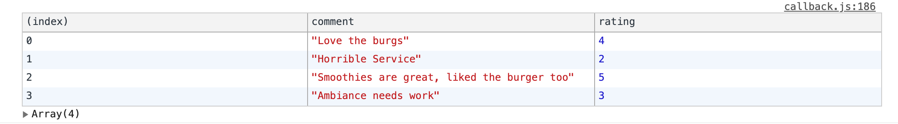

# Module 8 - Data Types

As most of the content is information and small coding bits, this README here is used as a notepad. <br>
This module contains no project. <br>

[Objects](#Objects)

[Object Reference vs Values](#Object-Reference-vs-Values)

[Maps](#Maps)

[Arrays](#Arrays)

[Array Cardio Static Methods](#Array-Cardio-Static-Methods)

[Array Cardio Instance Methods](#Array-Cardio-Instance-Methods)

[Array Cardio Callback Methods and Function Generation](#Array-Cardio-Callback-Methods-and-Function-Generation)

## Objects

**Following examples are referring to `object.html` and `object.js`**

- objects are one fundamental building block of JavaScript, just like strings, numbers, boolean
- actually everything in JavaScript is an object
- objects allow us to group together properties and values (keys and values)
- used for example for storing related data, storing functionality, creating your own custom types
- values of an object can be of _any_ type

**Important: objects can be used for where the order of the properties does not matter. You cannot trust the order in an object.**

### Object Literal Syntax

```
const person = {
  name: 'Helga',
  age: 100,
};
console.log(person); // {name: 'Helga', age: 100}
```

### Also possible but used rarely as the object literal syntax is much cleaner

```
const person = new Object({
  name: 'Helga',
  age: 100,
});
```

### Shorten a property/value pair

```
const age = 100;
const name = 'Helga';
const person = {
  name: name,
  age: age,
};
// can be shortened to
const person = { name, age };
console.log(person);
```
- if property and value are the same, it's possible to shorten to the property

### Create own properties

```
const person = {
  name: 'Helga',
  age: 100,
  'cool-dude': true,
  'really cool': true,
  '777': true,
};
console.log(person); // {777: true, name: 'Helga', age: 100, cool-dude: true, really cool: true}
```
- you can have properties with a dash in them
- you can have properties with spaces in them

**Reasoning to always put a comma at the end of the last property value pair**

- when a Syntax Error is shown because of a missing comma it will complain about the _newly_ added line - even though the comma is missing in the line _before_
- more important: Git
  - the person that has to add the next property value pair does not only have to add the new line but also needs to touch the line before to only add a comma
  - with Git Blame, that line will then fall on that person even though another person wrote the original code
- all modern browsers support putting a comma at the end of the last line

### Nested objects: access, add and overwrite through dot notation

```
const person = {
  name: 'Helga',
  age: 100,
  clothing: {
    shirts: 10,
    pants: 2,
  }
};
console.log(person.age); // 100
person.job = 'Chef cook';
person.age = 50;
console.log(person.job); // Chef cook
console.log(person.age); // 50
```

**Why is it possible to change a variable value that has been created with `const`?!**

- `const` does NOT mean that the VALUE of an object cannot be changed
- `const` means that the BINDING to `person` cannot be changed
- "a person can evole and get older, have another profession - so that can change but not the person itself"
- properties CAN change but the actual object itself (`person`) can never be overwritten entirely
### Immutable object

- freeze an entire object with `Object.freeze();`

```
const helga = {
  name: 'Helga',
  age: 100,
};
console.log(helga.age); // age: 100

helga.job = 'Chef cook';
helga.age = 50;
console.log(helga.age); // age: 50

const helgaFroze = Object.freeze(helga);
helga.age = 75;
console.log(helga.age); // age: 50
```

- that's not going to freeze the original object `helga` though
- it will return a new object `helgaFroze`, which can never be changed

### Bracket Notation - reason 1 for `[]`

```
const age = 100;
const person = {
  name: 'Helga',
  propertyToCheck: 'If I\'m logged - are you really looking for the property??',
  age: 100,
  clothing: {
    shirts: 10,
    pants: 2,
  }
};
person.job = 'Chef cook';
person.age = 50;

console.log('regular log:', person.age); // regular log: 50

const propertyToCheck = prompt('What do you want to check?');

console.log('regular square brackets:', person['age']); // regular square brackets: 50

// whatever you type in the prompt (and is a property in the object) will be logged
console.log('propertyToCheck square brackets:', person[propertyToCheck]);
// will literally look for the property 'propertyToCheck' and will log its value
console.log('propertyToCheck:', person.propertyToCheck);
```

**Why is there both `.` and `[]` - as `[]` seem to be much uglier?**

- `person[propertyToCheck])` is not going to look for a property called `propertyToCheck`
- what `person[propertyToCheck])` will do is use the string in that variable as a property look-up
- `console.log(person.propertyToCheck);` will literally look for the PROPERTY `propertyToCheck` on that object
- that's the reason why `[]` are used: `console.log('person[propertyToCheck]);` to reference the NAME of the property

### Bracket Notation - reason 2 for `[]`

- if properties on an object are not referencable via JavaScript, you have to use a string

```
const person = {
  name: 'Helga',
  age: 100,
  'cool-dude': true,
  'really cool': true,
  '777': true,
};

// console.log(person.cool-dude);
// Uncaught ReferenceError: dude is not defined

// console.log(person.cool - dude);
// Uncaught ReferenceError: dude is not defined

// console.log(person.really cool);
// Uncaught SyntaxError: missing ) after argument list

// console.log(person.777);
// Uncaught SyntaxError: missing ) after argument list

console.log(person['cool-dude']); // true
console.log(person['really cool']); // true
console.log(person[777]); // true
```

- `person.cool-dude`, `person.cool - dude`, `person.really cool`, `person.777` are invalid property look-ups
- if that's the case, use square bracket notation, to access those

**Why is that necessary in the first place?**

If you receive data from another language or data from a server side you don't have a choice or a lot of options - you need bracket notation in order to reference that data.

### Referencing multiple levels deep

```
const person = {
  name: 'Helga',
  age: 100,
  clothing: {
    shirts: 10,
    pants: 2,
  },
  'hey man': {
    shoes: 4,
  },
};

console.log(person.clothing.shirts); // 10
console.log(person['hey man'].shoes); // 4
```

### Check for existance

HTML:

```
<input type="text" name="first" value="valuehere">
```

JavaScript:
```
const nameInput = document.querySelector('[name="first"]');
const naming = nameInput.value;
console.log(nameInput); // input object
console.log(naming); // valuehere

const notPresentInput = document.querySelector('[name="not-present"]');
console.log(notPresentInput); // null
// const nomen = notPresentInput.value; // Uncaught TypeError: Cannot read property 'value' of null

const noma = notPresentInput ? notPresentInput.value : 'not present';
console.log(noma); // not present
```

- it's pretty common to check like this and return an empty string<br>
  `const noma = notPresentInput ? notPresentInput.value : '';`

### Move a property from an object

- with `delete`, delete a property from an object
- `delete` will return `true` or `false`

```
const person = {
  name: 'Helga',
  age: 100,
  clothing: {
    shirts: 10,
    pants: 2,
  },
  'hey man': {
    shoes: 4,
  },
};
const deleted = delete person['hey man'];
console.log(deleted); // true
console.log(delete person['hey man']); // true
console.log(person); // will log the object without deleted property 'hey man'
console.log(person['hey man']); // undefined, because deleted
```
### Methods

**What's the difference between a method and a function?**

A method is a function that lives inside of an object.

```
const person = {
  name: 'Helga',
  age: 100,
  sayHello: function (greeting = 'Hola') {
    return `${greeting} ${this.name}!`;
  },
};
console.log(person.sayHello()); // Hola Helga!
console.log(person.sayHello('HIIIIIII,')); // HIIIIIII, Helga!
```

**What is `this`?**

- `this` will always be equal to the left of the dot
- in this case `this` is equal to (the object) `person`
- for prototyping, to use a method on multiple instances, not only on `person`,
- more on that in future courses

### Method shorthand

```
const person = {
  name: 'Helga',
  age: 100,
  sayHello(greeting = 'Hola') {
    return `${greeting} ${this.name}!`;
  },
};
console.log(person.sayHello()); // Hola Helga!
console.log(person.sayHello('HIIIIIII,')); // HIIIIIII, Helga!
```

### Method arrow function

```
const person = {
  name: 'Helga',
  age: 100,
  sneeze: () => {
    console.log('regular log:', 'ahhhchoooo');
    // regular log: ahhhchoooo

    console.log('with this:', 'ahhhchoooo', this);
    // with this: ahhhchoooo Window {window: Window, self: Window, document: document, name: "", location: Location, …}
  },
};
person.sneeze();
```

- `this` is equal to `window`
- because it is an arrow function as a property on an object, there is no access to the `this` keyword

### Method regular function

```
  name: 'Helga',
  age: 100,
  sneeze1: function () {
    console.log('regular function:', 'brrrr', this);
    // regular function: brrrr {name: "Helga", age: 100, sneeze: ƒ, sneeze1: ƒ}
  }
};
person.sneeze1();
```

- `this` is equal to (the object) `person`

**Arrow functions do not scope `this` to the thing that they are called against, the parent scope will inherit `this`.**

## Object Reference vs Values

See [ref-vs-value.html](./ref-vs-value.html) and [ref-vs-value.js](./ref-vs-value.js) in this module's folder to follow up with the coding bits.

### Strings

```
let name1 = 'betty';
let name2 = 'betty';
console.log(name1 === name2); // true

name1 = 'paul';
console.log(name1); // paul
console.log(name2); // betty
console.log(name1 === name2); // false

name1 = name2;
console.log(name1); // betty (!)
console.log(name1 === name2); // true

name2 = 'bettina';
console.log(name1 === name2); // false
console.log(name2); // bettina
```

- `===` checks
  - the type: is string
  - the value: is exactly the same?
- when taking `name1` and setting it to `name2` like this `name1 = name2;`, the value of `name2` is taken, copied and pasted into `name1`
- when one of the variables is updated, the other one that has been pointing to does not update itself

### Objects

**Why is that `false`?**

```
const person1 = {
    first: 'todd',
    last: 'smith',
};

const person2 = {
    first: 'todd',
    last: 'smith',
};

console.log(person1 === person2); // false
```

- when you are comparing objects, it is done by reference to the object itself, NOT the values inside of it
- even if the content is exactly the same, it is NOT the same object

**What's going on here?**

```
const person1 = {
    first: 'todd',
    last: 'smith',
};

const person2 = {
    first: 'todd',
    last: 'smith',
};

console.log(person1 === person2); // false

const person3 = person1;
person1.first = 'teddy';
console.log(person3.first); // teddy
console.log(person1.first); // teddy (!)
```

- `person3` has been updated and `person1` was ALSO updated

**Why is `person1` being updated?**

```
const person1 = {
    first: 'todd',
    last: 'smith',
};

const person2 = {
    first: 'todd',
    last: 'smith',
};

console.log(person1 === person2); // false

const person3 = person1;
person1.first = 'teddy';

console.log(person3.first); // teddy
console.log(person1.first); // teddy (!)

console.log(person1); // {first: "teddy", last: "smith"}
console.log(person2); // {first: "todd", last: "smith"}
console.log(person3); // {first: "teddy", last: "smith"}

person3.last = 'cool';

console.log(person3); // {first: "teddy", last: "cool"}
console.log(person1); // {first: "teddy", last: "cool"}
```

- this is a fundamental concept of JavaScript that will come and bite you in the butt
- with this `const person3 = person1;`, we are not taking a copy, we are simply creating a variable `person3` that references/points to the original variable
- `person3` never was its own object, it was just pointing to the orginal object `person1`

### How to take a copy then?

- spread `...` operator or `Object.assign()` operator
- copying will only work one level deep!
- "shallow copy"

**Copy via spread operator**

- takes in every single item in an object
- takes a copy of single item
- spreads them into a new object

```
const person1 = {
    first: 'todd',
    last: 'smith',
};

const person2 = {
    first: 'todd',
    last: 'smith',
};

const person3 = { ...person1 };
console.log(person3); // {first: "todd", last: "smith"}

person3.first = 'Larry';
console.log(person3.first); // Larry
console.log(person1.first); // todd
console.log(person3); // {first: "Larry", last: "smith"}
```

**Copy via Oject.assign()**

- not that popular anymore since spread has been introduced
- first argument is an empty object
- second argument is the object that is supposed to be fold into the first argument's empty object

```
const person4 = Object.assign({}, person1);
console.log(person3); // {first: "Larry", last: "smith"}
```

**Copying this way only goes one level deep!**

```
const person1 = {
    first: 'todd',
    last: 'smith',
    clothing: {
        shirts: 2,
        shoes: 4,
    },
};

const person2 = {
    first: 'todd',
    last: 'smith',
};

const person3 = { ...person1 };
console.log(person3);
// {first: "todd", last: "smith", clothing: {{shirts: 2, shoes: 4}}}

person3.clothing.shirts = 100;
console.log(person3);
// {first: "todd", last: "smith", clothing: {{shirts: 100, shoes: 4}}}

console.log(person1);
// {first: "todd", last: "smith", clothing: {{shirts: 100, shoes: 4}}}
```

- changes you do on the newly created `person3` object will also be done on the spreaded object `person1`

### Deep Copy / Deep Clone

- via utility library, for example lodash https://lodash.com/
- has lots of methods to work with objects and arrays
- can be included in your script
- all of lodash method live in the `_`
- `_.cloneDeep(value)` https://lodash.com/docs/4.17.15#cloneDeep

**How to work with lodash?**

- use https://unpkg.com/#/
- change URL to https://unpkg.com/lodash@4.17.21/lodash.js will return the most recent lodash version
- then take that URL and have it as a script tag in your HTML, right before your own scripts start

```
<body>
    ...
    <script src="https://unpkg.com/lodash@4.17.21/lodash.js"></script>
    <script src="./ref-vs-value.js"></script>
</body>
```

```
const person1 = {
    first: 'todd',
    last: 'smith',
    clothing: {
        shirts: 2,
        shoes: 4,
    },
};

const person2 = {
    first: 'todd',
    last: 'smith',
};

const person3 = _.cloneDeep(person1);
person3.clothing.shirts = 100;

console.log(person1);
// {first: "todd", last: "smith", clothing: {{shirts: 2, shoes: 4}}}

console.log(person3);
// {first: "todd", last: "smith", clothing: {{shirts: 100, shoes: 4}}}
```

### Merging objects with spread

```
const meatInventory = {
    bacon: 2,
    sausage: 3,
    oyster: 2,
};

const veggieInventory = {
    lettuce: 5,
    tomatoes: 3,
    oyster: 10,
};

const inventory = {
    ...meatInventory,
    ...veggieInventory,
    lobsters: 5
};
console.log(inventory);
// bacon: 2 lettuce: 5 lobsters: 5 oyster: 10 sausage: 3 tomatoes: 3
```

- you can spead in as many objects as you want
- you can add your own property value pair
- **in case of duplicates, the last one in the code wins and overwrites the one before**

### Reference vs copy in functions

```
let name1 = 'betty';

function doStuff(data) {
    data = 'something else';
    console.log(data); // something else
}

doStuff(name1);
console.log(name1); // betty
```

- when we pass in `name1` to `doStuff()`, it only passes in the value
- it does NOT reference to the external variable

### Reference vs copy with objects in functions

```
const meatInventory = {
    bacon: 2,
    sausage: 3,
};

const veggieInventory = {
    lettuce: 5,
    tomatoes: 3,
};

const inventory = {
    ...meatInventory,
    ...veggieInventory,
};

function doStuff2(data) {
    data.tomatoes = 5000;
    console.log(data);
    // bacon: 2 lettuce: 5 sausage: 3 tomatoes: 5000
}

doStuff2(inventory);
console.log(inventory);
// bacon: 2 lettuce: 5 sausage: 3 tomatoes: 5000
```

- when you pass in an object into a function, and you modify that object, the external object will also be updated

## Maps

See [maps.html](./maps.html) and [maps.js](./maps.js) in this module's folder to follow up with the coding bits.

- a `map` is very similar to an object
- a `map` is simply for storing data
- in order to add/delete items we have
  - the `.set()` API
  - the `.get()` API
  - the `.has()` API
  - the `.delete()` API
- PROS of `map`
  - the above mentioned methods
  - the keys and the values can be of ANY type
    - previously in the course, there only was the ability to put different types in the VALUE portion of an object
    - a `map` allows to put ANY type into the key AND value
  - order IS guaranteed (with an object, order is NOT guaranteed)
- CONS of `map`
  - there is no object literal syntax (as is with objects), we have to create a `new Map()` and then set the items (you _can_ pass items into a `map` though, with array of arrays)
  - you cannot put functions inside of `map` (as you can with objects), that's not what `map` is for
  - JSON
    - currently JSON does not handle `map`
    - if you use `map` and want to send your code for example via email, you have to convert it to an object first to then make it a JSON
    - `Object.fromEntries()` tries its best to convert to an object

**In a lot of the exercises that will follow - whenever there's the need to create an object - first is should be evaluated if `map` can be used.**

Why would you want to use a `map` over an object?<br>
Use `map` if you do need to maintain the order of your items.

```
const myMap = new Map();

myMap.set('name', 'wes');
myMap.age = 100;

console.log(myMap);
```


- `.set(key, value)` takes two arguments, first one is the key, second one is the value you want to set
- "Entries" are the actual values in the `map`
- `age` is not in the same spot, it's a property ON `map` but NOT an actual entry IN `map`

### Example dictionary

Dictionaries are a way to store additional metadata about something.

```
const person1 = {
    name: 'wes',
    age: 200,
};

const myMap = new Map();

myMap.set('name', 'wes');
myMap.set(100, 'this is a number');
myMap.set(person1, 'really cool');

console.log(myMap);
console.log(myMap.get(person1));
```


- to store additional information inside of `map` use the reference to `person1` object as a key in `map`: `myMap.set(person1, 'really cool');`
- the key is actually an object and the value is `'really cool'`

```
const person1 = {
    name: 'wes',
    age: 200,
}

myMap.set('name', 'wes');
myMap.set(100, 'this is a number');
myMap.set(person1, 'really cool');

console.log(myMap);
console.log(myMap.get(person1));
```


- use the nice `get()` method, instead of using a unique string or an ID to look the value up later
- use the reference of the object as the key in the map `console.log(myMap.get(person1));`

### Example score

Somebody has some scores that they want to store some additional information about.

```
const score = 100;
const prizes = new Map();
prizes.set(100, 'bear');
prizes.set(200, 'duck');
prizes.set(300, 'cat');

console.log(`you win a ${prizes.get(score)}`);
// you win a bear
```

- previously, if this was an object, we would have to use a string of the number to look it up
- in this case we can simply use a number `const score = 200` to look up what the corresponding prize is

### Example looping - return of value

```
const score = 100;
const prizes = new Map();
prizes.set(100, 'bear');
prizes.set(200, 'duck');
prizes.set(300, 'cat');

const ul = document.querySelector('.prizes');
// returns the value
prizes.forEach(entry => {
    console.log(entry);
});
```


### Example looping - returns array with key AND value

```
const score = 100;
const prizes = new Map();
prizes.set(100, 'bear');
prizes.set(200, 'duck');
prizes.set(300, 'cat');

// returns array with key and value
for (const prize of prizes) {
    console.log(prize);
    console.log(prize[0]);
    console.log(prize[1]);
    console.log(prize[2]);
}
```


### Destructuring and creating `<ul>`, `<li>` in the HTML

```
const score = 100;
const prizes = new Map();
prizes.set(100, 'bear');
prizes.set(200, 'duck');
prizes.set(300, 'cat');

const ul = document.querySelector('.prizes');
for (const [points, prize] of prizes) {
    console.log(points, prize);

    const li = `<li>${points} - ${prize}</li>`;
    ul.insertAdjacentHTML('beforeend', li);
};
```


### Example Array of Arrays

```
const arrayOfArrays = new Map([
    ['name', 'bella'],
    ['age', '75']
]);
console.log(arrayOfArrays);
```


- object literal syntax is a bit nicer than that though

### `.delete()` a property

```
const person1 = {
    name: 'wes',
    age: 200,
};
const myMap = new Map();
myMap.set('name', 'wes');
myMap.set(100, 'this is a number');
myMap.set(person1, 'really cool');
myMap.delete('name');

console.log(myMap);
```



## Arrays

See [arrays.html](./arrays.html) and [arrays.js](./arrays.js) in this module's folder to follow up with the coding bits.

### What's an array?

- an array is used to hold a list of items where the order matters
- each thing in an array is called an item
- each item in an array can be of any type
- each item's position is called an index
- the number of items inside of an array is called a length
- an array has no keys, the keys are always going to be indexes
- whereas the `{}` are for an object, `[]` are for an array
- an array is of type object (!), it is NOT its own type
- an array can hold data that has a bunch of methods on them that live inside of the array
- arrays are zero-based, the counting starts at `0`

### Array Literal Syntax

```
const names = [];

// similar as with objects, you can also do this
const names1 = new Array();
```

```
const names = ['wes', 'kait', 'snickers'];
console.log(names);
console.log(typeof names); // object
```


```
// check typeof
console.log(typeof names); // object

// check if type is array
console.log(Array.isArray(names)); // true

// access items via index
console.log(names[1]); // kait

// check for length
console.log(names.length); // 3

// check for the last item
console.log(names[names.length - 1]); // will return the last one: snickers
```

### Methods

Most of the methods are immutable, but there are some to be careful with (will be addressed later in the course)

#### Mutable

- mutable methods perform mutations, they DO change the original data

```
const numbers = [1, 2, 3, 4, 5, 6, 7, 8, 9];
const numbersBackwards = numbers.reverse();

console.log(numbersBackwards);
// (9) [9, 8, 7, 6, 5, 4, 3, 2, 1]

console.log(numbers);
// (9) [9, 8, 7, 6, 5, 4, 3, 2, 1]
```

- the original array has been reversed as well
- the second const `const numbersBackwards = numbers.reverse();` is not needed/too verboxe, do `numbers.reverse();` instead

#### Immutable

- immutable methods DO NOT change the original data
- immutable methods return a new array
- please see `slice()` method further down below

#### `push()` - add item to the end - mutable

```
const names = ['wes', 'kait', 'snickers'];
names.push('lux');

console.log(names);
// (4) ["wes", "kait", "snickers", "lux"]
```

- `push()` adds an item to the end of an array
- mutates the original array

#### `unshift()` - add item to the front - mutable

```
const names = ['wes', 'kait', 'snickers'];
names.unshift('poppy');

console.log(names);
// (4) ["poppy", "wes", "kait", "snickers"]
```

- `unshift()` adds an item to the front of an array
- mutates the original array

#### spread `...` - reverse items - immutable

```
const numbers = [1, 2, 3, 4, 5, 6, 7, 8, 9];
const numbersReversed = [...numbers];
numbersReversed.reverse();

console.log(numbersReversed);
// (9) [9, 8, 7, 6, 5, 4, 3, 2, 1]

console.log(numbers);
// (9) [1, 2, 3, 4, 5, 6, 7, 8, 9]
```

- to have a nice one-liner, instead of having two lines like in the example, immediately call the method with<br>
  `const numbersReversed = [...numbers].reverse();`

#### spread `...` - add item to the end - immutable

```
const names = ['wes', 'kait', 'snickers'];
const names2 = [...names, 'lux'];

console.log(names2);
// (4) ["wes", "kait", "snickers", "lux"]

console.log(names);
// (4) ["wes", "kait", "snickers"]
```

- keeps the original array intact with creating a new array
- copies the original array via spread `...`
- no `push()` needed
- common thing in React, as you don't want to push items into state - you want to take a copy and update state

#### spread `...` - add item to the front - immutable

```
const names = ['wes', 'kait', 'snickers'];
const names2 = ['lux', ...names];

console.log(names2);
// ["lux", "wes", "kait", "snickers"]

console.log(names);
// (4) ["wes", "kait", "snickers"]
```

#### spread `...` - add item to the middle - immutable

```
const bikes = ['bianchi', 'miele', 'panasonic', 'miyata'];
const newBikes = [
    ...bikes.slice(0, 2),
    'benotto',
    ...bikes.slice(2)
];
console.log(newBikes);
// (5) ["bianchi", "miele", "benotto", "panasonic", "miyata"]

console.log(bikes);
// (4) ["bianchi", "miele", "panasonic", "miyata"]
```

- task: insert `'benotto'` between `'miele'` and `'panasonic'`
- there is no method to insert an item at a specific index and have the rest pushed over
- for the `...` after inserting `'benotto'`, there is no need to put an "end of index" number, it's enough to have the "with this index number the end begins"

#### spread `...` - remove item from the middle - immutablec

```
const bikes = ['bianchi', 'miele', 'panasonic', 'miyata'];
const newBikes = [
    ...bikes.slice(0, 2),
    ...bikes.slice(3)
];
console.log(newBikes);
// ["bianchi", "miele", "miyata"]

console.log(bikes);
// (4) ["bianchi", "miele", "panasonic", "miyata"]
```

- task: remove `'panasonic'`
- takes up everything up until `'panasonic'` (`0, 2`)
- skips one (`2`) and starts with a one plus from there (`3`), with that, wents to the end

#### `slice()` and `splice()`

- they are both used to grab a subset of the original array
- you probably want to use `slice()` as this method does not mutate the original array

**`slice()` - immutable**

- is immutable
- returns a shallow copy
- the original array will not be modified
- takes 2 arguments - start and end
- start and end represent the index of items in that array
- will take a portion of the original array and returns a new array from start to end (end not included)

```
const numbers = [1, 2, 3, 4, 5, 6, 7, 8, 9];
const pizzaSlice = numbers.slice(2, 4);

console.log(pizzaSlice);
// (2) [3, 4]

console.log(numbers);
// (9) [1, 2, 3, 4, 5, 6, 7, 8, 9]
```

- from index 2 (which is 3) and stop before index 4 which in turn means log index 3 (which is 4)

**`splice()` - mutable**

- is mutable
- changes the content of the original array by removing or replacing existing elements
- takes 2 arguments - start and "how many you should go for"

```
const numbers = [1, 2, 3, 4, 5, 6, 7, 8, 9];
numbers.splice(3, 2);
console.log(numbers); // (7) [1, 2, 3, 6, 7, 8, 9]
```

- go to index 3 (which is `4`), from there splices off 2 items (which is `4, 5`)

**`findIndex()`, if/else, log selected index**

```
const names = ['poppy', 'wes', 'kait', 'snickers', 'lux'];

console.log(names);
// (5) ["poppy", "wes", "kait", "snickers", "lux"]

const kaitIndex = names.findIndex(name => {
    if (name === 'kait') {
        return true;
    } else {
        return false;
    }
});
console.log(kaitIndex); // 2
console.log(names[kaitIndex]); // kait
```

**`findIndex()`, explicit return, log selected index**

```
const names = ['poppy', 'wes', 'kait', 'snickers', 'lux'];
const kaitIndex = names.findIndex(name => {
    return (name === 'kait')
});

console.log(kaitIndex); // 2
console.log(names[kaitIndex]); // kait
console.log(names);
// (5) ["poppy", "wes", "kait", "snickers", "lux"]
```

**`findIndex()`, implicit return, spread `...`, log resulting array**

```
const names = ['poppy', 'wes', 'kait', 'snickers', 'lux'];
const kaitIndex = names.findIndex(name => name === 'kait');

console.log(kaitIndex); // 2
console.log(names[kaitIndex]); // kait

const newNamesWithoutKait = [
    // get everything up to kaitIndex
    ...names.slice(0, kaitIndex),
    // everything after kaitIndex
    ...names.slice(kaitIndex + 1)
];

console.log(newNamesWithoutKait);
// (4) ["poppy", "wes", "snickers", "lux"]

console.log(names);
// (5) ["poppy", "wes", "kait", "snickers", "lux"]
```

- use `...` if you don't want arrays within arrays

**`findIndex()`, implicit return, `flat()`, log resulting array**

```
const names = ['poppy', 'wes', 'kait', 'snickers', 'lux'];
const kaitIndex = names.findIndex(name => name === 'kait');
const newNamesWithoutKait = [
    // get everything up to kaitIndex
    names.slice(0, kaitIndex),
    // everything after kaitIndex
    names.slice(kaitIndex + 1)
].flat();

console.log(newNamesWithoutKait);
// (4) ["poppy", "wes", "snickers", "lux"]

console.log(names);
// (5) ["poppy", "wes", "kait", "snickers", "lux"]
```

**`findIndex()`, spread `...` and `slice()`**

```
const comments = [
    { text: 'Cool Beans', id: 123 },
    { text: 'Love This', id: 133 },
    { text: 'Neato', id: 233 },
    { text: 'Good Bikes', id: 333 },
    { text: 'So Good', id: 433 },
];

function deleteComment(id, comments) {
    // find the index of an item in the array
    const commentIndex = comments.findIndex(comment => comment.id === id);
    // make a new array without an item in it
    // return new array
    return [
        ...comments.slice(0, commentIndex),
        ...comments.slice(commentIndex + 1)
    ];
};
console.log(comments);
// (5) [{…}, {…}, {…}, {…}, {…}]

console.log(deleteComment(233, comments));
// (4) [{…}, {…}, {…}, {…}]

console.log(comments);
// (5) [{…}, {…}, {…}, {…}, {…}]
```



## Array Cardio Static Methods

There are static methods and there are instance or prototype methods.<br>

**What does Static Method mean?**

- static methods live on the `Array`
- `Array.of()`
- `Array.from()`
- `Array.isArray()`
- they are often called "utility methods", handy methods for creating/working with arrays
- they are not a method like `push()`
- https://developer.mozilla.org/en-US/docs/Web/JavaScript/Reference/Global_Objects/Array#static_methods

### `Array.of()`

```
const names = Array.of('wes', 'kait', 'snickers');

console.log(names);
// (3) ["wes", "kait", "snickers"]

console.log(Array.of(...'wes'));
// (3) ["w", "e", "s"]
```

- is used for creating an array from its arguments
- spread `...` into a function is possible with it

```
// most of the time you'll create an array this way though
const names2 = ['wes2', 'kait2', 'snickers2'];

console.log(names2);
// (3) ["wes2", "kait2", "snickers2"]
```

### `Array.from()`

```
const from = Array.from({ length: 10 });
console.log(from);
```


- will take an iterable (something with a length) and return an array from that iterable
- example will return an array with 10 empty spots

### `Array.from()` with function that creates a range from x to y

```
const range = Array.from({ length: 10 }, function () {
    return 'wes';
});

console.log(range);
// (10) ["wes", "wes", "wes", "wes", "wes", "wes", "wes", "wes", "wes", "wes"]
```

```
const range = Array.from({ length: 10 }, function (item, index) {
    return index;
});

console.log(range);
// (10) [0, 1, 2, 3, 4, 5, 6, 7, 8, 9]
```

```
function createRange(start, end) {

    const range = Array.from({ length: end - start + 1 }, function (item, index) {
        return index + start;
    });
    return range;

}

console.log(createRange(3, 7));
// (5) [3, 4, 5, 6, 7]
```

- `Array.from()` creates an array
- `Array.from()` takes two arguments
  - the first one is an iterable (most likely will be an object with a length on it)
  - the second argument is referred to as a map argument (callback function)
- the callback function can take two arguments `function(item, index)`
- in our example `item` is undefined, so we can refer to it with `function(_, index)` or `function(_item, index)` or `function(item, index)` - just to denote that item doesn't do anything

### `Array.isArray()`, check if array really is an array, aka `true`

```
function createRange(start, end) {

    const range = Array.from({ length: end - start + 1 }, function (item, index) {
        return index + start;
    });
    return range;

}
const myRange = createRange(3, 7);

console.log(Array.isArray(myRange)); // true
```

### Object.entries(), Object.keys(), Object.values() - make three arrays with each method

**Those are static methods that are on the OBJECT instead of on the array, however, they RETURN ARRAYS.**

```
const meats = {
    beyond: 10,
    beef: 5,
    pork: 7
};

console.log(Object.entries(meats));
console.log(Object.keys(meats));
console.log(Object.values(meats));
```


- `Object.entries()`
  - returns an array of the keys, or values, or both of them
  - gives us arrays that are nested
- `Object.keys()`
  - returns an array of all the object keys
- `Object.values()`
  - returns an array of all the object values

**`forEach()` looping**

```
const meats = {
    beyond: 10,
    beef: 5,
    pork: 7
};

Object.values(meats).forEach(qty => {
    console.log(qty);
    // 10
    // 5
    // 7
});

Object.keys(meats).forEach(qty => {
    console.log(qty);
    // beyond
    // beef
    // pork
});

Object.entries(meats).forEach(entry => {
    console.log(entry);
    // (2) ["beyond", 10]
    // (2) ["beef", 5]
    // (2) ["pork", 7]
});
```

**`forEach()`, split up into their own variables**

```
const meats = {
    beyond: 10,
    beef: 5,
    pork: 7
};

Object.entries(meats).forEach(entry => {
    const key = entry[0];
    const value = entry[1];

    console.log(key, value);
    // beyond 10
    // beef 5
    // pork 7
});
```

**`forEach()`, split up into their own variables, destructuring**

```
const meats = {
    beyond: 10,
    beef: 5,
    pork: 7
};
Object.entries(meats).forEach(entry => {
    const [key, value] = entry;

    console.log(key, value);
    // beyond 10
    // beef 5
    // pork 7
});
```

- or

```
const meats = {
    beyond: 10,
    beef: 5,
    pork: 7
};
Object.entries(meats).forEach(([key, value]) => {

    console.log(key, value);
    // beyond 10
    // beef 5
    // pork 7
});
```

## Array Cardio Instance Methods

**What does Instance Method (or Prototype Method) mean?**


- instance or prototype methods are the methods with `Array.prototype.something()`:
- when you create an array you get what is referred to as the array prototype
- these are the methods that are on every single array

**`join()`**

```
const buns = ['egg', 'wonder', 'brioche'];

console.log(buns); // ["egg", "wonder", "brioche"]
console.log(buns.join()); // egg,wonder,brioche
console.log(buns.join(' or ')); // egg or wonder or brioche
```

- `join()` turns an array into a string

**`split()`**

```
const foodString = 'hot dogs,hamburgers,sausages,corn';

console.log(foodString.split());
// ["hot dogs,hamburgers,sausages,corn"]

console.log(foodString.split(','));
// ["hot dogs", "hamburgers", "sausages", "corn"]
```

- `split()` turns a string into an (one) array
- is a method on a string

**`split()` on `''` is pretty much similar to spread `...`**

```
const foodString = 'hot dogs,hamburgers,sausages,corn';

console.log(foodString.split(''));
// ["h", "o", "t", " ", "d", "o", "g", "s", ",", "h", "a", "m", "b", "u", "r", "g", "e", "r", "s", ",", "s", "a", "u", "s", "a", "g", "e", "s", ",", "c", "o", "r", "n"]
```

- `split()` on `''` returns a string, split into single characters including spaces and commas

**`pop()`**

```
const toppings = ['Mushrooms ', 'Tomatoes', 'Onions', 'Cheese'];
const lastItem = toppings.pop();

console.log(lastItem); // Cheese
console.log(toppings); // (3) ["Mushrooms ", "Tomatoes", "Onions"]
```

- `pop()` returns the last item of an array
- it's a **mutable method** because it **mutates the original array** / it takes the last item off of the original array

**`push()`**

```
const toppings = ['Mushrooms ', 'Tomatoes', 'Onions', 'Cheese'];
const lastItem = toppings.pop();
console.log(lastItem); // Cheese
console.log(toppings); // (3) ["Mushrooms ", "Tomatoes", "Onions"]

const t2 = toppings.push(lastItem);

console.log(t2); // 4
console.log(toppings); // (4) ["Mushrooms ", "Tomatoes", "Onions", "Cheese"]
```

- `push()` will return the new length of the array

**`shift()`**

```
const toppings = ['Mushrooms ', 'Tomatoes', 'Onions', 'Cheese'];
const firstItem = toppings.shift();

console.log(firstItem); // Mushrooms
console.log(toppings); // (3) ["Tomatoes", "Onions", "Cheese"]

```

- `shift()` takes off the first item of an array, mutates the original array

**`unshift()`**

```
const toppings = ['Mushrooms ', 'Tomatoes', 'Onions', 'Cheese'];
const firstItem = toppings.shift();
console.log(firstItem); // Mushrooms
console.log(toppings); // (3) ["Tomatoes", "Onions", "Cheese"]

toppings.unshift(firstItem);

console.log(toppings); // (4) ["Mushrooms ", "Tomatoes", "Onions", "Cheese"] */
```

- `unshift()` puts the item taken off via `shift()` back

**IMMUTABLE - use `slice()` and spread `...` to take off / bring back items**

```
const toppings = ['Mushrooms ', 'Tomatoes', 'Onions', 'Cheese'];
console.log(toppings); // (4) ["Mushrooms ", "Tomatoes", "Onions", "Cheese"]

let newToppings = toppings.slice(0, toppings.length - 1);
console.log(newToppings); // (3) ["Mushrooms ", "Tomatoes", "Onions"]

// add it back
newToppings = [...newToppings, toppings[toppings.length - 1]];
console.log(newToppings); // (4) ["Mushrooms ", "Tomatoes", "Onions", "Cheese"]
```

**`slice()`**

```
const toppings = ['Mushrooms ', 'Tomatoes', 'Onions', 'Cheese'];
const toppingsCopy = toppings.slice(0);
toppings[0] = 'Mushy Boi';

console.log('original toppings', toppings);
// original toppings (4) ["Mushy Boi", "Tomatoes", "Onions", "Cheese"]

console.log('toppings copy', toppingsCopy);
// toppings copy (4) ["Mushrooms ", "Tomatoes", "Onions", "Cheese"]
```

- use `slice()` to make a copy of an array

**spread `...`**

```
const toppings = ['Mushrooms ', 'Tomatoes', 'Onions', 'Cheese'];
const toppingsCopy = [...toppings];

console.log(toppings); // (4) ["Mushrooms ", "Tomatoes", "Onions", "Cheese"]
console.log(toppingsCopy); // (4) ["Mushrooms ", "Tomatoes", "Onions", "Cheese"]

toppingsCopy[0] = 'PARMESAN';
console.log(toppings); // (4) ["Mushrooms ", "Tomatoes", "Onions", "Cheese"]
console.log(toppingsCopy); // (4) ["PARMESAN", "Tomatoes", "Onions", "Cheese"]
```

- use spread `...` to make a copy of an array

**`splice()`**

```
const toppings = ['Mushrooms ', 'Tomatoes', 'Eggs', 'Chili', 'Lettuce', 'Avocado', 'Chiles', 'Bacon', 'Pickles', 'Onions', 'Cheese'];

console.log(toppings);
// (11) ["Mushrooms ", "Tomatoes", "Eggs", "Chili", "Lettuce", "Avocado", "Chiles", "Bacon", "Pickles", "Onions", "Cheese"]

const toppingsCopy = [...toppings];
toppingsCopy.splice(3, 5);

console.log(toppingsCopy);
// (6) ["Mushrooms ", "Tomatoes", "Eggs", "Pickles", "Onions", "Cheese"]
```

- use `splice()` to take out items off an array

**`indexOf()` / `lastIndexOf()` to find the index of `'Avocado'`**

```
const toppings = ['Mushrooms ', 'Tomatoes', 'Eggs', 'Chili', 'Lettuce', 'Avocado', 'Cheese'];

console.log(toppings);
// (7) ["Mushrooms ", "Tomatoes", "Eggs", "Chili", "Lettuce", "Avocado", "Cheese"]

const avoIndex = toppings.indexOf('Avocado');
console.log(avoIndex); // 5

const avoZwo = toppings.lastIndexOf('Avocado');
console.log(avoZwo); // 5
```

- previously, `.find()` was used but if you're sure what exactly you are looking for (simply strings or numbers or reference to an object), `indexOf()` will do what you want to do
- `indexOf()` will return the first instance
- `indexOf()` works with any types
- `indexOf()` is giving reference to objects
- `-1` is returned when `indexOf()` doesn't find anything

**Gotcha `indexOf()`**

```
const wesObject = { name: 'wes' };
const people = [{ name: 'scott' }, wesObject];

console.log(people.indexOf(wesObject)); // 1
console.log(people.indexOf({ name: 'scott' })); // -1
```

**Why does it work when you pass it an object `people.indexOf(wesObject)` but doesn't work when you pass it an object that is kinda of the same "structure" and content `people.indexOf({ name: 'scott' })`?**

- even though the objects `{ name: 'scott' }` may look exactly the same, they are NOT the exact same thing
- **objects don't do a deep check for all the properties**
- in case of `wesObject`, it checks if that object is the exact same object as the object in here `[{ name: 'scott' }, wesObject]`, in this case it's `true`
- whereas when you just checked it for an object that looks exactly the same `{ name: 'scott' }` it returns `false`
- **reference vs value** again
- if you're looking for someone with the name of `'scott'` then you need to use `find()` with a callback

**`includes()`**

```
const toppings = ['Mushrooms ', 'Tomatoes', 'Onions', 'Cheese'];
const isInToppings = toppings.includes('Hot Sauce');

console.log(isInToppings); // false
console.log(toppings); // (4) ["Mushrooms ", "Tomatoes", "Onions", "Cheese"]

// add if it's not
if (!isInToppings) {
    toppings.push('Hot Sauce');
}

console.log(toppings); // (5) ["Mushrooms ", "Tomatoes", "Onions", "Cheese", "Hot Sauce"]
```

- `includes()` is NOT case sensitive
- if you'd want to check for all different versions (`hot sauce`, `Hot sauce`, `hot Sauce`, etc), you'd first lowercase the entire array (more on that later in the course, `map()`)
- `includes()` checks if the array includes a number, a string, or reference to an object

**`reverse()` - mutable method**

```
const toppings = ['Mushrooms ', 'Tomatoes', 'Onions', 'Cheese'];
console.log(toppings); // (4) ["Mushrooms ", "Tomatoes", "Onions", "Cheese"]

toppings.reverse();
console.log(toppings); // (4) ["Cheese", "Onions", "Tomatoes", "Mushrooms "]
```

- mutatable method, meaning it will reverse the original `toppings` array

**`reverse()` - how to use this in an immutable way**

```
const toppings = ['Mushrooms ', 'Tomatoes', 'Onions', 'Cheese'];
console.log(toppings); // (4) ["Mushrooms ", "Tomatoes", "Onions", "Cheese"]

const toppingsReversed = [...toppings].reverse();
console.log(toppingsReversed); // (4) ["Cheese", "Onions", "Tomatoes", "Mushrooms "]
```

- make a new array
- spread `...` the previous array into it
- `reverse()` the new array

## Array Cardio Callback Methods and Function Generation

```
function doSomething(element, index, array) {
    //  function body
}
```

- function as we want to use it can take in 3 arguments
  - element = each individual item (in the example below, this would be `singleFeedback`)
  - `index`, often shortened to `i` (if you ever need to know what index something is, when you are in the loop, you have access to it)
  - `array`, if you need to reference the entire array
- general goal is to have a reusable function

**SIMPLE FUNCTION - `find()`**

```
const feedback = [
    { comment: 'Love the burgs', rating: 4 },
    { comment: 'Horrible Service', rating: 2 },
    { comment: 'Smoothies are great, liked the burger too', rating: 5 },
    { comment: 'Ambiance needs work', rating: 3 },
    { comment: 'I DONT LIKE BURGERS', rating: 1 },
];

function findBurgRating(singleFeedback) {
    // long version:
    if (singleFeedback.comment.includes('burg')) {
        return true;
    } else {
        return false;
    }
    // short version:
    // return singleFeedback.comment.includes('burg');
}

const burgRating = feedback.find(findBurgRating);
console.log(burgRating); // {comment: "Love the burgs", rating: 4}
```

- the argument of `find()` is a function that either returns `true` or `false`
- with `find(findBurgRating)` we are not _calling_ the function `findburgRating`, just passing a reference to it!
- JavaScript itself is going to run this function once for each of the `singleFeedback` items in our `feedback` array

**ASSIGNING the function to a const, `const findBurgRating`**

```
const findBurgRating = function (singleFeedback) {
    return singleFeedback.comment.includes('burg');
}
```

**ARROW FUNCTION**

```
const findBurgRating = singleFeedback => {
    return singleFeedback.comment.includes('burg');
}
```

**IMPLICIT RETURN**

```
const findBurgRating = singleFeedback => singleFeedback.comment.includes('burg');

```

**UTIL**

```
const util = {
    findBurgRating: function (singleFeedback) {
        return singleFeedback.comment.includes('burg');
    }
}
```

**Function that returns other function (high-order function)**

- if you ever get the feeling that your code is too verbose and can be shortended

```
const findBurgRating = singleFeedback => singleFeedback.comment.includes('burg');
const findSmoothieRating = singleFeedback => singleFeedback.comment.includes('smoothie');
```

- the lines above are really unefficient and tied to `'burg'` / `'smoothie'`, how to make this more general?
- make a function that makes another function

```
function findByWord(word) {
    return function (singleFeedback) {
        return singleFeedback.comment.includes(word);
    }
}

const burgRating = feedback.find(findByWord('burg'));
const smoothieRating = feedback.find(findByWord('Smoothies'));

console.log(burgRating, smoothieRating);
```

- `findByWord()` does not find the burger or smoothie themselves
- it just returns a function which then in turn will find them for you

**SIMPLE FUNCTION - `filter()`**

```
const feedback = [
    { comment: 'Love the burgs', rating: 4 },
    { comment: 'Horrible Service', rating: 2 },
    { comment: 'Smoothies are great, liked the burger too', rating: 5 },
    { comment: 'Ambiance needs work', rating: 3 },
    { comment: 'I DONT LIKE BURGERS', rating: 1 },
];

const goodReviews = feedback.filter(singleFeedback => {
    if (singleFeedback.rating > 2) {
        return true;
    } else {
        return false;
    }
    // short version
    // return singleFeedback.rating > 2;
});
```

**IMPLICIT return**

```
const goodReviews = feedback.filter(singleFeedback => singleFeedback.rating > 2);
```

**Function that returns other function (high-order function)**

```
function filterByMinRating(minRating) {
    return function (singleFeedback) {
        return singleFeedback.rating > minRating;
    }
}

const goodReviews = feedback.filter(filterByMinRating(2));
console.table(goodReviews);
```


- `filter()` works pretty much the same as `find()` but will return a new array instead of one item
- `filter()` method will loop over every single item
- will either return `true` or `false`

```
const feedback = [
    { comment: 'Love the burgs', rating: 4 },
    { comment: 'Horrible Service', rating: 2 },
    { comment: 'Smoothies are great, liked the burger too', rating: 5 },
    { comment: 'Ambiance needs work', rating: 3 },
    { comment: 'I DONT LIKE BURGERS', rating: 1 },
];

function findByWord(word) {
    return function (singleFeedback) {
        return singleFeedback.comment.includes(word);
    }
}

const burgRatings = feedback.filter(findByWord('burg'));
console.table(burgRatings);
```



```
const feedback = [
    { comment: 'Love the burgs', rating: 4 },
    { comment: 'Horrible Service', rating: 2 },
    { comment: 'Smoothies are great, liked the burger too', rating: 5 },
    { comment: 'Ambiance needs work', rating: 3 },
    { comment: 'I DONT LIKE BURGERS', rating: 1 },
];

const legitRatings = feedback.filter(single => single.rating !== 1);
console.table(legitRatings);
```



**`some()`**

```
const meats = {
    beyond: 10,
    beef: 5,
    pork: 7,
};

console.log(Object.values(meats)); // (3) [10, 5, 7]

const isThereEnoughOfAtLeastOneMeat = Object.values(meats).some(meatValue => meatValue >= 5);
console.log(isThereEnoughOfAtLeastOneMeat); // true
```

- convert object into array to use the method `some()` on it, in our case with `Object.values()`

**`every()`**

```
const meats = {
    beyond: 10,
    beef: 5,
    pork: 7,
};

console.log(Object.values(meats)); // (3) [10, 5, 7]

const isThereEnoughOfEveryMeat = Object.values(meats).every(meatValue => meatValue >= 3);
console.log(isThereEnoughOfEveryMeat); // true
```

**`sort()` strings**

```
const toppings = ['Mushrooms ', 'Tomatoes', 'Eggs', 'Chili', 'Lettuce', 'Avocado', 'Chiles', 'Bacon', 'Pickles', 'Onions', 'Cheese'];

console.log(toppings.sort());
// (11) ["Avocado", "Bacon", "Cheese", "Chiles", "Chili", "Eggs", "Lettuce", "Mushrooms ", "Onions", "Pickles", "Tomatoes"]
```

- by default, it sorts alphabetically as strings

**`sort()` numbers (OR nested elements), needs a callback function**

```
const numbers = [1, 2, 100, 3, 200, 400, 155];

const numbersSorted = numbers.sort(function (firstItem, secondItem) {
    if (firstItem > secondItem) {
        return 1;
    } else if (secondItem > firstItem) {
        return -1;
    } else {
        return 0;
    }
    // short version:
    // return firstItem - secondItem;
});

console.log(numbersSorted); // (7) [1, 2, 3, 100, 155, 200, 400]
```

- the way that `sort()` works, it takes a compare callback function, loops over items, gives the first and the second item
- up to user to decide what goes in front, behind or stays in place
- less than `0` - go before it
- `0` - unchanged
- greater than `0` - go behind of it
- every function gets two things: one in the left hand, one in the right hand
- up to developer to decide if places need to be switched
- JavaScript will switch places until there's nothing left to be switched

**`sort()` and `reverse()`**

```
const orderTotals = [342, 1002, 523, 34, 634, 854, 1644, 2222];

function totalSort(a, b) {
    return a - b;
}
console.log(orderTotals.reverse()); // (8) [2222, 1644, 854, 634, 34, 523, 1002, 342]
```

**`sort()` on object with `Object.entries()`**

```
const prices = {
    hotDog: 453,
    burger: 765,
    sausage: 634,
    corn: 234,
};

const productsSortedByPrice = Object.entries(prices).sort(function (a, b) {
    const aPrice = a[1];
    const bPrice = b[1];
    return aPrice - bPrice;
});
console.table(productsSortedByPrice);

// return back into object
const newProducts = Object.fromEntries(productsSortedByPrice);
console.log(newProducts); // {corn: 234, hotDog: 453, sausage: 634, burger: 765}
```


- `Object.entries(prices)` returns an array where each item is an array
- return back into an object with `Object.fromEntries()`
