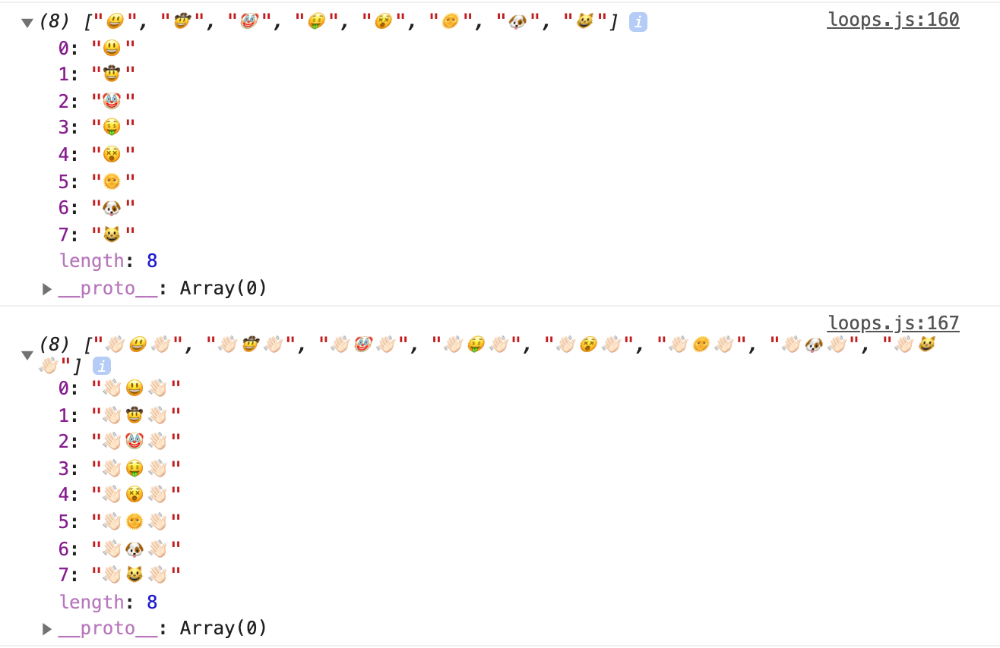
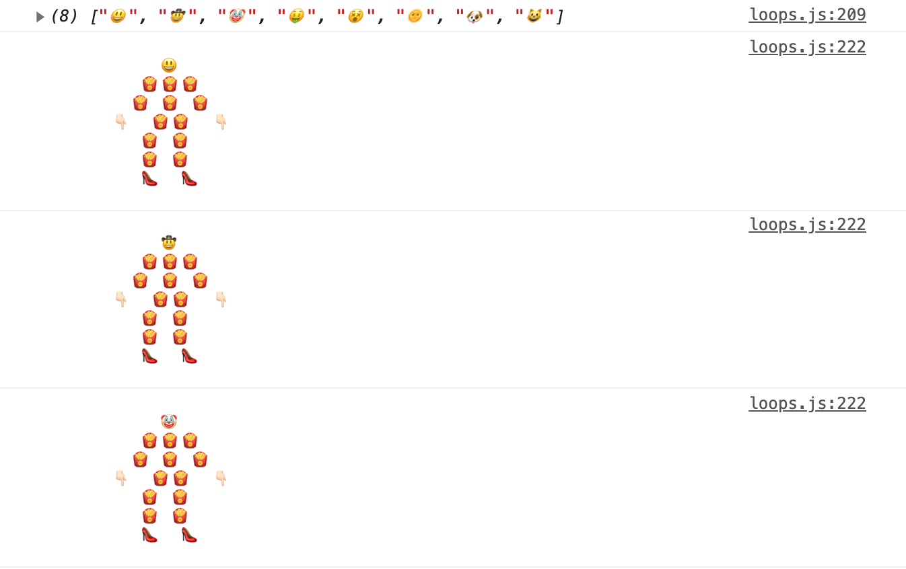
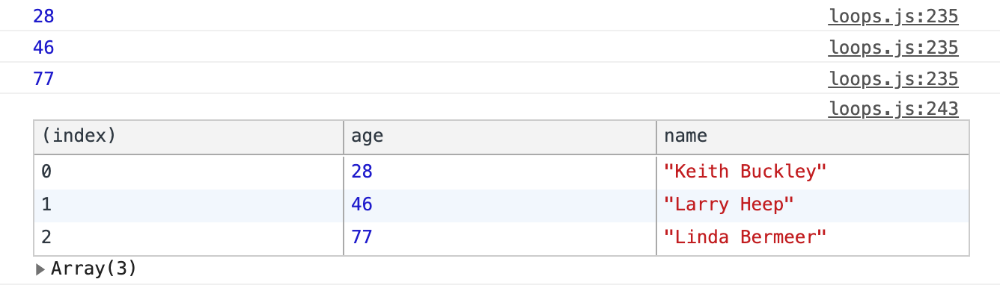
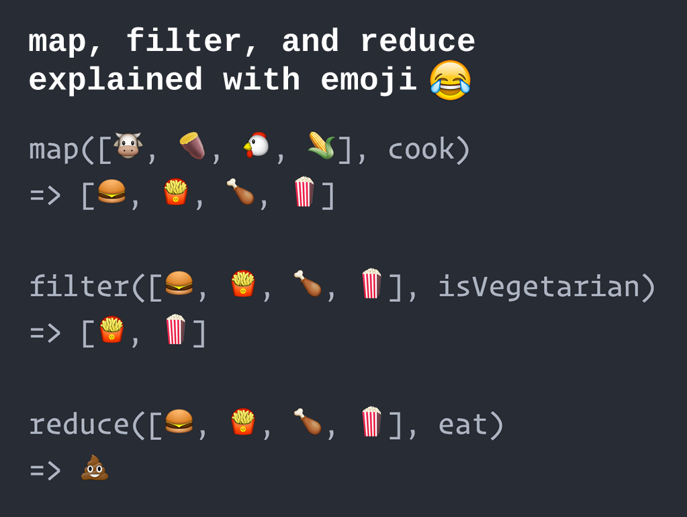
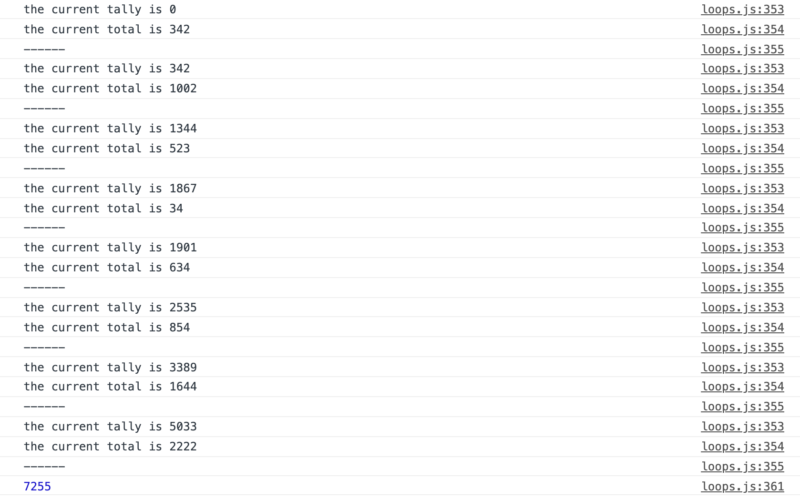
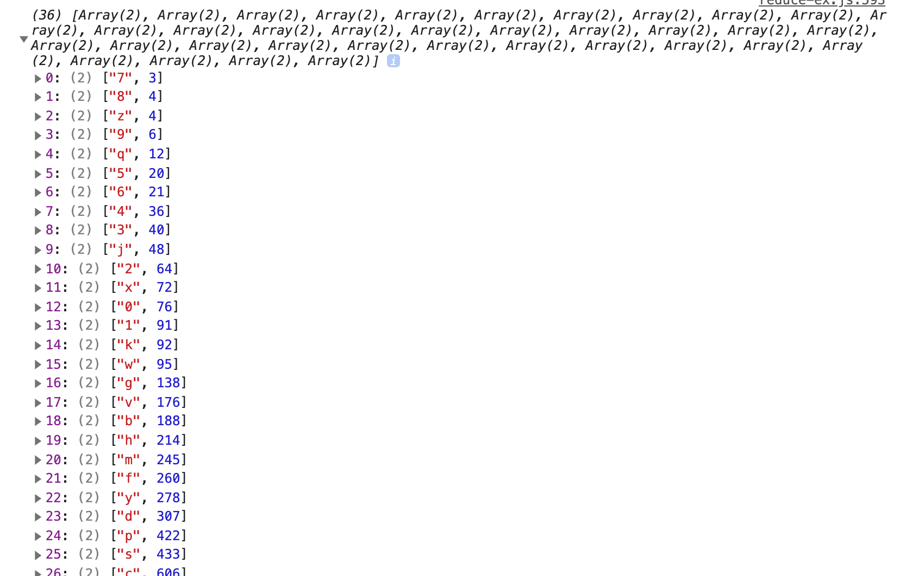

# Module 9 - Looping and Iterating

As most of the content is information and small coding bits, this README here is used as a notepad. <br>
This module contains no project. <br>

[Array for Each](#Array-for-Each)
 `.forEach()`

[Mapping](#Mapping)
`map()`

[Filter, Find and Higher Order Functions](#Filter-Find-And-Higher-Order-Functions)
`filter()`, `find()`

[Reduce](#Reduce)
`reduce()`

[Reduce Exercise](#Reduce-Exercise)
`reduce()`

[for, for in, for of, while loops](#for-for-in-for-of-while-loops)

## Array for Each

**Following examples are referring to `loops.html` and `loops.js`**

There's a few different ways to loop in JavaScript
- the most common thing to happen is to loop over an array
- most loopings work the same way:
  - a method that loops over an array
  - it's been passed a callback function
  - the callback function will run once for every item in the array, giving access to each idividual item

**`forEach()` with function outside**

```
const toppings = ['Mushrooms ', 'Tomatoes', 'Eggs', 'Chili', 'Lettuce', 'Avocado', 'Chiles', 'Bacon', 'Pickles', 'Onions', 'Cheese'];

function logTopping(topping, index, array) {
  console.log(topping);
  console.log(topping, index, array);
}

toppings.forEach(logTopping);
```

**`forEach()` no function outside**

```
const toppings = ['Mushrooms ', 'Tomatoes', 'Eggs', 'Chili', 'Lettuce', 'Avocado', 'Chiles', 'Bacon', 'Pickles', 'Onions', 'Cheese'];

toppings.forEach(topping => {
  console.log(topping);
});
```

**`forEach()` example operations**

```
const toppings = ['Mushrooms ', 'Tomatoes', 'Eggs', 'Chili', 'Lettuce', 'Avocado', 'Chiles', 'Bacon', 'Pickles', 'Onions', 'Cheese'];

function logTopping(topping, index, originalArray) {

  const prevTopping = originalArray[index - 1];
  const nextTopping = originalArray[index + 1];

  // log the topping
  console.log('originalTopping: ', topping);

  // log the prev topping if there is one
  if (prevTopping) {
    console.log('prevTopping: ', prevTopping);
  }

  // log the next topping if there is one
  if (nextTopping) {
    console.log('nextTopping: ', nextTopping);
  }
  // or:
  // nextTopping ? console.log(nextTopping) : null;

  // if its the last item in the array, say Goodbye
  index === originalArray.length - 1
    ? console.log('Goodbye')
    : console.log('next please');
  // or:
  // index === originalArray.length && console.log('Goodbye');

  console.log('----');
}
toppings.forEach(logTopping);
```

- `forEach()` is the very basic looping on some data
- `forEach()` is a bit different from the other looping methods, it doesn't return any value, it just goes off and does some work on each piece of data in an array
- the phrase `topping` is not important, important is, that it is a PLACEHOLDER, not an argument that has a value
- `forEach()` takes in 3 arguments: current value, index, array
- the first parameter in `forEach()` stands for the (current) element being processed in the array

### Side Effects

- a side effect is when you are inside of a function and you reach outside of that function to do something else, for example attaching event listeners, putting some data on a page
- whereas side effects are totally fine, there's quite some methods that are simply taking in data, doing something with that data, and then returning that data that has been modified, massaged or transformed in some way
- that is where we get into `map()`, `filter()` and `reduce()`
- pure functions: they take in data, they return data, they always work exactly the same way given the data input, they always return the exact same thing, they don't reach outside of themselves

## Mapping

- `map()` is like a machine in a factory, it takes in data, performs an operation and spits it out on the other side
- `map()` will always produce the same length of the array as it starts with (returns an array of the exact same length put in)
- `map()` can be used for any kind of data (strings, numbers, objects)
- **don't update the DOM inside of a `map()` function, for that use `forEach()`**

**`map()` simple use**

```
const faces = ['😃', '🤠', '🤡', '🤑', '😵', '🌞', '🐶', '😺'];
console.log(faces); // (8) ['😃', '🤠', '🤡', '🤑', '😵', '🌞', '🐶', '😺']

function addArms(face) {
  return `👋🏻${face}👋🏻`;
};

const toys = faces.map(addArms);
console.log(toys); // (8) ['👋🏻😃👋🏻', '👋🏻🤠👋🏻', '👋🏻🤡👋🏻', '👋🏻🤑👋🏻', '👋🏻😵👋🏻', '👋🏻🌞👋🏻', '👋🏻🐶👋🏻', '👋🏻😺👋🏻']
```



**`map()` simple use**

```
const fullNames = ['wes', 'kait', 'poppy'].map(name => `${name} bos`);
console.log(fullNames); // (3) ['wes bos', 'kait bos', 'poppy bos']
```

**`map()` chaining**

```
function bosify(name) {
  return `${name} Bos`;
}

function capitalize(word) {
  // one way:
  // return word[0].toUpperCase() + word.slice();
  // better way: concatenate string via back ticks instead of using +
  return `${word[0].toUpperCase()}${word.slice(1)}`;
}

const fullNames = ['wes', 'kait', 'poppy'].map(capitalize).map(bosify);
console.log(fullNames); // (3) ["Wes Bos", "Kait Bos", "Poppy Bos"]
```

- you can chain `.map()`
- `slice()` works the same way as an array does on a string: you can take everything from one to three `slice(1, 3)`, we are just returning from one to the end `slice(1)`

**`map()` with numbers**

```
const orderTotals = [342, 1002, 523, 34, 634, 854, 1644, 2222];
console.log(orderTotals); // (8) [342, 1002, 523, 34, 634, 854, 1644, 2222]

// turn all values to 1
const orderTotalsOne = orderTotals.map(total => 1);
console.log(orderTotalsOne); // (8) [1, 1, 1, 1, 1, 1, 1, 1]

// add tax to each value
const orderTotalsWithTax = orderTotals.map(total => total * 1.13);
console.log(orderTotalsWithTax); // (8) [386.46, 1132.26, 590.9899999999999, 38.419999999999995, 716.42, 965.0199999999999, 1857.7199999999998, 2510.8599999999997]
console.log(orderTotals); // (8) [342, 1002, 523, 34, 634, 854, 1644, 2222]
```

- why are items turned into value `1`?
- whatever you return from your `map()` function will replace whatever initially was in your `map()` function
- it's NOT mutable, `orderTotals` are still there
- the NEW array `orderTotalsOne` will have the updated values

**`repeat()`, `fill()`, `map()`, `forEach()` - cowboys**

```
const faces = ['😃', '🤠', '🤡', '🤑', '😵', '🌞', '🐶', '😺'];
console.log(faces); // (8) ["😃", "🤠", "🤡", "🤑", "😵", "🌞", "🐶", "😺"]

function attachBody(face, body) {
    return `
             ${face}
           ${body.repeat(3)}
          ${Array(3).fill(body).join(' ')}
        👇🏻  ${body.repeat(2)}  👇🏻
           ${Array(2).fill(body).join(' ')}
           ${Array(2).fill(body).join(' ')}
           👠  👠
    `
}
faces.map(face => attachBody(face, '🍟')).forEach(body => console.log(body));
```



**`map()` and `filter()`**

`map()` use case:

- data that's not in the format that you need
- take in that data, optimize it and return the new formatted data
- timestamp checker https://epoch.vercel.app/
- `31536000000` is January 1st 1971
- https://date-fns.org/

`filter()` use case:

- find ONE person in a set of data or filter that list of data down to be a subset of it
- `filter()` loops over every single item in the array, and you either say 'yes' or 'no' (aka, `true` or `false`)
- `filter()` will return ALL of the items that match what you want
- `filter()` will always return an ARRAY

```
const people = [
  {
    birthday: 'April 22, 1993',
    names: {
      first: 'Keith',
      last: 'Buckley'
    }
  },
  {
    birthday: 'January 3, 1975',
    names: {
      first: 'Larry',
      last: 'Heep'
    }
  },
  {
    birthday: 'February 12, 1944',
    names: {
      first: 'Linda',
      last: 'Bermeer'
    }
  }
];

// map()
const cleanPeople = people.map(function(person) {
  // get their birthday
  // timestamp
  const birthday = new Date(person.birthday).getTime();
  // now timestamp
  const now = Date.now();
  console.log(birthday, now);

  // figure out how old they are
  const age = Math.floor((now - birthday) / 31536000000);
  console.log(age); // 28 46 77 -> depending on the year you check!

  // return their full name and birthday in an object
  return {
    age: age,
    name: `${person.names.first} ${person.names.last}`,
  }
});
console.table(cleanPeople);

// older than 40 years old
// filter() - verbose version
/* const over40 = cleanPeople.filter(function(person) {
  if (person.age > 40) {
    return true;
  } else {
    return false;
  }
});
console.table(over40); */

// filter() - smaller version - explicit return
/* const over40 = cleanPeople.filter(person => {
  return person.age > 40;
});
console.table(over40); */

// check if any people are in this subset of an array
if (over40.length) {
  console.log('there is someone over 40');
}
```



## Filter, Find and Higher Order Functions

- `filter()` see `map()`

**`find()`**

- works the same way as `filter()` except
  - `find()` will only find ONE item in the array; `filter()` will return ALL of the items that match what you want
  - `find()` will always return the actual ITEM; `filter()` will always return an ARRAY

```
const students = [
  {
    id: '11ce',
    first_name: 'Dall',
    last_name: 'Puckring',
  },
  {
    id: '2958',
    first_name: 'Margarete',
    last_name: 'Brandi',
  },
  {
    id: '565a',
    first_name: 'Bendicty',
    last_name: 'Woodage',
  },
  {
    id: '3a16',
    first_name: 'Micki',
    last_name: 'Mattes',
  },
  {
    id: 'f396',
    first_name: 'Flory',
    last_name: 'Gladeche',
  },
  {
    id: 'de5f',
    first_name: 'Jamill',
    last_name: 'Emilien',
  },
  {
    id: '54cb',
    first_name: 'Brett',
    last_name: 'Aizikowitz',
  },
  {
    id: '9135',
    first_name: 'Lorry',
    last_name: 'Smallman',
  },
  {
    id: '978f',
    first_name: 'Gilly',
    last_name: 'Flott',
  },
];

// find() student with 565a
// returns an object which is the student itself
const student = students.find(studi => studi.id === '565a');
console.log(student); // {id: "565a", first_name: "Bendicty", last_name: "Woodage"}

// returns an array of one item
const student2 = students.filter(studi => studi.id === '565a');
console.log(student2); // [0: {id: "565a", first_name: "Bendicty", last_name: "Woodage"}]
```

**`find()`, higher order function**

```
// find() student with 565a with external higher order function
function findById(id) {
  return function isStudent(studi) {
    return studi.id === id;
  }
}
const student = students.find(findById('565a'));
console.log(student); // {id: "565a", first_name: "Bendicty", last_name: "Woodage"}
```

- a higher order function will return another function
- more flexible

**`find()`, higher order function, part 2**

```
function findByProp(prop, propWeAreLookingFor) {
  return function fullStudent(studentele) {
    return studentele[prop] === propWeAreLookingFor;
  }
}

const student2 = students.find(findByProp('id', '565a'));
const student3 = students.find(findByProp('first_name', 'Micki'));
console.log(student2); // {id: "565a", first_name: "Bendicty", last_name: "Woodage"}
console.log(student3); // {id: "3a16", first_name: "Micki", last_name: "Mattes"}
```

- more flexible, because what happpens if a `student` you want to run `find()` on has 15 properties on them?
- `function findByProp()`
  - takes in a prop and the propWeAreLookingFor
  - looks into an object for whatever property you specified is equal to whatever value you have specified
  - `[]` and not `.` notation, because the property that we are looking for is being passed in as a variable, as an argument to that function
- advanced topic

## Reduce



- `map()`
  - takes in data, optimize it and returns the new formatted data
  - takes in items and returns a transformed item
  - takes in raw materials and map it through a 'cook function', returns the cooked, transformed materials
- `filter()`
  - takes in items and returns a subset of those items
  - takes in cooked materials and returns a subset of the original array
- `reduce()`
  - takes in an array of data, just like `map()`, `filter()`
  - loops over every single item in that array
  - returns to you a result or a single value
  - takes in the cooked materials and returns a smaller, compiled (reduced!) version of it

**adding up numbers, messy version**

```
const orderTotals = [342, 1002, 523, 34, 634, 854, 1644, 2222];

let total = 0;
orderTotals.forEach(singleTotal => {
  total = total + singleTotal;
});
console.log(total); // 7255
```
- this works but is messy
- the callback function `orderTotals` relies on an external variable that has been made outside `let total = 0`
- then this variable `let total = 0` will be updated inside of that callback function
- side effect, where you update a variable that exists outside of the function

**adding up numbers with `reduce()`**

```
const orderTotals = [342, 1002, 523, 34, 634, 854, 1644, 2222];

function tallyNumbers(tally, currentTotal) {
  console.log(`the current tally is ${tally}`);
  console.log(`the current total is ${currentTotal}`);
  console.log('------');
  // return the current tally PLUS the amount of this order
  return tally + currentTotal;
}

const allOrders = orderTotals.reduce(tallyNumbers, 0);

console.log(allOrders); // 7255
```



- callback function, that will run once for every single item in it
- `reduce()` will loop over items in an array
- `reduce()` takes in two parameters
  - accumulator: the thing that has been handed to you from the last instance of the loop
  - we start with `0` because the accumulator starts with `0`
  - if you don't provide an initial accumulator value, the first loop iteration will take the first numbers
  - it's good practice to provide a default accumulator value
  - currentValue: the current thing in it
- every single time you loop over an item in an array, you have the option to return a value and can use that to accumulate values or distill them down into one value

**check how many of each instances, total value of all of the inventory, with `reduce()`**

```
const inventory = [
  { type: 'shirt', price: 4000 },
  { type: 'pants', price: 4532 },
  { type: 'socks', price: 234 },
  { type: 'shirt', price: 2343 },
  { type: 'pants', price: 2343 },
  { type: 'socks', price: 542 },
  { type: 'pants', price: 123 },
];

// how many of each instances are there
function inventoryReducer(accuTotals, item) {
  console.log(`looping over ${item.type}`);

  // increment the type by 1
  // as if statement:
  if (accuTotals[item.type]) {
    accuTotals[item.type] = accuTotals[item.type] + 1;
    // accuTotals[item.type]++;
  } else {
    accuTotals[item.type] = 1;
  }

  // shortened, version 1:
  // accuTotals[item.type] = accuTotals[item.type] + 1 || 1;

  // shortened, version 2, example with shirt:
  // accuTotals.shirt ? accuTotals.shirt + 1 : accuTotals.shirt = 1;

  // return the accuTotals, so the next loop can use it
  return accuTotals;
}

const inventoryCounts = inventory.reduce(inventoryReducer, {});
console.log(inventoryCounts); // {shirt: 2, pants: 3, socks: 2}

// what is the total value
const totalInventoryPrice = inventory.reduce((acc, item) => acc + item.price, 0);
console.log(totalInventoryPrice); // 14117
```

- check how many of each instances (`shirt`, `pants`, `socks`) are there
- what is the total value (`price`) of all of the inventory that we have
- in function `inventoryReducer` check if the property exists before we add `1` to it
- for total value `totalInventoryPrice`, start at `0`, loop over single item, return previous amount which is the accumulator plus the price of the looped item

## Reduce Exercise

Please see [reduce-ex.html](./reduce-ex.html) and [reduce-ex.js](./reduce-ex.js) in this module's folder, open the html file and the JavaScript console to follow up with the coding bits of this part of the course.

- use `map()`, `filter()`, `reduce()`
- grab all the text from https://developer.mozilla.org/en-US/docs/Web/JavaScript/Reference/Global_Objects/Array/Reduce (simply select all, copy & paste into js file)
- get rid off the junk characters first
- lowercase the result
- count, how many times each (remaining) letter and number occurs
- sort result by value



- https://regex101.com/

## For, for in, for of, while loops

These methods are not as nearly as popular as the array methods.

**`for()`**

- `for()` loop requires 3 things: initial expression, condition, increment expression
- a plain `for()` loop is great for running a block of code a number of times

```
for (let i = 0; i <= 10; i++) {
    console.log(i);
}
```

- initial expression: `let i = 0;`
  - sort of set up of the code, the loop starts here
- condition: `i <= 0;`
  - will run each time before each loop runs
  - if this is `true` the loop will run one more time
  - if this is `false` it will no longer run and it will move on to the next line of code
- increment expression: `i++`

  - this is the increment, in this case we increment `0` by `1`
  - this allows us to access the variable `i`

- traditionally this is used to loop over something, like an array of numbers
- `let` is scoped to the block, so you can use the var name (most of the time `i`) more than once

```
const numbers = [2, 34, 3, 23, 42, 3, 1, 65, 364, 5, 645, 6];

for (let i = 0; i < numbers.length; i++) {
    console.log(i);
    console.log('numbers length', numbers.length);
    console.log('retrieve numbers inside of array', numbers[i]);
}
```

- it's now easier to do this with `forEach()`, `map()` or `reduce()`
- if you see a `for()` loop maybe ask yourself if you can refactor it

See etch-a-sketch example in module 6.

- for HTML canvas there's a `getImageData()` method on it
- `cancasContext.getImageData(0, 0, 100, 100)`
- will return an array of data with a lot of items inside of it (40.000)
- special kind of array called clamped array, used for very, very, very large arrays
- if you want to loop over that data, you have to loop over every single pixel, meaning that you have to take 4 key/value pairs at a time

**`for(... of ...)`**

- used for looping over iterables (an iterable is something that has a length, like a number or a string)
- in most cases you will use this for an array or a string
- returns every single letter as a string

```
const naming = '🦁 Wes 🦁 Bos 🦁';

for (const letter of naming) {
    console.log(letter);
}
```

Why would `for(... of ...)` be better than splitting it and looping over it with a `forEach()`?

- `for(... of ...)` can handle emojis, `split()` won't work
- the other use case would be working with promises: if you ever need to sequence a bunch of data, the `for(... of ...)` loop will allow to use `await` in it (more later in course)

```
const numbers = [2, 34, 3, 23, 42, 3, 1, 65, 364, 5, 645, 6];

for (const number of numbers) {
    console.log('number of', number);
}
```

- returns each of the **raw values** from the array
- `for(... of ...)` won't give us the index (whereas `.forEach()` would do that)
- `for(... of ...)` also doesn't allow to filter or anything like that

**`for(... in ...)`**

- used for looping over keys of an object
- returns the **keys** of an object

```
const numbers = [2, 34, 3, 23, 42, 3, 1, 65, 364, 5, 645, 6];

for (const number in numbers) {
    console.log('number in', number);
}
```

```
const wes = {
    name: 'wes',
    age: 100,
    cool: true,
}

for (const prop in wes) {
    console.log(prop);
}
```

- how is that better than `Object.entries()` or `Object.keys()` or `Object.values()`? It's not :p
- one sort of gotcha with `for(...in...)` vs `Object.entries()`:

```
const wes = {
    name: 'wes',
    age: 100,
    cool: true,
}

const baseHumanStats = {
    feet: 2,
    arms: 2,
    head: 1,
};

function Human(naming) {
    this.naming = naming;
}

const wes2 = new Human('wes');
console.log(wes2); // Human {naming: "wes"}
```

- `wes2` is an object with the type of `Human`
- what happens with a prototype is that
  - when you try to access a property, it first checks on the object itself for a property on that
  - when it's not there, it will look up the prototype chain

**If you need to grab the prototype methods and properties, then you can use a `for(...in...)` loop to grab those. If you don't need those, then you are fine with `Object.entries()`**

**`while()` and `do... while()`**

- not all that popular
- be aware of infinite loops!!!
- `while()` will take in an condition and will run infinitely until the condition is `false`
- `while()` will check the condition before the first run and then go ahead and do it

```
let cool = true;
let i = 0;

while (cool === true) {
    console.log('you are cool'); // 101loops.js:449 you are cool
    i++;
    if (i > 100) {
        cool = false;
    }
}
```

```
let a = 1;
let b = 2;
do {
    console.log('b actually is bigger than a'); // b actually is bigger than a
} while (b <= a);
```

- `do... while()` will run first and then check the condition after the first run
