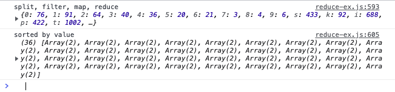

# Module 9 - Looping and Iterating

As most of the "Module 9 - Loops" content is information and small coding bits, this README here is used as a notepad.

Please also [see loops.html](./loops.html) and [loops.js](./loops.js) in this module's folder to follow up with the coding bits.

[Array for Each](#Array-for-Each)

[Mapping](#Mapping)

[Filter, Find and Higher Order Functions](#Filter-Find-And-Higher-Order-Functions)

[Reduce](#Reduce)

[Reduce Exercise](#Reduce-Exercise)

[for, for in, for of, while loops](#for-for-in-for-of-while-loops)

- there's a few different ways to loop in JavaScript
- the most common thing to happen is to loop over an array
- most loopings work the same way:
  - a method that loops over an array
  - it's been passed a callback function
  - the callback function will run once for every item in the array, giving access to each idividual item

## Array `.forEach()`

- the very basic looping on some data
- for example add event listeners to multiple elements, logging of data, displaying data on a page
- `forEach()` is a bit different from the other methods, it doesn't return any value, it just goes off and does some work on each piece of data in an array

```
const toppings = ['Mushrooms ', 'Tomatoes', 'Eggs', 'Chili', 'Lettuce', 'Avocado', 'Chiles', 'Bacon', 'Pickles', 'Onions', 'Cheese'];

function logTopping(topping) {
    console.log(topping);
}

toppings.forEach(logTopping);

// instead of external function:
toppings.forEach(topping => {
    console.log(topping);
});
```

- so where is `topping` coming from?
- the phrase is not important, important is, that it is a PLACEHOLDER, not an argument that has a value
- the first parameter in `forEach()` stands for the (current) element being processed in the array

```
function logTopping(element, index, array) {
    console.log(element, index, array);
}
toppings.forEach(logTopping);
```

```
const toppings = ['Mushrooms ', 'Tomatoes', 'Eggs', 'Chili', 'Lettuce', 'Avocado', 'Chiles', 'Bacon', 'Pickles', 'Onions', 'Cheese'];

function logTopping(topping, index, originalArray) {

    const nextTopping = originalArray[index + 1];
    const prevTopping = originalArray[index - 1];

    // log the topping
    console.log('originalTopping: ', topping);

    // log the prev topping if there is one
    if (prevTopping) {
        console.log('prevTopping: ', prevTopping);
    }

    // log the next topping if there is one
    if (nextTopping) {
        console.log('nextTopping: ', nextTopping);
    }
    // or:
    // nextTopping ? console.log(nextTopping) : null;

    // if its the last item in the array, say Goodbye
    index === originalArray.length - 1
        ? console.log('Goodbye')
        : console.log('next please');
    // or:
    // index === originalArray.length && console.log('Goodbye');

    console.log('----');

}
toppings.forEach(logTopping);
```


### Side Effects

- when you are inside of a function and you reach outside of that function to do something else, for example attaching event listeners, console.logging
- whereas side effects are totally fine, there's quite some methods that are simply taking in data, doing something with that data, and then returning that data that has been modified, massaged or transformed in some way
- that is where we get into `map()`, `filter()` and `reduce()`
- pure functions: they take in data, they return data, they always work exactly the same way given the data input, they always return the exact same thing, they don't reach outside themselves

## Mapping

- `map()` is like a machine in a factory
- it takes in data, performs an operation and spits it out on the other side
- it will always produce the same length of the array as it starts with (returns an array of the exact same length put in)
- `map()` can be used for any kind of data (strings, numbers, objects)
- **don't update the DOM inside of a `map()` function**

**`map()` simple use**

```
const faces = ['😃', '🤠', '🤡', '🤑', '😵', '🌞', '🐶', '😺'];
console.log(faces);

function addArms(face) {
    return `👋🏻${face}👋🏻`;
};

const toys = faces.map(addArms);
console.log(toys);
```


**`map()` simple use**

```
const fullNames = ['wes', 'kait', 'poppy'].map(name => `${name} bos`);
console.log(fullNames);
```

**`map()` chaining**

```
function bosify(name) {
    return `${name} Bos`;
}

function capitalize(word) {
    /* return word[0].toUpperCase() + word.slice(); */
    // better way: concatenate string via back ticks instead of +
    return `${word[0].toUpperCase()}${word.slice(1)}`;
}

const fullNames = ['wes', 'kait', 'poppy'].map(capitalize).map(bosify);
console.log(fullNames); // (3) ["Wes Bos", "Kait Bos", "Poppy Bos"]
```

- you can chain `.map()`
- `slice()` works the same way as an array does on a string: you can take everything from one to three `slice(1, 3)`, we are just returning from one to the end `slice(1)`

**`map()` with numbers**

```
const orderTotals = [342, 1002, 523, 34, 634, 854, 1644, 2222];
const orderTotalsWithTax = orderTotals.map(total => 1);
console.log(orderTotalsWithTax); // (8) [1, 1, 1, 1, 1, 1, 1, 1]
console.log(orderTotals); // (8) [342, 1002, 523, 34, 634, 854, 1644, 2222]
```

- every items is turned into `1` - why?
  - whatever you return from your `map()` function will replace whatever initially was in your `map()` function
- it's NOT mutable, `orderTotals` are still there
- the NEW array `orderTotalsWithTax` will have the updated values

```
const orderTotals = [342, 1002, 523, 34, 634, 854, 1644, 2222];
const orderTotalsWithTax = orderTotals.map(total => total * 1.13);
console.log(orderTotalsWithTax);
// (8) [386.46, 1132.26, 590.9899999999999, 38.419999999999995, 716.42, 965.0199999999999, 1857.7199999999998, 2510.8599999999997]
console.log(orderTotals); // (8) [342, 1002, 523, 34, 634, 854, 1644, 2222]
```

**fun with `repeat()`, `fill()`, `map()`, `forEach()`**

```
const faces = ['😃', '🤠', '🤡', '🤑', '😵', '🌞', '🐶', '😺'];
console.log(faces); // (8) ["😃", "🤠", "🤡", "🤑", "😵", "🌞", "🐶", "😺"]

function attachBody(face, body) {
    return `
             ${face}
           ${body.repeat(3)}
          ${Array(3).fill(body).join(' ')}
        👇🏻  ${body.repeat(2)}  👇🏻
           ${Array(2).fill(body).join(' ')}
           ${Array(2).fill(body).join(' ')}
           👠  👠
    `
}
faces.map(face => attachBody(face, '🍟')).forEach(body => console.log(body));
```


**`map()` with objects**

- use case: data that's not in the format that you need
  - take in that data, optimize it and return the new formatted data
- timestamp checker https://epoch.vercel.app/
- https://date-fns.org/

```
const people = [
    {
        birthday: 'April 22, 1993',
        names: {
            first: 'Keith',
            last: 'Buckley'
        }
    },
    {
        birthday: 'January 3, 1975',
        names: {
            first: 'Larry',
            last: 'Heep'
        }
    },
    {
        birthday: 'February 12, 1944',
        names: {
            first: 'Linda',
            last: 'Bermeer'
        }
    }
];

const cleanPeople = people.map(function (person) {
    // get their birthday
    // figure out how old they are

    // then timestamp
    const birthday = new Date(person.birthday).getTime();
    // now timestamp
    const now = Date.now();

    const age = Math.floor((now - birthday) / 31536000000);
    console.log(age);

    // return their full name and birthday in an object
    return {
        age: age,
        name: `${person.names.first} ${person.names.last}`,
    }
});
console.table(cleanPeople);
```


## Filter, Find and Higher Order Functions

**`filter()`**

- use case: find ONE person in a set of data or filter that list of data down to be a subset of it
- `filter()` loops over every single item in the array, and you either say 'yes' or 'no' (aka, `true` or `false`)
- `filter()` will return all of the items that match what you want
- `filter()` will always return an array

```
const over40 = cleanPeople.filter(function (person) {
    console.log(person);
    if (person.age > 40) {
        return true;
    } else {
        return false;
    }
});

// shortened
const over40 = cleanPeople.filter(person => {
    return person.age > 40;
});
console.table(over40);

// implicit return
const over40 = cleanPeople.filter(person => person.age > 40);
console.table(over40);
```

**`find()`**

- works the same way except it will only find ONE item in the array
- `find()` will always return the actual item

```
// find the student with 565a
const student = students.find(studi => studi.id === '565a');
console.log(student); // {id: "565a", first_name: "Bendicty", last_name: "Woodage"}

const student2 = students.filter(studi => studi.id === '565a');
console.log(student2); // [0: {id: "565a", first_name: "Bendicty", last_name: "Woodage"}]
```

**`find()`, higher order function**

```
function findById(id) {
    return function isStudent(studi) {
        return studi.id === id;
    }
}
const student = students.find(findById('565a'));

console.log(student); // {id: "565a", first_name: "Bendicty", last_name: "Woodage"}
```

- a higher order function will return another function
- more flexible

**`find()`, higher order function, part 2**

```
function findByProp(prop, propWeAreLookingFor) {
    return function fullStudent(studentele) {
        return studentele[prop] === propWeAreLookingFor;
    }
}

const student2 = students.find(findByProp('id', '565a'));
const student3 = students.find(findByProp('first_name', 'Micki'));

console.log(student2); // {id: "565a", first_name: "Bendicty", last_name: "Woodage"}
console.log(student3); // {id: "3a16", first_name: "Micki", last_name: "Mattes"}
```

- more flexible, because what happpens if a student you want to `find()` on has 15 properties on them?
- `function findByProp()`
  - takes in a property (or key) we are looking for and an actual key we are looking for
  - looks into an object for whatever property you specified is equal to whatever value you have specified
  - `[]` and not `.` notation, because the property that we are looking for is being passed in as a variable, as an argument to that function
- advanced topic

## Reduce

- `map()` take in items and return a transformed item
- `filter()` take in items and return a subset of those items
- `reduce()`
  - takes in an array of data, just like `map()`, `filter()`
  - loops over every single item
  - will return to you a result or a single value


- `map()` take in raw materials and map it through a 'cook function', return the cooked, transformed materials
- `filter()` take in cooked materials and return the veggie options, a subset of the original array
- `reduce()` take in the cooked materials and return a compiled smaller version of it

- `reduce()`
  - accumulator: the thing that has been handed to you from the last instance of the loop
  - currentValue: the current thing in it

**adding up numbers, messy version**

```
const orderTotals = [342, 1002, 523, 34, 634, 854, 1644, 2222];

let total = 0;
orderTotals.forEach(singleTotal => {
    total = total + singleTotal;
});
console.log(total); // 7255
```

- this works but is messy
- the callback method relies on an external variable that has been made outside
- side effect, where you update a variable that exists outside of the function

**`reduce()` adding up numbers, correct version**

```
const orderTotals = [342, 1002, 523, 34, 634, 854, 1644, 2222];

function tallyNumbers(tally, currentTotal) {
    console.log(`the current tally is ${tally}`);
    console.log(`the current total is ${currentTotal}`);
    console.log('------');
    // return the current tally PLUS the amount of this order
    return tally + currentTotal;
}

const allOrders = orderTotals.reduce(tallyNumbers, 0);
```


- `reduce()` will loop over items in an array
- every single time you loop over an item in an array, you have the option to return a value and can use that to accumulate values or distill them down into one value

```
const inventory = [
    { type: 'shirt', price: 4000 },
    { type: 'pants', price: 4532 },
    { type: 'socks', price: 234 },
    { type: 'shirt', price: 2343 },
    { type: 'pants', price: 2343 },
    { type: 'socks', price: 542 },
    { type: 'pants', price: 123 },
];

function inventoryReducer(accuTotals, item) {
    console.log(`looping over ${item.type}`);

    // increment the type by 1
    // as if statement:
    if (accuTotals[item.type]) {
        accuTotals[item.type] = accuTotals[item.type] + 1;
        // accuTotals[item.type]++;
    } else {
        accuTotals[item.type] = 1;
    }

    // shortened, version 1:
    // accuTotals[item.type] = accuTotals[item.type] + 1 || 1;

    // shortened, version 2, example with shirt:
    // accuTotals.shirt ? accuTotals.shirt + 1 : accuTotals.shirt = 1;

    // return the accuTotals, so the next loop can use it
    return accuTotals;
}
const inventoryCounts = inventory.reduce(inventoryReducer, {});
console.log(inventoryCounts); // {shirt: 2, pants: 3, socks: 2}

// what is the total value
const totalInventoryPrice = inventory.reduce((acc, item) => acc + item.price, 0);
console.log(totalInventoryPrice); // 14117
```

- check how many of each instanced are there
- check if the property exists before we add `1` to it
- for total value, start at `0`, loop over single item, return previous amount which is the accumulator plus the price of the looped item

## Reduce Exercise

Please see [reduce-ex.html](./reduce-ex.html) and [reduce-ex.js](./reduce-ex.js) in this module's folder, open the html file and the JavaScript console to follow up with the coding bits of this part of the course.

- use `map()`, `filter()`, `reduce()`
- grab all the text from https://developer.mozilla.org/en-US/docs/Web/JavaScript/Reference/Global_Objects/Array/Reduce (simply select all, copy & paste into js file)
- get rid off the junk characters first
- lowercase the result
- count, how many times each (remaining) letter and number occurs
- sort result by value



- https://regex101.com/

## For, for in, for of, while loops

- ToDo
