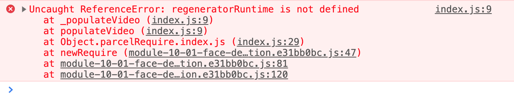
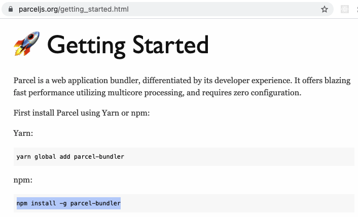
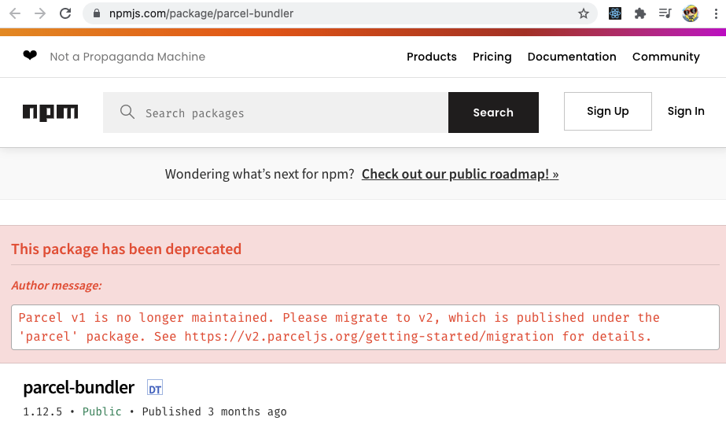

# Module 10 - Face Detection

## What is this about?

Face detection, plus pixelation, plus two option ranges

- JavaScript, HTML, CSS
- will detect, snapshot and blur (pixelate) your face
- two option ranges where you can change the amount of pixel(ation) and the size of the pixelated image put on top of your "normal" image

## Face Detection in your browser of choice

- check if your browser supports face detection (in my case Chrome)
- go to the JavaScript console of any page and type `FaceDetector` or `typeof FaceDetector`

- if you get an error or `undefined` you need to enable this feature as follows:
- go to `chrome://flags/`, search for "Experimental Web Platform features" and enable this

- you most likely need to restart your browser
- typing in `typeof FaceDetector`, you should see this now (if not, your browser most likely does not support face detection):

- double check if you gave access to your camera, just to be sure that it's not accidentally turned off, not allowed still

## Parcel js

- a server is needed in order to run this project
- accessing a user's webcam is kind of a security issue, you have to ask a user first for access to their webcam
- permission-based API in the browser - accessing someone's webcam is no different than that
- "is it allowed or not" - often tied to the `origin`, an `origin` in JavaScript is a fancy way of saying "a domain name"
- so in our case we are allowing the camera on localhost
- you cannot open the html file up straight in a browser on localhost, because localhost how we used it until now is not an `origin`
- the html file must run through a server

**This is why we need parcel.js**

https://parceljs.org/ - parcel will give us a development server

- `cd` into the face detection project folder
- check if you have node installed `node -v`
- if not, install the latest lts (long term support) version of node https://nodejs.org/en/

- in the face detection project directory, type `npm i parcel`, this will install parcel.js
- type `npm init -y` to create a `package.json`
- run `parcel index.html --open`, this will fire up your localhost at `http://localhost:1234`
- stop the server with `control c`

## Error - trouble shoot `regeneratorRuntime is not defined`

- my and also Wes Bos' final code threw me an `regeneratorRuntime is not defined` error while following the course
- this happened while coding the first `async / await` function `populateVideo()`

- originally I started with following parcel js instructions https://parceljs.org/getting_started.html how to install parcel js

- ran `npm install -g parcel-bundler`
- as I ran into the error, I quickly checked if something's already off there
- found out that `parcel-bundler` is no longer maintained https://www.npmjs.com/package/parcel-bundler

- installed parcel, as recommended https://www.npmjs.com/package/parcel
- ran `npm i parcel`
- ran `npm audit fix` and `npm audit fix --force`
- error still occured
- quick research lead to this: https://www.npmjs.com/package/regenerator-runtime
- installed `npm i regenerator-runtime` and put `const regeneratorRuntime = require("regenerator-runtime");` at the top of `index.js`
- stopped and restarted parcel and project worked, camera worked

## Project

- accessing the user's webcam
- dumping webcam stream into the video element (putting a square around the person's face on this one)
- taking frames of that video and dumping them into the face element (here, person's face will get pixelated)

**Promise**

- async `populateVideo(){...}` function returns a promise

- it's not the actual video stream it's a promise that it will get the stream of the webcam eventually
- in order to wait for the stream to come back from the webcam (b/c it takes some time) this function needs to be marked as `async`
- more on `async` / `await` in a future course

**Recursion**

- `detect()` function
- when a function calls itself inside of itself
- will run forever until something stops it, there's an exit condition (like a loop)

**In between, face detection was not working for me again, returned an empty array `[]` - should have shown `[DetectedFace]`**

- continued with course, face detection was working again once the `boundingBox` had been defined

**Pixelation**

- take a snapshot of the user's face (from video stream)
- scale snapshot down to very very small
- paint snapshot to the canvas
- immediately after, pull it off the canvas, stretch it back up, put it back in

**Don't forget to turn off the Experimental Web Platform features on chrome://flags/**
