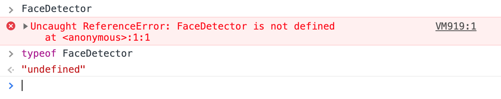
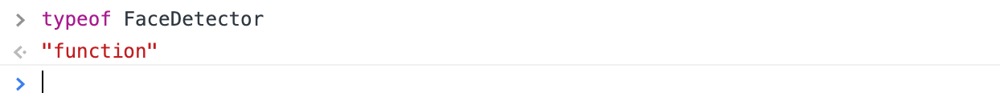
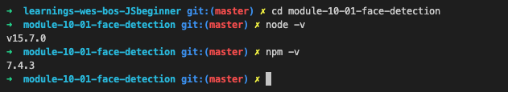
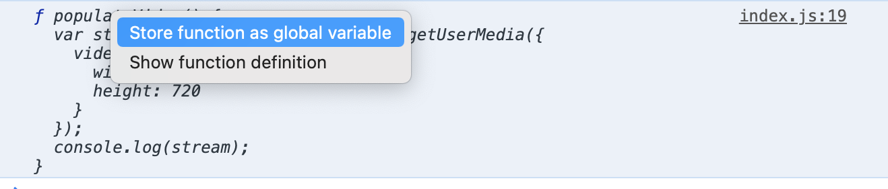
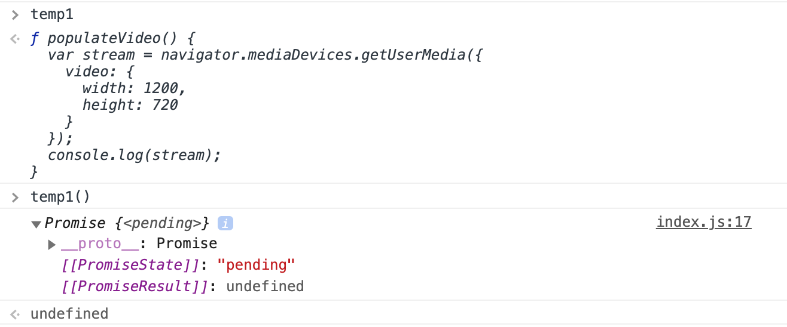

# Module 10 - Face Detection

## What is this about?


Face detection, plus pixelation, plus two option ranges

- JavaScript, HTML, CSS
- deskop first, not responsive / no mobile version
- access the user's webcam
- detect the user's face
- take a snapshot and blur (pixalate) the user's face

How?
- dump the webcam stream into the video element `<video class="webcam"></video>` (put a square around the user's face here)
- take frames of that video and dump them into the face element `<canvas class="face"></canvas>` (here, user's face will get pixelated)
- implement two option ranges where you can change the amount of pixel(ation) and the size of the pixelated image put on top of your "normal" image

## Enable Face Detection in your browser of choice

- check if your browser supports face detection (in my case Chrome)
- go to the JavaScript console of any page and type `FaceDetector` or `typeof FaceDetector`



- if you get an error or `undefined` you need to enable this feature as follows:
- go to `chrome://flags/`, search for "Experimental Web Platform features" and enable this


- you need to relaunch your browser
- type in `typeof FaceDetector` again, you should see this now (if not, your browser most likely does not support face detection):



- double check if you gave access to your camera, just to be sure that it's not accidentally turned off
- now start with the rest of the project

## Parcel js, why?

- a server is needed in order to run this project
- accessing a user's webcam is kind of a security issue, you have to ask a user for access to their webcam first
- "is it allowed or not" - often tied to the `origin`, an `origin` in JavaScript is a fancy way of saying "a domain name"
- so in our case we are allowing the camera on localhost
- you cannot open the html file up straight in a browser on localhost, because localhost how we used it until now is not an `origin`
- the html file must run through a server

**This is why we need parcel.js**

https://parceljs.org/ - parcel will give us a development server

## `cd` into the project folder `module-10-01-face-detection`

- check if you have node installed `node -v`, if not, install the latest lts (long term support) version of node https://nodejs.org/en/
- check if you have npm installed `npm -v`, if not, install it



Assuming that you cloned this projects code:
- run `npm install`, this will take all of the dependencies of this project and install them
- having these lines in `package.json`...
```
  "scripts": {
    "start": "parcel index.html",
    "build": "parcel build index.html"
  },
```
- ...allow you to run `npm run start`, this will fire up your localhost at `http://localhost:1234`
- stop the server with `control c`

**Detour**

How it worked with installing parcel from scratch:
- `npm install --save-dev parcel`
- type `npm init -y` to create a `package.json`
- important: in the `package.json`, add these lines
```
  "scripts": {
    "start": "parcel index.html",
    "build": "parcel build index.html"
  },
```
- run `npm run start`, this will fire up your localhost at `http://localhost:1234`
- stop the server with `control c`

## Project

Important: comment in line 59 `requestAnimationFrame(detect);`

**Promise - `async` / `await`**

- async `populateVideo(){...}` function returns a promise




- it's not the actual video stream it's a promise that it will get the stream of the webcam eventually
- in order to wait for the stream to come back from the webcam (b/c it takes some time) this function needs to be marked as `async`
- more on `async` / `await` in a future course

**Recursion**

- `detect()` function
- when a function calls itself inside of itself
- will run forever until something stops it, there's an exit condition (like a loop)

**In between, face detection was not working for me again, returned an empty array `[]` - should have shown `[DetectedFace]`**

- continued with course, face detection was working again once the `boundingBox` had been defined

**Pixelation**

- take a snapshot of the user's face (from video stream)
- scale snapshot down to very very small
- paint snapshot to the canvas
- immediately after, pull it off the canvas, stretch it back up, put it back in

**Don't forget to turn off the Experimental Web Platform features on chrome://flags/**
